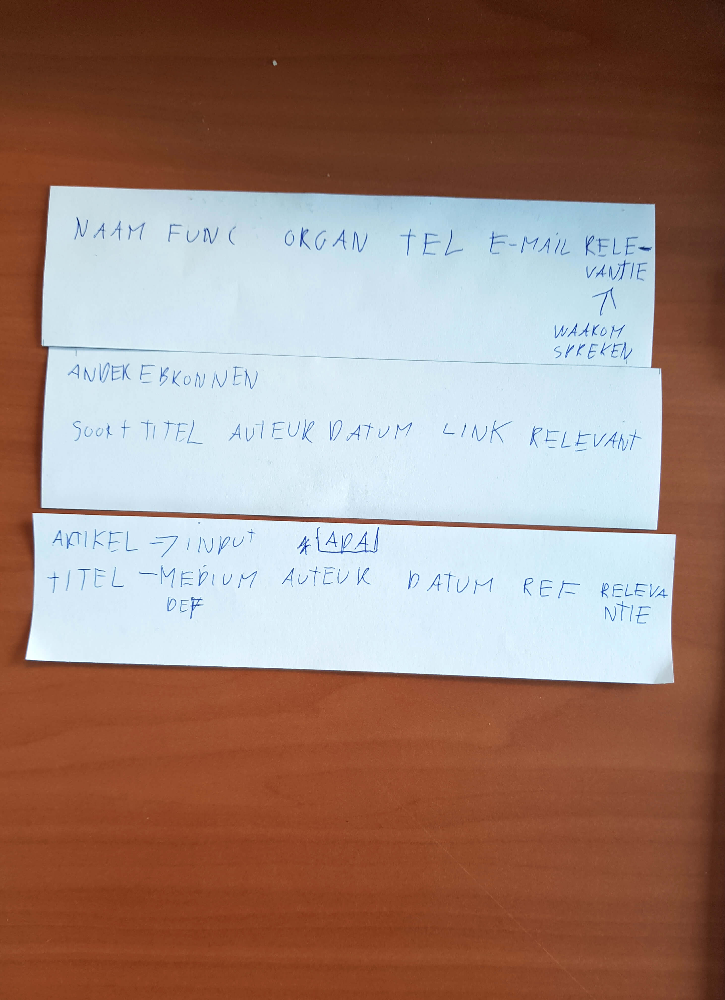

# Analyse onderzoeksjournalistiek

## Werkwijze

De werkwijze waarop Frank Meijer zijn onderzoeksjournalistieke proces uitvoert.

### Kan er worden gestart?
Dit proces begint met vooronderzoek naar een bepaald onderwerp. Vaak is hiervoor wel al een aanleiding. Een aanleiding zou vanaf een bron kunnen komen of van een onderwerp waar nog niet zoveel bekend van is. Maatschappelijke belangen komen hier ook vrij vaak in voor.

In het vooronderzoek met in iedergeval deskresearch word het probleem tot dusdanig in kaart gebracht dat deze goed genoeg is voor een idee pitch. De hoofdredactie beoordeeld of er met dit idee door kan gaan. Mocht het idee niet worden goedgekeurd dan moet er nog wat meer worden geïtereerd tot dat deze haalbaar en relevant is. Het is soms ook handig om overstappen op een ander onderwerp/idee, in het geval dat er te veel twijvel is.

### Is het idee goedgekeurd?
Frank werkt vaak het verhaal(product) met proces uit in 1 document. Het `Werk document`. Dit document wordt in de eerste instantie opgebouwd door middel van een `PvA`(Plan van Aanpak) en een `artikel opzet`.

#### Bij de PvA worden de volgende vragen gesteld:
* What behandel ik?
* Wie wil ik spreken?

#### Voor het `artikel opzet` de volgende punten:
* Volgorde (Chronologisch, of ander structuur?)
* Vorm (Welke verhaal/artikel vorm?)

#### Werk document
Het werkdocument is voor Frank een informatie vorm die zich constant evolueerd en itereerd tot dat het uitgroeid tot een artikel. 
Als CMD ontwerper houd je het eindproduct gescheiden van het proces omdat de verantwoording voor de keuzes al genomen zijn en het product moet voor zichzelf spreken. In onderzoeksjournalistiek is dat in Frank zijn manier niet een probleem. De veranwoording staat letterlijk in het verhaal en zal zich in een tekstuele manier moeten presenteren.

Of dit de beste methode is, dat weet ik persoonlijk niet. Het is wel duidelijk dat de informatie eenvoudig

  
Foto's

