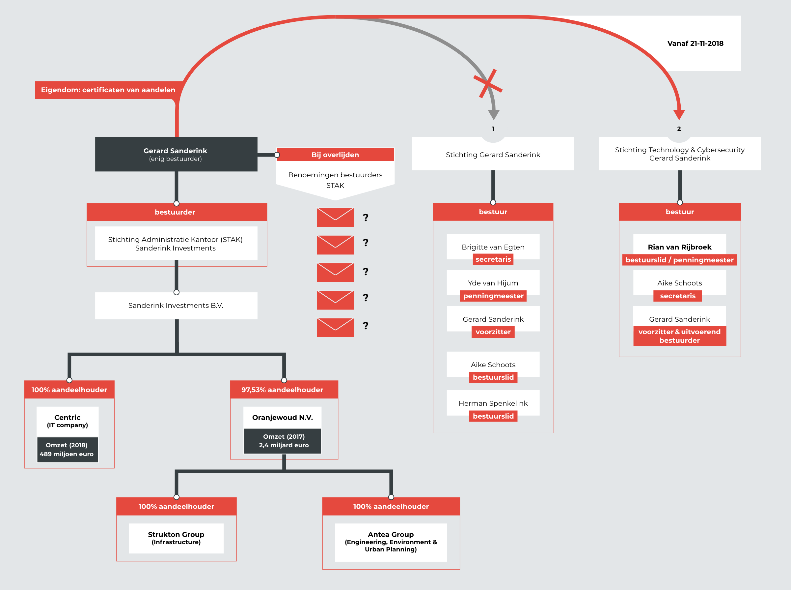
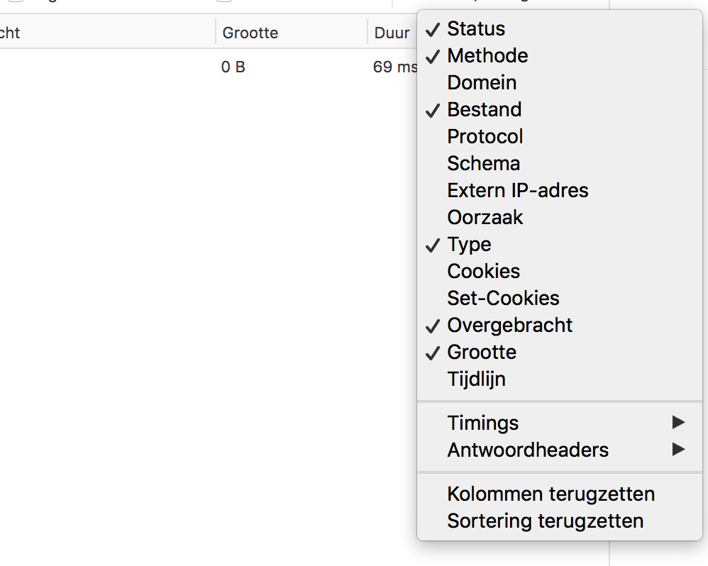

# Concept boomhiërarchie

> Hoe kan de onderzoeksjournalist zijn bronnen opnemen in het product?

__Type bronnen:__

* Persoon
* Organisatie

__Inclusief:__
* Eigenschappen van de bron
* Bedrijfsstructuur (Vanuit eigen ervaring)

## Concept zin

De gebruiker kan bronnen invoeren binnen een systeem en organiseren op een manier dat de positie van de bron het bedrijfsstructuur aangeeft.


Een concept zin is invulbaar.


## Bedrijfsstructuur

De gebruiker kan via een boomhiërarchie indeling, bronnen op een __ouders en kinderen__ relatie indelen. Dit heeft als voordeel dat je hiërarchie tussen bronnen kan aanbrengen. Dit kan handig zijn wanneer je een bedrijfsstructuur probeert vast te stellen.

__Bijvoorbeeld:__ Een 'bedrijf' staat bovenaan de boomhiërarchie. Onder het moederbedrijf kan je de sub-bedrijven hangen. 

De onderzoeksjournalist heeft hier behoefte aan, dit blijkt uit het journalistiekonderzoek: ['Verblind door een cybercharlatan'](https://www.ftm.nl/artikelen/gerard-sanderink-rian-van-rijbroek?utm_medium=social&utm_campaign=sharebuttonleden&utm_source=linkbutton) (__FTM account nodig om te bekijken__), waarin de volgende afbeelding is gebruikt:

Smit, E., Van Essen, J., & FTM. (2019, 18 mei). Verblind door een cybercharlatan [Illustratie]. Geraadpleegd op 1 oktober 2019, van https://www.ftm.nl/artikelen/gerard-sanderink-rian-van-rijbroek?utm_medium=social&utm_campaign=sharebuttonleden&utm_source=linkbutton

Deze manier van hiërarchie moet het eenvoudiger maken dit soort informatie in te vullen en te structureren.

## Eigenschappen en vergelijking met contentvorm `tabel`

Elk entiteit heeft ook zijn eigen lijst met eigenschappen. Het wel bekende tabel layout heeft het voordeel en nadeel dat elk eigenschap altijd een eigen kolom heeft. De informatie is altijd gesorteerd over de kolomen dat is een voordeel. Maar het nadeel is dat voor elke unieke eigenschap een extra kolom aangemaakt wordt. Hierdoor kan de tabel breder dan je scherm worden en dit heeft als gevolg dat de data onoverzichtelijk wordt.

[Definitie 'entiteit'](https://www.vandale.nl/gratis-woordenboek/nederlands/betekenis/entiteit)

Voorbeeld tabel layout
| Eigenschap: a | Eigenschap: B | Eigenschap: C |
|---------------|---------------|---------------|
| [waarde]      | [waarde]      | [waarde]      |
| [waarde]      | [waarde]      | [waarde]      |
| [waarde]      | [waarde]      | [waarde]      |

Voorbeeld van een boomhiërarchie layout:

[Meer voorbeelden van een `boomhiërarchie` weergave? (Google)](https://www.google.com/search?client=firefox-b-d&channel=trow&biw=2332&bih=1397&tbm=isch&sa=1&ei=CPIIXZb-GYaRmwXg6ZXwCQ&q=boom+hi%C3%ABrarchie+data&oq=boom+hi%C3%ABrarchie+data&gs_l=img.3...6287.6287..6648...0.0..0.42.42.1......0....2j1..gws-wiz-img.Iv0y6k-_MpY)

De meerwaardes: `Boomhiërarchie`
* Onderdelen kunnen onder elkaar worden geschoven. Bijvoorbeeld een persoon kan onder een organisatie worden geschoven. Dit kan ook andersom gedaan worden.
* Eigenschappen van een entiteit: Het aantal eigenschappen en de volgorde daarvan zit niet zoals bij een grid vast aan kolommen.

De meerwaardes: `Tabel`
* Met een tabel zit je vast aan een grid. Het voordeel van een tabel is dat je alle zelfde soort gegevens onder elkaar kan zetten door te soorteren via kolommen.
* Het is mogelijk om bepaalde kolommen met minder relevante informatie niet te tonen. Kijk maar hoe Firefox dit oplost: 

[Dit is een screenshot van de Firefox Netwerk tab dat beschikbaar is via het inspector menu.](https://developer.mozilla.org/en-US/docs/Tools/Network_Monitor)

De `Tabel` weergave is hele goede manieren om informatie van bronnen weer te geven. Maar toch kan een tabel niet hiërarchie op meerdere lagen weergeven dat een `Boom hiërarchie` wel kan.

**Voorbeeld van data waarbij een Boom hiërarchie een belangrijke rol kan spelen**
* Organisatie A (entiteit)
  * Persoon A (entiteit)
    * Loon (Eigenschap)
    * Contactgegevens (entiteit als lijst)
      * Telefoonnummer 1 (Eigenschap)
      * Telefoonnummer 2 (Eigenschap)
      * Email (Eigenschap)
  * Persoon B (entiteit)
    * Loon (Eigenschap)
      * Contactgegevens (entiteit als lijst)
        * Telefoonnummer (Eigenschap)
  * Persoon C (entiteit)
    * Loon (Eigenschap)
* Organisatie B (entiteit)
  * Persoon D (entiteit)
    * Loon (Eigenschap)