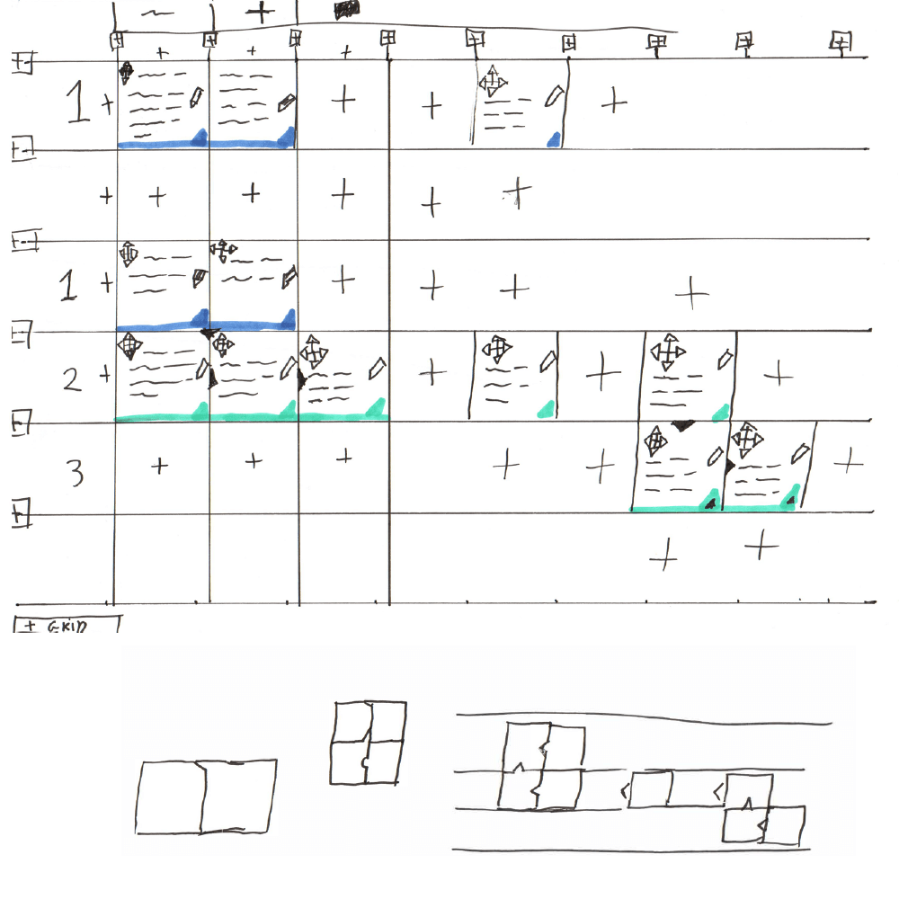

Dit is een tweede concept om deze vraag te beantwoorden:

> Hoe kan de onderzoeksjournalist zijn bronnen opnemen in het product?

De onderzoeksjournalist zou ook zijn bronnen binnen een gebied kunnen neerleggen om deze later te organiseren. __Lees verder:__

Stel je voor. Er ligt een vel papier voor je waar je plaknotities op kan plakken. Elke notitie bevat een bron. Je hebt de vrijheid om plaknotities te verschuiven waar je maar wil.

Om overlapping te voorkomen en het overzicht te bewaren worden de plaknotities uitgelijnd op een grid.

|      |      |      |      |      |      |
|------|------|------|------|------|------|
|      |      | Bron |      |      |      |
|      | Bron |      |      |      |      |
|      | Bron |      | Bron |      | Bron |
| Bron |      |      |      | Bron |      |

## Concept zin

De onderzoeksjournalist zijn bronnen organiseren op een grid, en daarnaast ook nog de bedrijfsstructuur (zie vorige hoofdstuk) bepalen door middel van positie en tussenruimte van de bronnen.

### Bedrijfsstructuur implementatie door middel van positie en tussenruimte

__Regels:__

* Horizontale regel staat voor een bedrijfsstructuur niveau:

| niveau |      |      |      |      |      |
|------|------|------|------|------|------|
|  1   |      |      |      |      |      |
|  2   |      |      |      |      |      |
|  3   |      |      |      |      |      |

* Elk bedrijfsstructuur niveau begint op het moment dat er een bron ingevuld is:

| niveau |      |      |      |      |      |
|------|------|------|------|------|------|
|  1   | bron (hier) |      |      |      |      |
|  2   |      |      |      |      |      |
|  3   |      |      |      |      |      |

* Wanneer er een leeg horizontale regel is, begint het niveau opnieuw:

| niveau |      |      |      |      |      |
|------|------|------|------|------|------|
|  1   | bron |      |      |      |      |
|  2   | (leeg) |      |      |      |      |
|  1   | bron |      |      |      |      |
|  2   |      |      |      |      |      |

* Bronnen die op dezelfde horizontale regel staan hebben hetzelfde niveau:

| niveau |      |      |      |      |      |
|------|------|------|------|------|------|
|  1   | bron | bron |      | bron |      |
|  2   |      |      |      |      |      |
|  3   |      |      |      |      |      |

* Bronnen die direct op de volgende horizontale regel staan, bevinden zich op niveau + 1:

| niveau |      |      |      |      |      |
|------|------|------|------|------|------|
|  1   | bron |      |      |      |      |
|  2   | bron |      |      |      |      |

* Bedrijfsstructuur verdeling:

| niveau |      |      |      |      |
|------|------|------|------|------|
|  1   | bron A | (leeg) | bron B |      |
|  2   | bron (Valt onder A) | (leeg) | bron (Valt onder B) | bron (Valt onder B) |

## Complexiteit
Dit concept heeft vrij veel regels die eerst geleerd moeten worden voor dat dit concept gebruikt kan worden. Dat heeft mogelijk als effect dat het concept een vrij hoge leercurve heeft.