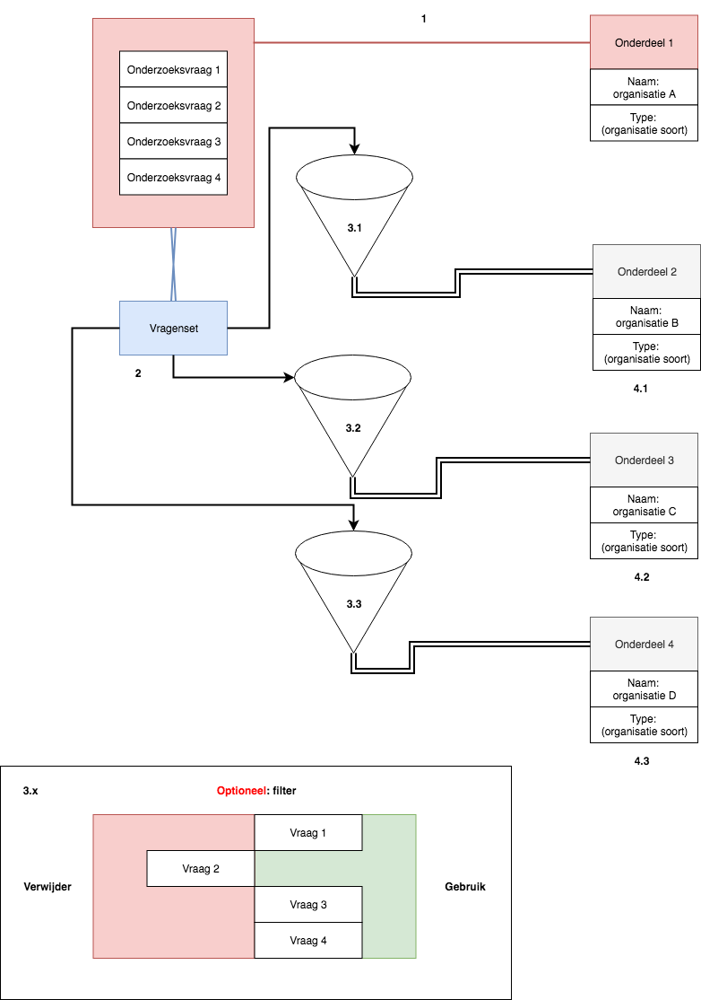

# Vragenlijst duplicatie

Tijdens het invulproces kunnen onderzoeksvragen van bepaalde onderdelen`*` worden hergebruikt voor zelfde soort onderdelen`*`.

Voorbeelden van onderdelen `*`
* Verantwoordelijke / slachtoffer
  * Persoon
  * Bedrijf
* Gebeurtenissen

## Vragenset

Een nieuw onderdeel is geboren: `vragenset`

Een lijst met vragen samenstellen als 1 entiteit, zorgt voor:
* Updatebaarheid
* Toepasbaarheid
* Kopieerbaarheid

Entiteit is iets dat op zichzelf kan staan, een ding, een [@wezen](http://www.mijnwoordenboek.nl/puzzelwoordenboek/ENTITEIT/1) dat een naam zou kunnen hebben.

## Werking

1. Een vragenlijst is aangemaakt
2. In vragenlijst zijn vragen opgesteld over een bepaald onderdeel. Dit kan bijvoorbeeld een organisatie zijn.
3. De vragenlijst wordt gezien als een entiteit en is herbruikbaar maar ook kopieerbaar.
  1. Een vragenlijst past niet bij elk onderdeel`*`. Uitzonderingen zijn belangrijk. Een filter op de vragenlijst zou een oplossing hiervoor kunnen zijn.
4. Het toepassen van een vragenlijst op een ander onderdeel.