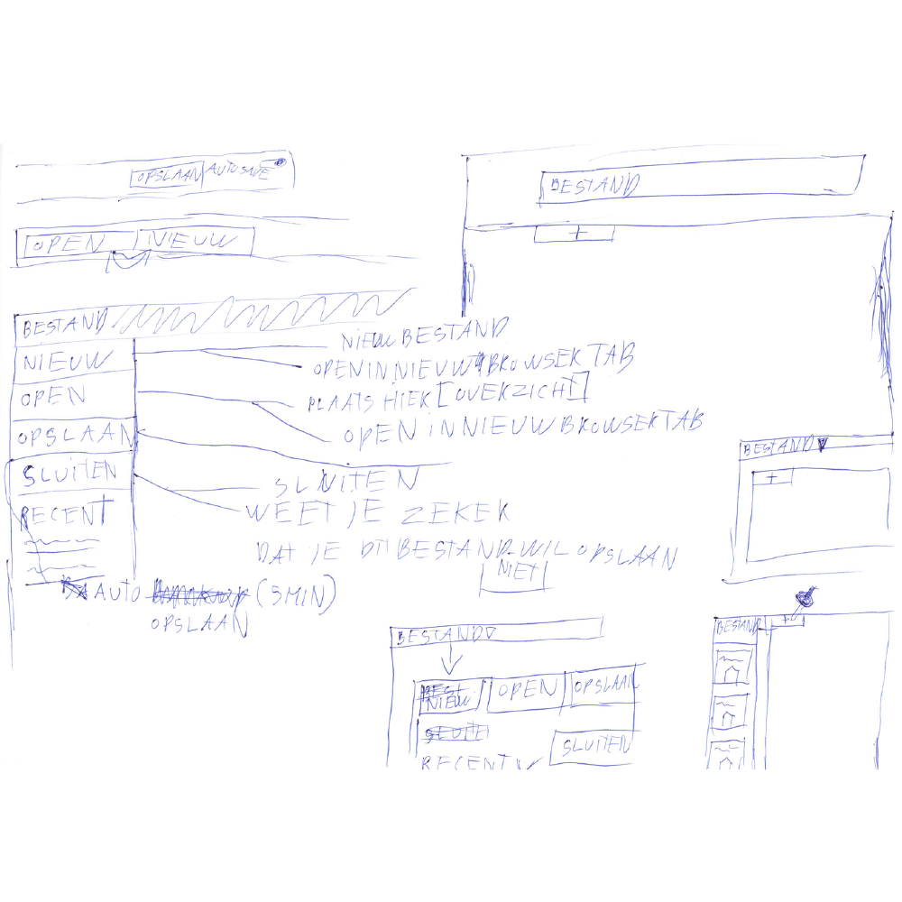
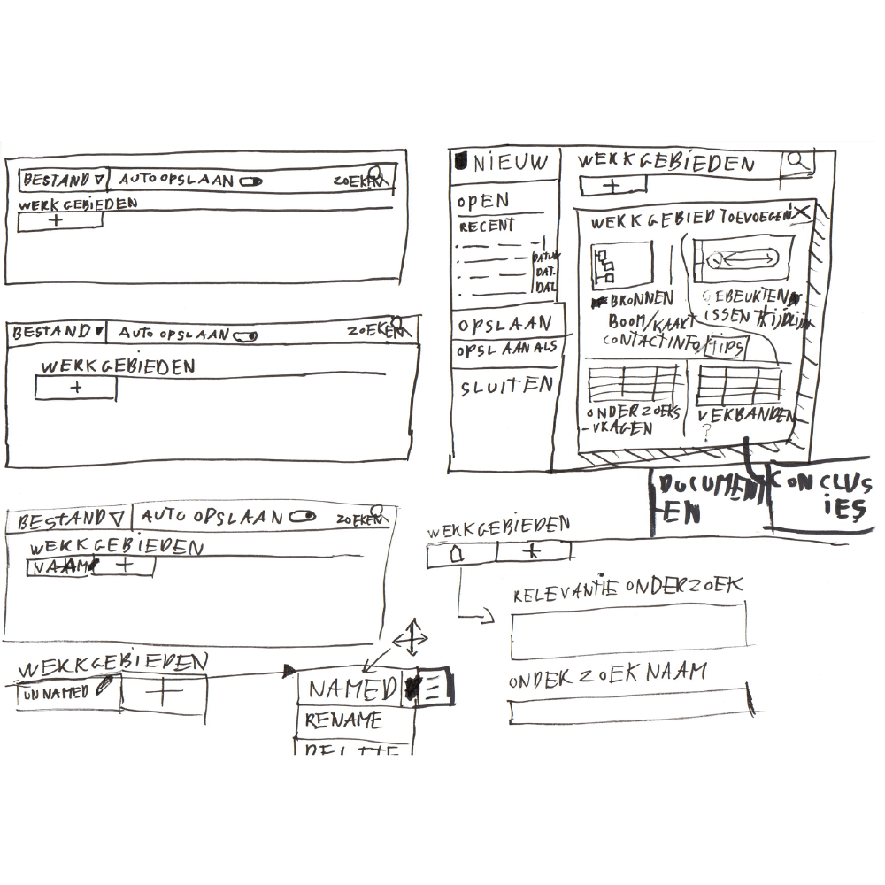

# Werkgebieden

Om de input informatie te kunnen opdelen in categorien, zijn er verschillende werkgebieden beschikbaar. Deze opdeling is belangrijk omdat elk informatie type andere eigenschappen heeft.

Een eerste snelle schets van het navigatie layout. Hier heb ik er voor gekozen om werkgebieden afzonderlijk te bouwen van de bovenbalk. De bovenbalk word namelijk gebruikt voor het opslaan en laden van projecten. Dit is de hoogste informatie-hiërarchie van de applicatie. Werkgebieden vallen binnen een project en zitten een informatie-hiërarchie niveau lager.

Vrij aan het begin van het concept zat ik te denken aan een manier om de gebruiker zelf werkgebieden toe te voegen. Maar na nader inzien merkte ik dat het juist tot meer werk leidt. Daarom heb ik er voor gekozen om deze optie niet te bieden, maar alle `*opties` te bieden die ik heb vast gesteld vanuit de data. 
* Zie opties hieronder

