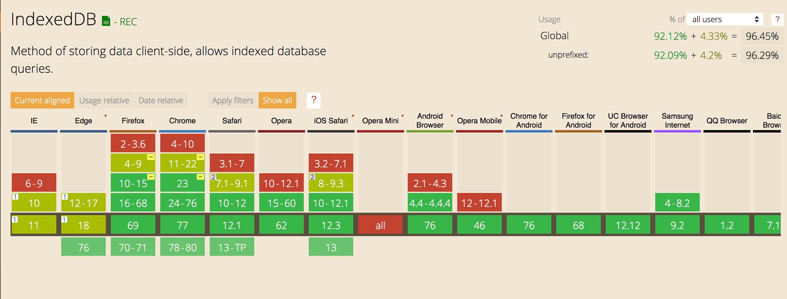

# Ethiek

## Informatie binnen het blauwdruk

De ethische kant binnen dit project speelt een grote rol voor de informatie die in de blauwdrukken voorkomen. Ik als ontwerper moet er rekening mee houden dat er over nagedacht is dat de gebruiker weet welke informatie er wel en niet ingestopt kan worden. Binnen de tijd die ik heb voor dit project heb kan ik niet overal op focussen.

### Gevoelige data

Mocht het blauwdruk gevoelige data gaan bevatten, dan moet er een meer dan basic encryptie komen voor deze data. Voor dit project gaat dit wellicht te veel tijd kosten. Het project moet wel reëel en haalbaar blijven. Het is daarom belangrijk dat ik ook zelf ga beslissen welke data er `niet` in het project komt. Naast de bronnen van de onderzoeksjournalist, wordt ik ook niet gelukkig als er gevoelige data in komt.

Hieronder aannames:

> Belang bij het niet tonen van gevoelige data in het product:
>
> * Bronnen
> * Onderzoeksjournalisten die het invoert
> * Ontwerper
> * Onderzoeksjournalist die de tool wil gebruiken om het onderzoek uit te leggen voor het publiek/lezer.
>
> Belang bij het tonen van gevoelige data in het product:
>
> * Onderzoeksjournalist die de tool wil gebruiken voorzichzelf of voor een collega die hij of zij kan vertrouwen.
>
> Ligt volledig aan de context:
>
> * Follow the Money
> * Eindredactie
>

## Data omgeving

Het eindproduct is een webapplicatie. 

__Deze keuze heb ik gemaakt voor de volgende redenen: (Niet alle punten zijn vanuit ethiek beschreven)__
* Onderzoeksjournalisten maken veel gebruik van de Webbrowser voor het vakgebied.
  * Het CMS van Follow the Money draait op een webapplicatie. 
  * Deskresearch gebeurt in de webbrowser.
  * De Google apps (Docs, Sheets) draaien in de webbrowser.
* Mocht een uitwerking van een journalistiekonderzoek worden gemaakt voor de doelgroep: Follow the Money lezer. Dan moet dat weer apart ontwikkeld worden voor op de website.
* De applicatie is eenvoudig deelbaar met collega's, sinds op een centraalpunt kan wordt gehost.
* De applicatie heeft geen toegang tot andere data dat op de onderzoeksjournalist zijn computer draait.
* Follow the Money is nog klein en het produceren van een native applicatie voor zowel Mac OS en Windows valt ver buiten het budget. Dat houd ook in dat de applicatie beschikbaar  gemaakt kan worden voor elk apparaat dat maar een browser ondersteund, klaar voor de toekomst!
* De applicatie kan geüpdate worden zonder complexe update tools.
* Ik kan zelf als ontwikkelaar beoordelen of er fouten in de code staan.

__Nadelen voor deze keuze ten opzichte van een native applicatie:__
* Native apps kunnen hogere prestaties behalen, omdat er programmeertalen gebruikt kunnen worden die dichter bij de processor en het geheugen staan.
* Data kan perongelijk gewist worden via browserinstellingen.
* Mocht de browser geïnfecteerd worden dan kan de veiligheid van de data in het geding zijn.

### Eigenschappen
* Lokale opslag
* Offline WEB-APP

### Opslag
* De data word opgeslagen in de [IndexedDB](https://developers.google.com/web/ilt/pwa/working-with-indexeddb)

#### IndexedDB

De indexedDB is een offline browser data-base gebruikt om offline data op te slaan.

> Each IndexedDB database is unique to an origin (typically, this is the site domain or subdomain), meaning it cannot access or be accessed by any other origin. 
(Google, z.d.-b)

De data is alleen beschikbaar via een unieke webadres. Dit betekend dat andere websites geen toegang tot deze data hebben.

[Browser ondersteuning: momenteel](https://caniuse.com/#search=IndexedDB)

[IndexedDB API](https://developer.mozilla.org/nl/docs/IndexedDB)

#### localStorage
`localStorage` is een soort database om data op te slaan binnen een bepaald website domein. Deze data is lokaal opgeslagen, dat betekend dat de data op de computer wordt opgeslagen. Maar na naderonderzoek blijkt het minder veilig te zijn dan de IndexedDB, [volgens dit artikel](https://dev.to/rdegges/please-stop-using-local-storage-1i04).

[localStorage API](https://developer.mozilla.org/en-US/docs/Web/API/Window/localStorage)

### Offline WEB-APP
* De webapplicatie draait op een geinstalleerde service worker en dat zorgt er voor dat de website ook offline beschikbaar is.
Het gebruik van een `service worker` heeft geen directe invloeden op de veiligheid van de data, maar verminderd de aanvragen van bestanden via het internet. Dit verminderd de kans op het downloaden van bestanden uit een overgenomen/gekaapte website binnen een specifiek website-domein. Je hebt dus meer controle over welke bestanden wel of niet gedownload worden.
[Service worker API](https://developer.mozilla.org/en-US/docs/Web/API/Service_Worker_API/Using_Service_Workers)

Kortom kan je offline werken als er geen of onbeveiligde wifi is.

## Gemakkelijk updatebaar

Websites zijn vrijwel altijd up-to-date met wat de server serveert, dit in vergelijking met bijvoorbeeld je Photoshop applicatie die je vaak handmatig moet updaten.

### Ethische voordelen updates
* Problemen verhelpen die tot ethische gevolgen leiden.

### Ethische nadelen updates
* Problemen veroorzaken die tot ethische gevolgen leiden.

