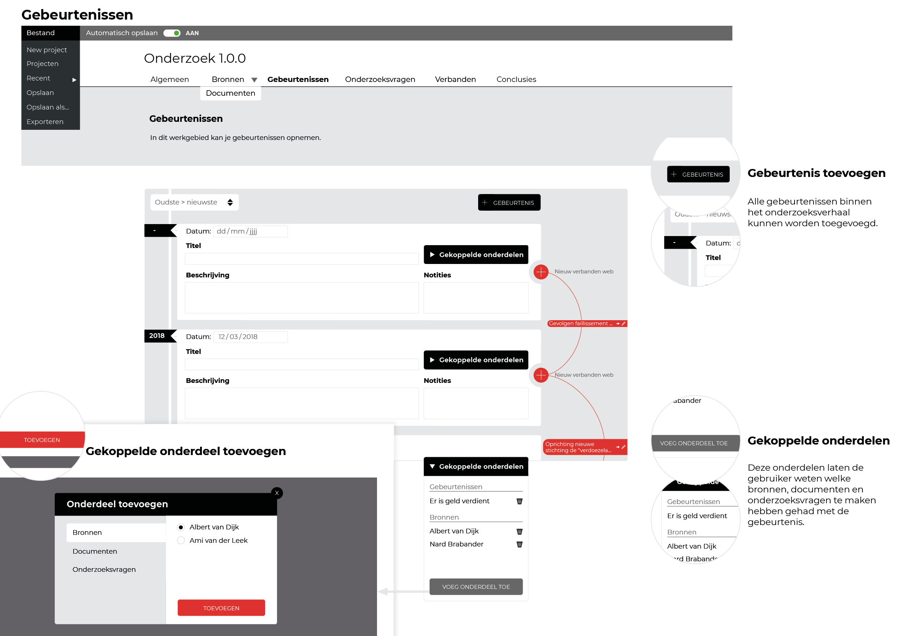

[Presentatie slides](https://iiyama12.github.io/Project-blauwdruk_html-content/groenlicht-presentatie/assets/player/KeynoteDHTMLPlayer.html#36)

## Ontwerp 1: Invoeren van onderzoeksdata v2_0_0

## Ontwerp 2: Visuele weergave v2_0_0

[Prototype V1_1_0](https://iiyama12.github.io/Project-blauwdruk_html-content/prototypes/output/version-3.0.0/)

Ondersteuning: Tablet / desktop

## Uitslag groenlichtpresentatie

[De volgende documenten als PDF](content/groenlicht-presentatie.pdf)

