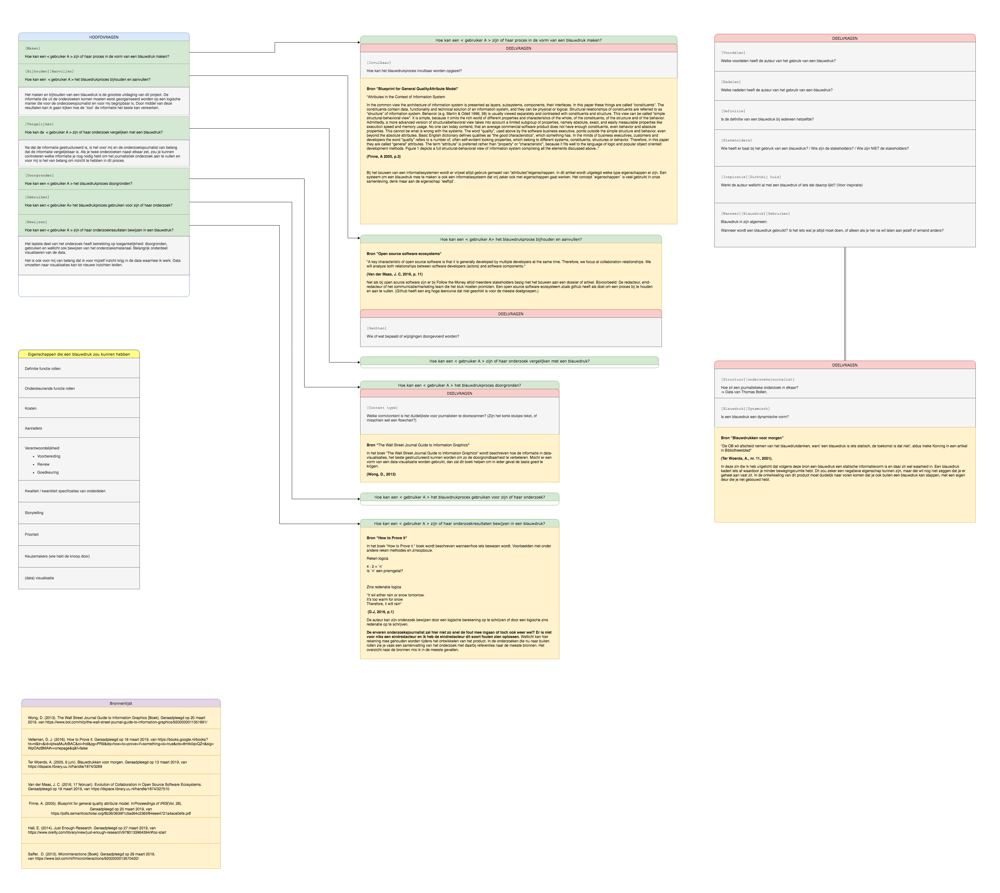

# Onderzoeksvragen

## Hoofdvragen
Hoe kan de onderzoeksjournalist zijn of haar proces in de vorm van een blauwdruk maken?
 `MAKEN`

Hoe kan de onderzoeksjournalist zijn of haar blauwdrukproces bijhouden en aanvullen?
 `BIJHOUDEN` `AANVULLEN`

Hoe kan de onderzoeksjournalist zijn of haar onderzoek vergelijken met een blauwdruk?
 `VERGELIJKEN`

Hoe kan de onderzoeksjournalist zijn of haar blauwdrukproces doorgronden?
 `DOORGRONDEN`

Hoe kan de onderzoeksjournalist zijn of haar blauwdruk gebruiken voor onderzoek? (+ welke informatie wordt er nodig)
 `GEBRUIKEN`
  

Hoe kan de onderzoeksjournalist zijn of haar onderzoeksresultaten bewijzen met een blauwdruk? 
 `BEWIJZEN` 

## Deelvragen
Hoe kan een blauwdrukproces invulbaar worden opgezet?
 `INVULBAAR` 

Wie of wat bepaald of er wijzigingen worden doorgevoerd in een blauwdruk?
 `RECHTEN`

Welke vorm/content is het duidelijkste voor journalisten te doorscannen? (Zijn het korte stukjes tekst, of misschien wel een flowchart?)
 `CONTENT TYPE`

Hoe zit een journalistieke onderzoek in elkaar?
 `STRUCTUUR`
 

Hoe dynamisch (flexibel voor content) kan een blauwdruk worden opgezet?
 `DYNAMISCH`
 

Welke voordelen en nadelen heeft de auteur van het gebruik van een blauwdruk?
 `VOORDELEN` `NADELEN`

Is de definitie van een blauwdruk bij iedereen hetzelfde?
 `DEFINITIE BLAUWDRUK`

Wie heeft er baat bij het gebruik van een blauwdruk? / Wie zijn de stakeholders? / Wie zijn NIET de stakeholders?
 `STAKEHOLDERS`

Werkt de auteur wellicht al met een blauwdruk of iets dat daarop lijkt?
 `INSPIRATIE DICHT BIJ HUIS`

Wanneer wordt een blauwdruk gebruikt? Is het iets wat je altijd moet doen, of alleen als je het na wil laten aan jezelf of iemand anders?
 `ALGEMEEN: GEBRUIK BLAUWDRUK`

Welke informatie moet een blauwdruk bevatten om gebruikt te kunnen worden?
 `INFORMATIE & GEBRUIK`

Wat is de werkwijze van een onderzoekjournalist?
 `WERKWIJZE`

## Onderzoeksvragen flow

### Versie 1.0.0

