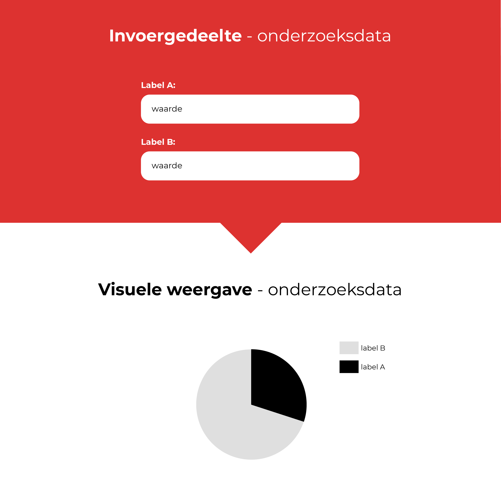
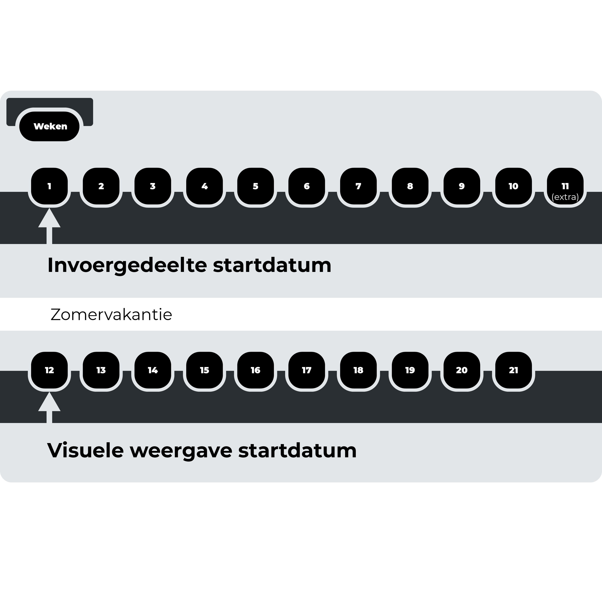

# Ontwerpproces

In dit hoofdstuk wordt uitgelegd hoe de ontwerpen van dit product tot stand zijn gekomen. Er worden in totaal 2 hoofdontwerpen beschreven. Het eerste ontwerp `invoergedeelte` gaat over de invoer van onderzoeksdata in database. Het tweede ontwerp gaat over de `visuele weergave` van de onderzoeksdata.

## Waarom 2 ontwerpen?
Het bouwen van een product die alle behoeftes van alle gebruikers vervuld is een lastige opgave. Dit wordt nog lastiger wanneer het product twee verschillende soorten rollen gaat spelen. Namelijk het invoeren van informatie, de informatie weergeven en daarbovenop moet het ook nog eens de informatie doorzoekbaar maken.

Wanneer je deze rollen vanaf het begin van de productontwikkeling gaat bundelen in 1 product wordt het een rommeltje. Te veel interactie-elementen op hetzelfde scherm, moeilijke keuzes maken welke elementen moeten blijven en het is lastig om de beste gebruikersflow te vinden.

## Vertakking naar een tweede ontwerp
Het eerste ontwerpt, het `invoergedeelte van de onderzoeksdata` heeft zich vertakt in een tweede ontwerp.

__Vanaf:__ Invoergedeelte 

__Naar:__ Visuele weergave

## Focus op het tweede ontwerp: Visuele weergave
Binnen de tijd die er beschikbaar is voor dit afstudeerproject, is het voor mij van belang dat ik keuzes maak welke ontwerp ik het verste uitwerk. De keuze die ik gemaakt heb, is het ontwerp de `visuele weergave van de onderzoeksdata` geworden. De belangrijkste reden achter deze keuze, aannamen: Je kan de frictie / drempel van het `invoergedeelte` zo laag mogelijk maken door slimmen oplossingen te verzinnen, maar als de __meerwaarde__ van de `Visuele weergave` niet een veelvoud van het `invoergedeelte` is, dan is de drempel nogsteeds te hoog om het daadwerkelijk te gaan gebruiken.

## Startdatums ontwerpen

