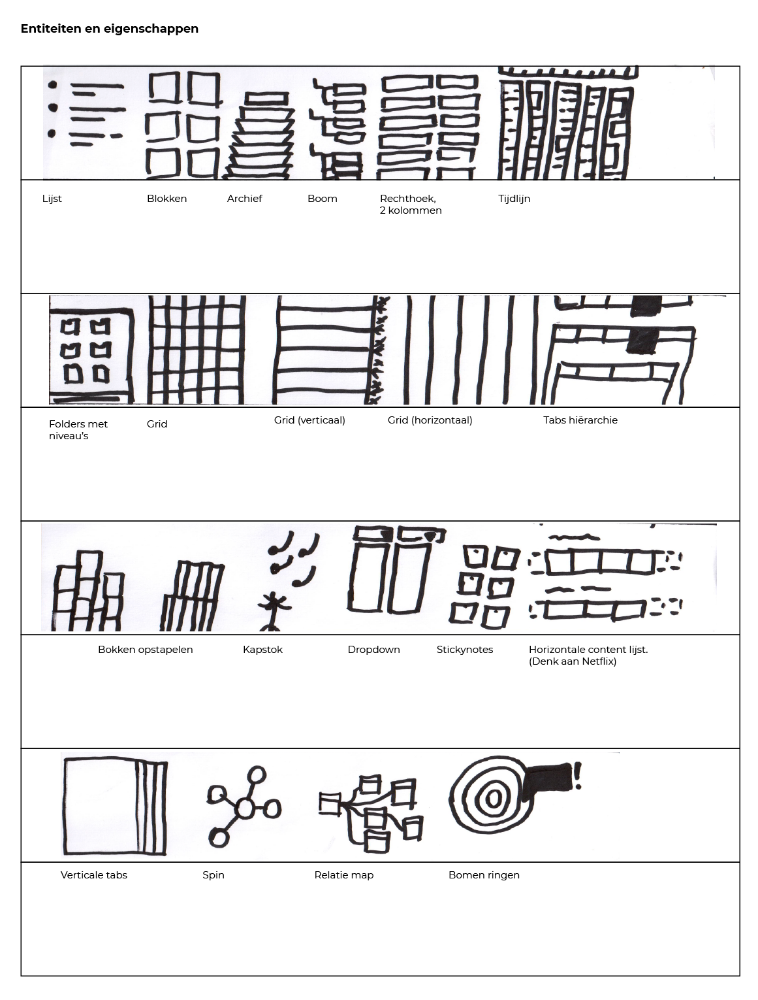
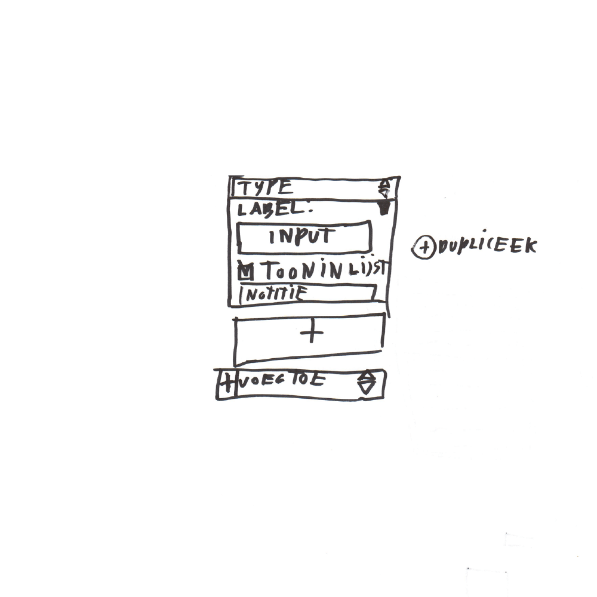
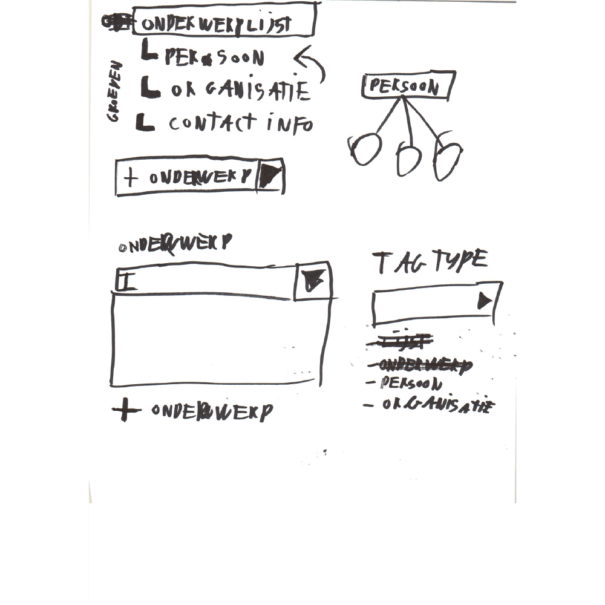
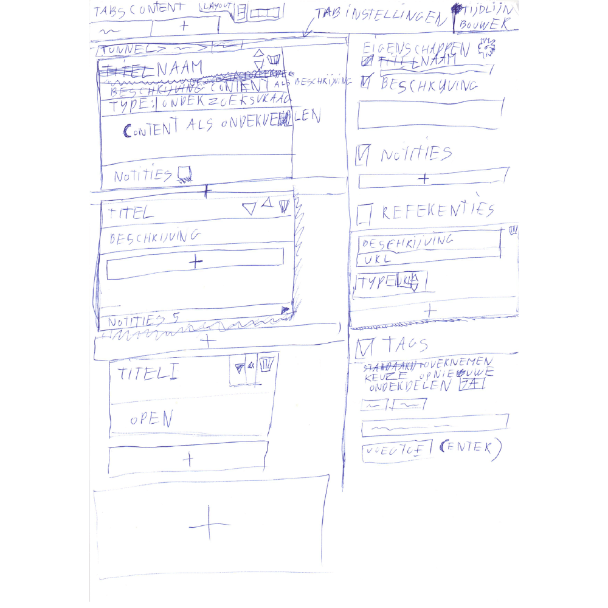
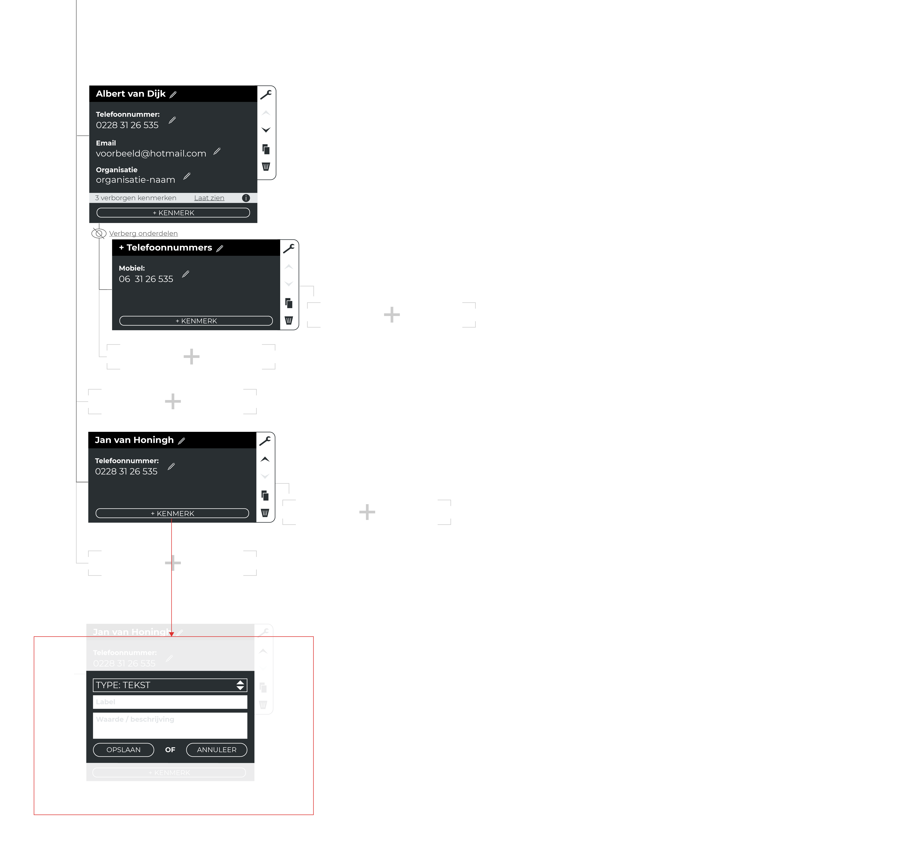

Op deze pagina is de vertaalslag naar een eerste ontwerp te vinden. Dit ontwerp is specifiek gericht op het invoeren van broninformatie.

__Met behulp van:__

* Informatiestructuur
* Task-analyse

## Informatiestructuur

De informatiestructuur van het bijbehorende concept: boom hiërarchie

* Boom / root
  * Bron 1
    * Naam
    * Eigenschap 1
      * Naam
      * Waarde
      * Type / tag / groep
    * Eigenschap 2
      * Naam
      * Waarde
      * Type / tag / groep
  * Bron 2
    * Naam
    * Eigenschap 1
      * Naam
      * Waarde
      * Type / tag / groep
    * Eigenschap 2
      * Naam
      * Waarde
      * Type / tag / groep

## Task-analyse

* `3.0` Voeg een onderdeel toe (bron)
  * `Stappen`3.2`,`3.3`en`3.4`zijn optioneel`
  * `3.1` Doe: voeg onderdeel toe
  * `3.2` Vul onderdeel naam in
  * `3.3` Vul onderdeel type in
  * `3.4` Vul onderdeel beschrijving in
  * `3.5` Bevestig toevoegen (misschien)
* `4.0` Verwijder onderdeel (bron)
  * `4.1` Doe: verwijder onderdeel
  * `4.2` Bevestig verwijderen onderdeel

## Eerste schetsen

### Morfologische-kaart

Mijn eerste schetsen van een bepaald ontwerp zijn vaak vormschetsen. De ruimte indeling bepaald hoeveel functionaliteiten je in je applicatie kwijt kan, of de applicatie kan door groeien en meest belangrijk of de hiërarchie correct is.

### Eerste indeling

Voor de eerste indeling heb ik het scherm in 2e gedeeld. De linkerkant wordt gebruikt voor de boomstructuur hiërarchie en de rechtekant is waar je details van bronnen kan weergegeven wanneer je ergens extra informatie over wilt hebben. De rechterkant is overigens standaard verborgen, totdat je details wil weergeven.

### Informatiestructuur vrijheid

__De volgende iteratie geeft de gebruiker nu de mogelijkheid om zelf de hiërarchie te bepalen. Er zitten nu controls bij:__
* Bronnen naar boven en naar beneden te schuiven.
* Bronnen verwijderen.
* Bronnen te verbergen.
* Details: eigenschap
  * Invulveld naam eigenschap.
  * Invulveld waarde eigenschap.

### Pas informatie direct aan bij de bron(entiteit) zelf

* Design pattern [Inplace Editor](http://ui-patterns.com/patterns/InplaceEditor) > In dit pattern heb je de mogelijkheid om een waarde aan te passen op dezelfde plek als het wordt weergegeven. Dit heeft als voordeel dat de gebruiker niet naar een andere pagina wordt gestuurd om iets aan te passen.
* Dupliceer eigenschap. > Experimenteel, moet getest worden.
* Notitie veld toegevoegd. > Een plek voor je eigen aantekeningen.
* Type eigenschap. > Meta-informatie toevoegen aan een eigenschap van een bron.

### Categorieën

* Categorieën als dropdown of tekst invulveld met suggesties. Categoriseer de bron. Gaat het om een persoon, een organisatie of wellicht extra contactinformatie.
* Tags in plaats van categorieën. Tags bieden meer vrijheid dan categorieën, omdat deze vorm meerdere antwoorden toelaat. Maar ook kan het zorgen tot verwarring en inconsistentie.

### Alles laten samenkomen

## Eerste design

Klaar voor een prototype!

