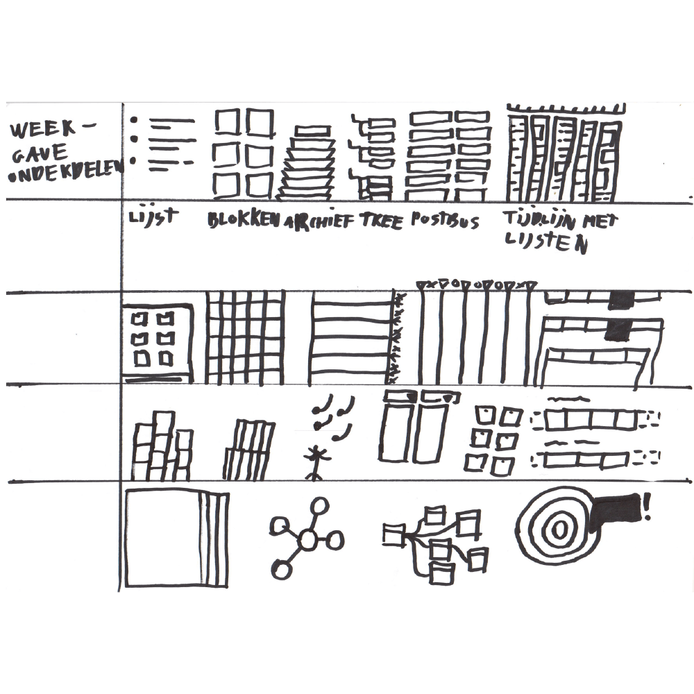
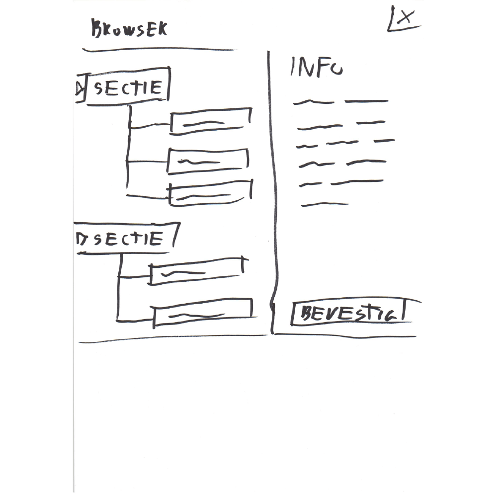
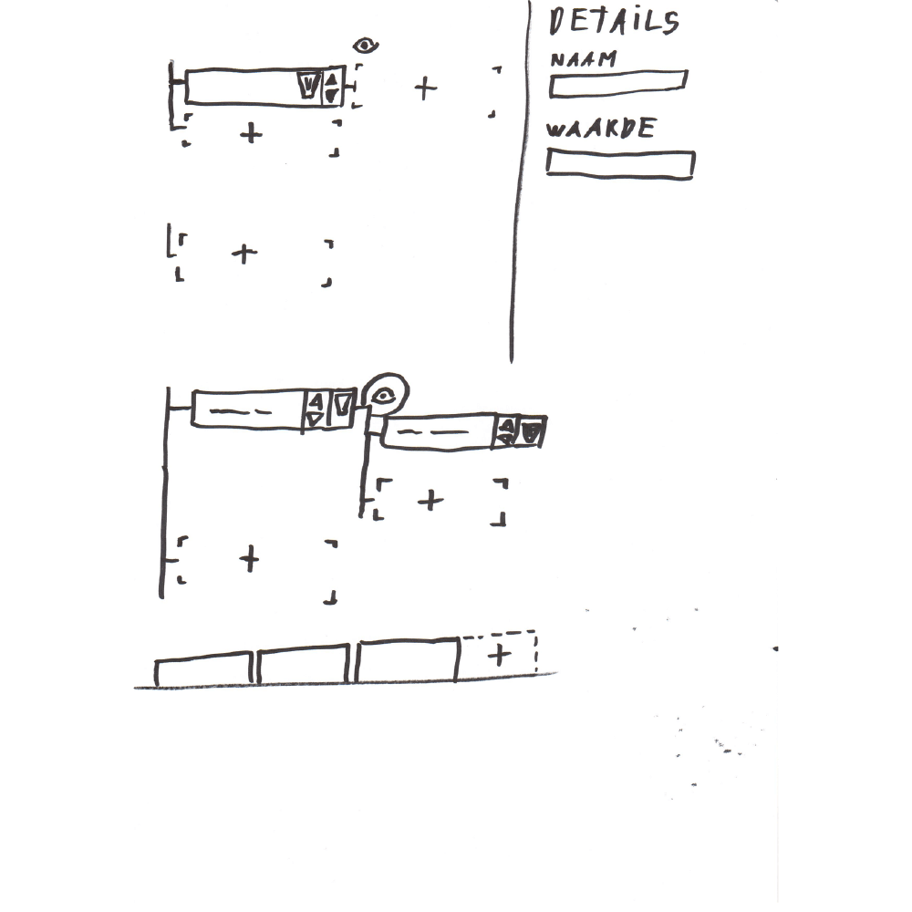

Op deze pagina is de vertaalslag naar een eerste ontwerp te vinden. Dit ontwerp is specifiek gericht op het invoeren van broninformatie.

## Task-analyse
Om deze te maken was de eerste versie van de [Task-analyse](https://app.gitbook.com/@jorik/s/project-blauwdruk/research_methods/task-analyse) nuttig om de stappen in de gebruikersinterface te verzamelen. Stappen waaronder data toevoegen, verwijderen en referenties toevoegen.

## Concept boomstructuur hiërarchie
In dit concept wordt informatie gehangen aan een 'boom'. 

Een boom heeft een stam, de stam heeft takken  ... , de takken hebben kleineren takken ... en de kleinste takken hebben dan de bladeren  ... .

Moeilijk voor je te zien? Denk maar eens aan een stamboom, dat is een heel concreet voorbeeld van een informatieboom. Alleen de informatie van een bron is complexer dan een basis stamboom zou kunnen bevatten.

## Informatie structuur

* Boom / root
  * Bron 1
    * Naam
    * Eigenschap 1
      * Naam
      * Waarde
      * Type / tag / groep
    * Eigenschap 2
      * Naam
      * Waarde
      * Type / tag / groep
  * Bron 2
    * Naam
    * Eigenschap 1
      * Naam
      * Waarde
      * Type / tag / groep
    * Eigenschap 2
      * Naam
      * Waarde
      * Type / tag / groep

Met de content vorm lijsten (in lijsten in lijsten) krijg je al vrij snel een boomstructuur.

## Eerste schetsen

Mijn eerste schetsen van een bepaald ontwerp zijn vaak vormschetsen. De ruimte indeling bepaald hoeveel functionaliteiten je in je applicatie kwijt kan, of de applicatie kan door groeien en meest belangrijk of de hiërarchie correct is.

