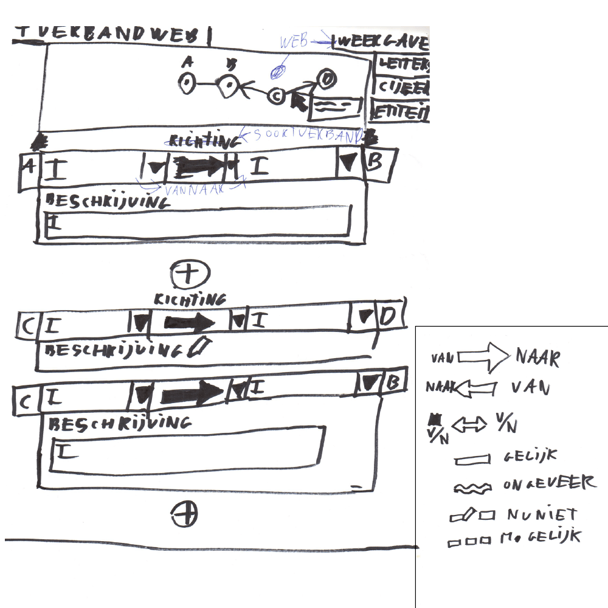

Tijdens het ontwerpen van deze gebruikersinterface om verbanden vast te leggen, liep ik tegen het volgende vraagstuk aan:

> Mag de gebruiker naast verbanden trekken tussen gebeurtenissen, ook verbanden trekken tussen bronnen of documenten?

Om deze te beantwoorden ben ik gaan kijken of dit nuttig is en of het misschien te veel vrijheid bied.

Voor nu houd ik er rekening mee met het idee dat niet alleen gebeurtenissen kunnen zijn, maar het zou ook een verband kunnen zijn tussen een bron en een gebeurtenis. Dit zorgt even voor wat meer vrijheid binnen het iteratieproces.

__Bijvoorbeeld:__
| __Persoon A__ | __heeft organisatie B opgericht__ |
| __Bron__ | __Gebeurtenis (+ organisatie)__ |

## Variant A

__Deze variant bestaat uit:__
* Voorvertoning in de vorm van een __netwerk diagram__.
  * Entiteiten (Cirkels met A, B, C)
    * Tooltip (Met muis hover kan je de naam van het entiteit bekijken)
  * Verbanden (Lijnen tussen de cirkels)
    * Tooltip (Met muis hover kan je de beschrijving zien)

* Verbanden (__Invulvelden onder de netwerk diagram__)
  * Startpunt (Entiteit)
  * Richting (pijl)
  * Eindpunt (entiteit)
  * Beschrijving

De onderzoeksjournalist heeft de mogelijkheid om steeds een verband tussen 2 entiteiten te trekken. Zie implementatie van het vorige voorbeeld.

* Verbanden
  * Startpunt: __Persoon A__
  * Richting: ->
  * Eindpunt: __organisatie B is opgericht__
  * Beschrijving: __Persoon A heeft organisatie B opgericht om geld mee te verdienen__

* Voorvertoning: 
  * __Persoon A__ = __A__
    * Tooltip 'Persoon A'
  * Verband = lijn tussen __A__ en __B__
    * Tooltip: 'Persoon A heeft organisatie B opgericht om geld mee te verdienen'
  * __organisatie B is opgericht__ = __B__
    * Tooltip 'organisatie B is opgericht'

## Variant B

De gebruiker kan in deze variant direct manipulatie gebruiken.

* Klikken op het entiteit geeft een sub-menu weer. Met de opties:
  * Sluiten sub-menu.
  * Pas entiteit aan. 
  * Verwijder entiteit.
* Klikken op de rand zorgt voor een tweede entiteit, die gekoppeld zit aan de eerst.
* Drag en drop is mogelijk door over het entiteit te hoveren, muisknop in te drukken en te verplaatsen. Het sub-menu opent in dit geval niet.

Verbanden tussen entiteiten (bronnen) invullen, zodat er een visualisatie uitrolt.

