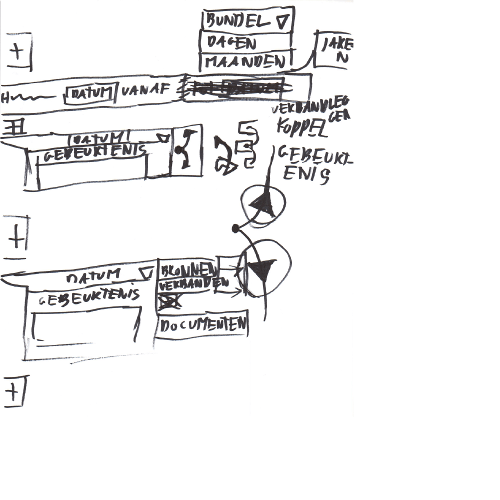
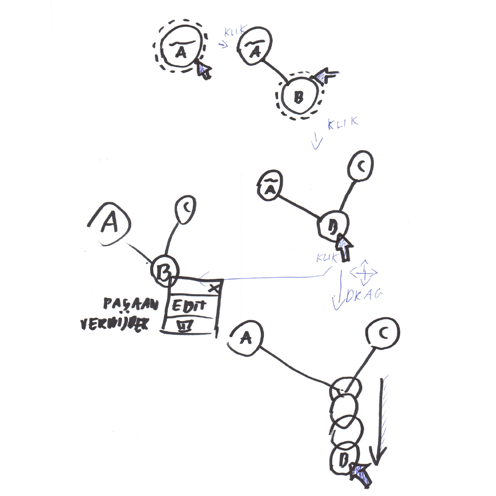

Tijdens het ontwerpen van deze gebruikersinterface om gebeurtenissen in vast te leggen liep ik tegen het volgende vraagstuk aan:
> Mag de gebruiker naast verbanden trekken tussen gebeurtenissen, ook verbanden trekken tussen bronnen of documenten?

Om deze te beantwoorden ben ik gaan kijken of dit nuttig is en of het misschien te veel vrijheid bied.

Verbanden tussen entiteiten (bronnen) invullen, zodat er een visualisatie uitrolt.
