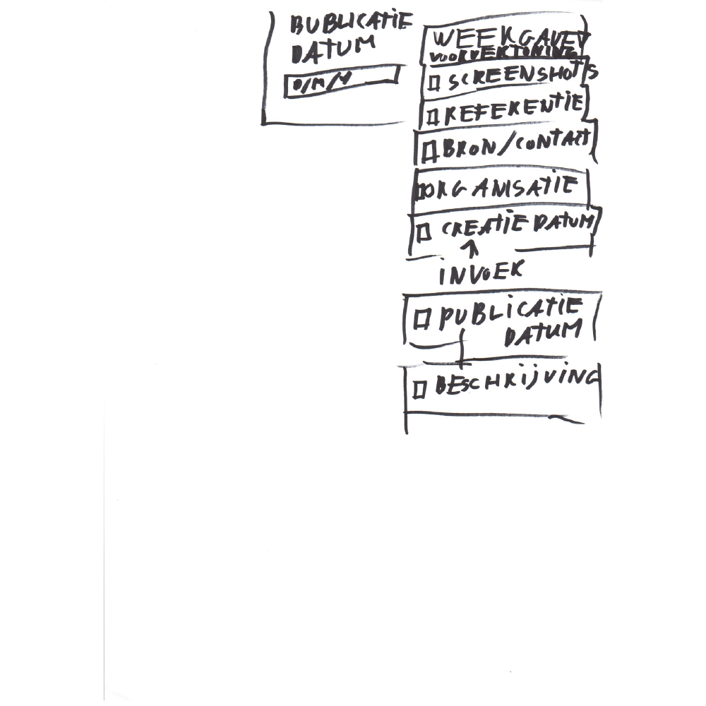


Beschrijvingen toevoegen


Het gebruik van documenten (jaarverslagen) is een belangrijke bron van informatie en daar naar toe moet gerefereerd kunnen worden.

### Verwijderde documenten
Mocht een organisatie of een persoon een document verwijderen, dan heb je als back-up nog een screenshot ervan.

### Ethisch
De `document status` is relevant voor de veiligheid van de bronnen die de informatie hebben weggegeven.