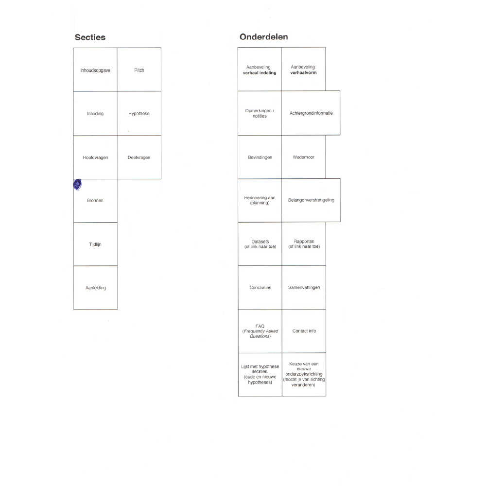

<!--  -->

__Eigenschappen:__

* __Naam__ 
De naam van het document. 
 
* __Link(url)__ 
tTegang tot je document die je in de cloud hebt opgeslagen. (Google: Docs, Spreadsheets, Drive)
 
* __Screenshots__ 
Screenshots kunnen gebruikt worden voor herkenning van het document of als bewijsmateriaal.
 
* __Beschrijving__
* __Documentstatus__ 
Aangegeven of een document gelekt is. (Mag dus niet binnen een publicatie gebruikt worden)
 
* __Type__ (Document type: pdf, excel, psd)
* __Bron/contactpersoon__ 
De persoon die het document heeft vrijgegeven.
 
* __Organisatie__ 
De organisatie die het document heeft vrijgegeven.
 
* __(Publicatiedatum of/en toevoegingsdatum)__ 
Maakt het mogelijk om documenten te sorteren op tijd.

Een digitale schets.

### Verwijderde documenten
Mocht een organisatie of een persoon een document verwijderen, dan heb je als back-up nog een screenshot ervan.

### Document gebruik
De `documentstatus` is relevant voor de veiligheid van de bronnen die de informatie hebben weggegeven.