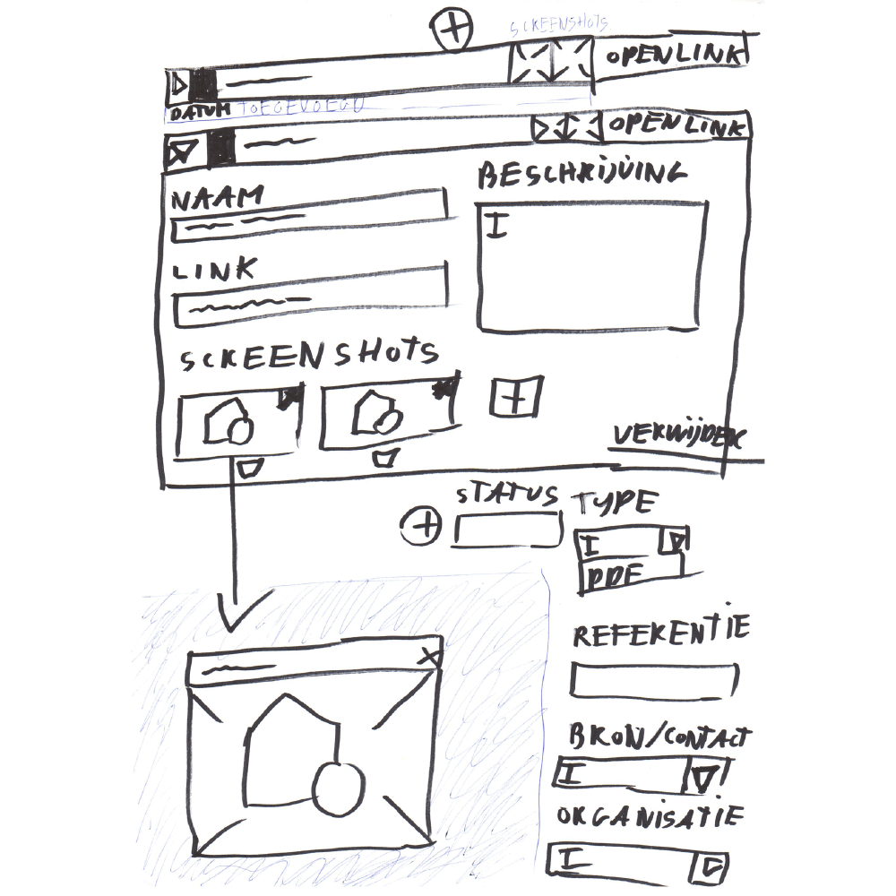

> Welke informatie heb je nodig om naar een document te refereren, het document niet op te laten slaan in de applicatie, maar wel het mogelijk maken om er bij te kunnen? 

Om dit mogelijk te maken heb ik deze eigenschappen lijst samengesteld:

* __Naam__
De naam van het document. 
<br>
* __Link(url)__ (Inspiratie uit Masterfile)
Toegang tot je document die je in de cloud hebt opgeslagen. (Google: Docs, Spreadsheets, Drive)
<br> <br>
* __Screenshots__
Screenshots kunnen gebruikt worden voor herkenning van het document of als bewijsmateriaal.
<br>
* __Beschrijving__
* __Documentstatus__ (Inspiratie uit Masterfile)
Aangegeven of een document gelekt is. (Mag dus niet binnen een publicatie gebruikt worden)
<br>
* __Type__ (Document type: pdf, excel, psd)
* __Bron/contactpersoon__  (Inspiratie uit Masterfile)
De persoon die het document heeft vrijgegeven.
<br>
* __Organisatie__ (Inspiratie uit Masterfile)
De organisatie die het document heeft vrijgegeven. 
<br>
* __(Publicatiedatum of/en toevoegingsdatum)__  (Inspiratie uit Masterfile)
Maakt het mogelijk om documenten te sorteren op tijd.

<!--  -->




De document-referenties zijn voorzien van een [details + summary](https://developer.mozilla.org/en-US/docs/Web/HTML/Element/details) element, om de details te verbergen van het document.

[Design pattern: Accordion Menu](http://ui-patterns.com/patterns/AccordionMenu)

__Technische specificatie:__

* details element: Informatie verbergen wanneer het 'details element' gesloten is.
* summary element: Deze informatie wordt altijd weergegeven. (Samenvatting)

```HTML
<details>
  <summary>Altijd zichtbaar</summary>
  Verborgen content
</details>
```


Een digitale schets.


### Verwijderde documenten
Mocht een organisatie of een persoon een document verwijderen, dan heb je als back-up nog een screenshot ervan.

### Document gebruik
De `documentstatus` is relevant voor de veiligheid van de bronnen die de informatie hebben weggegeven.