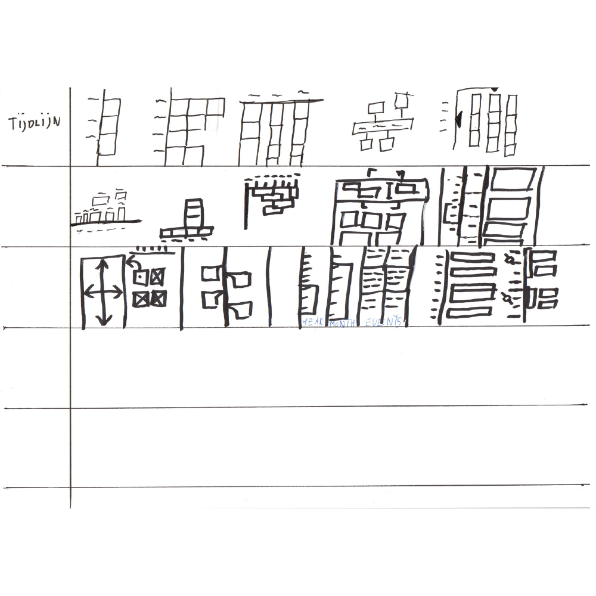
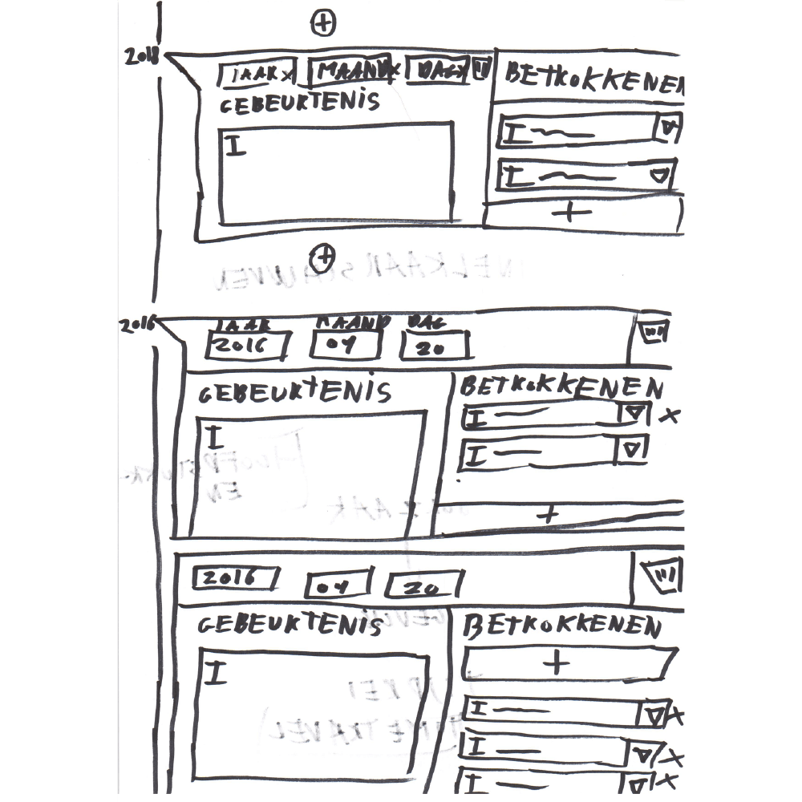
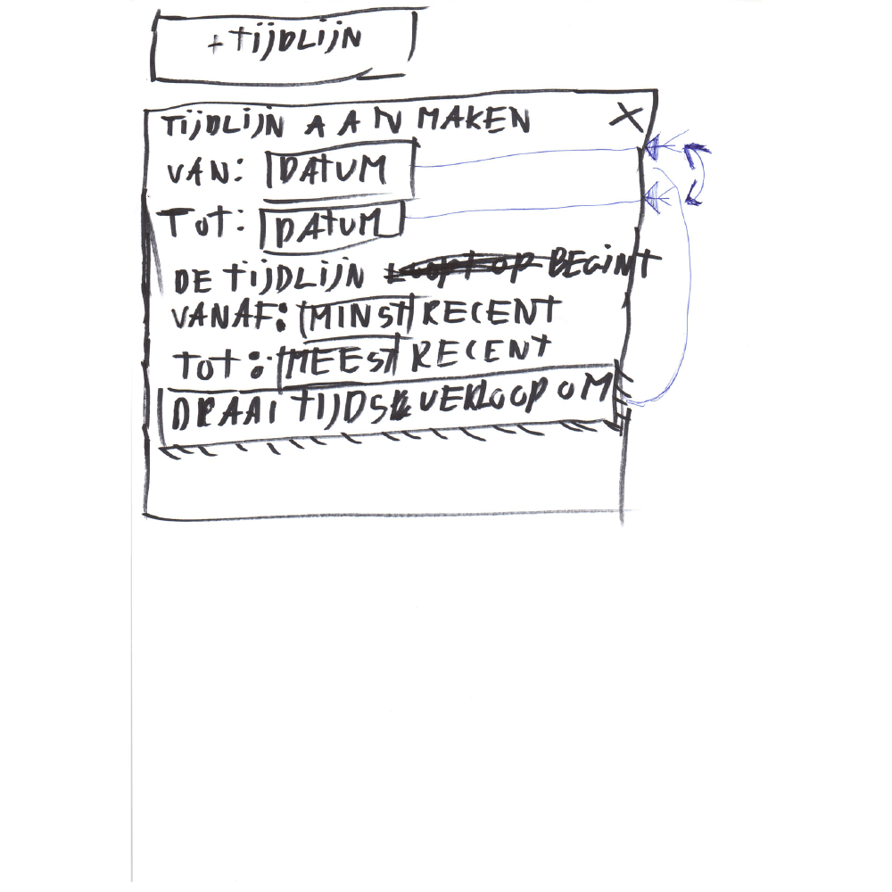
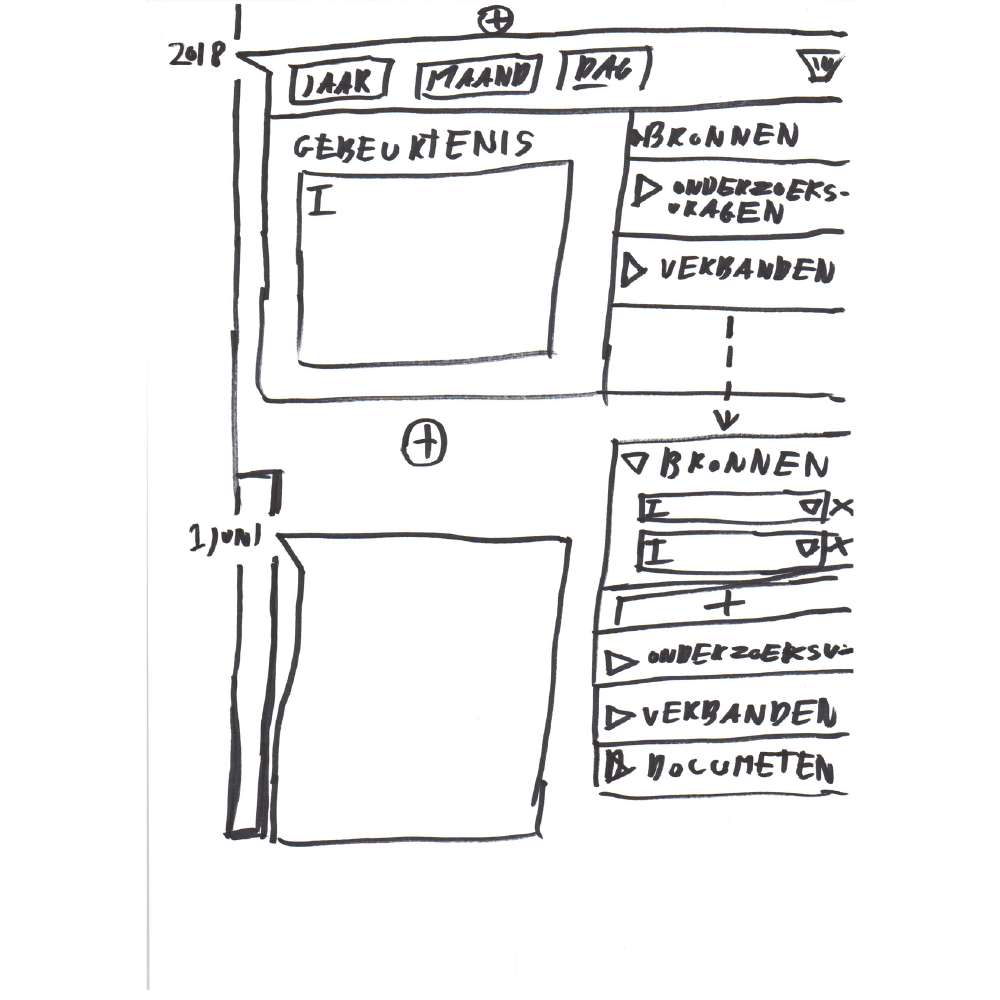
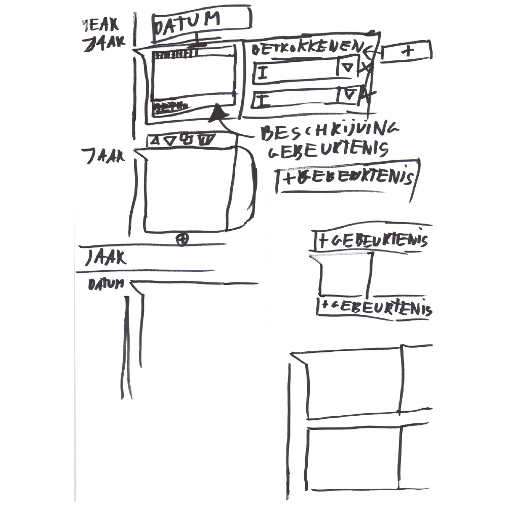
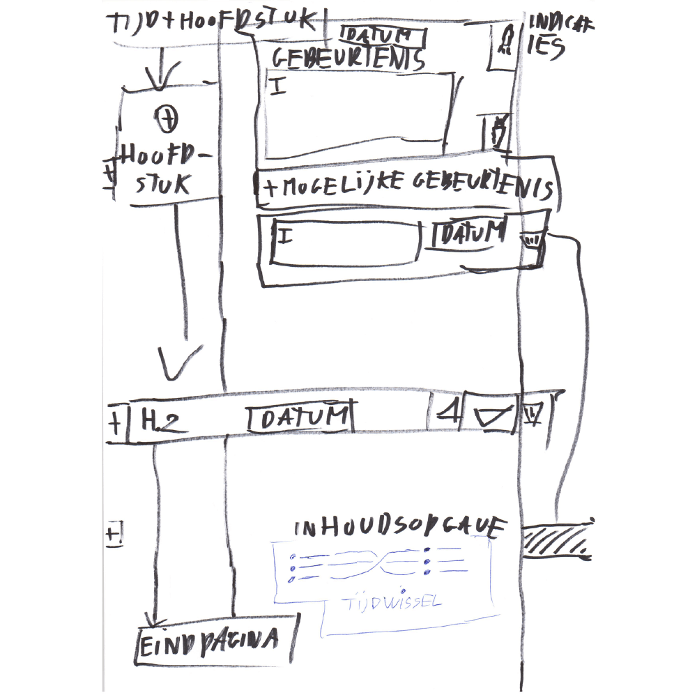
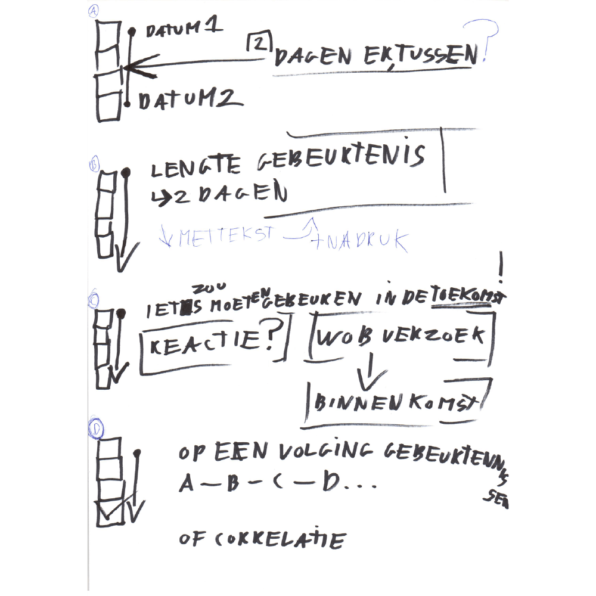
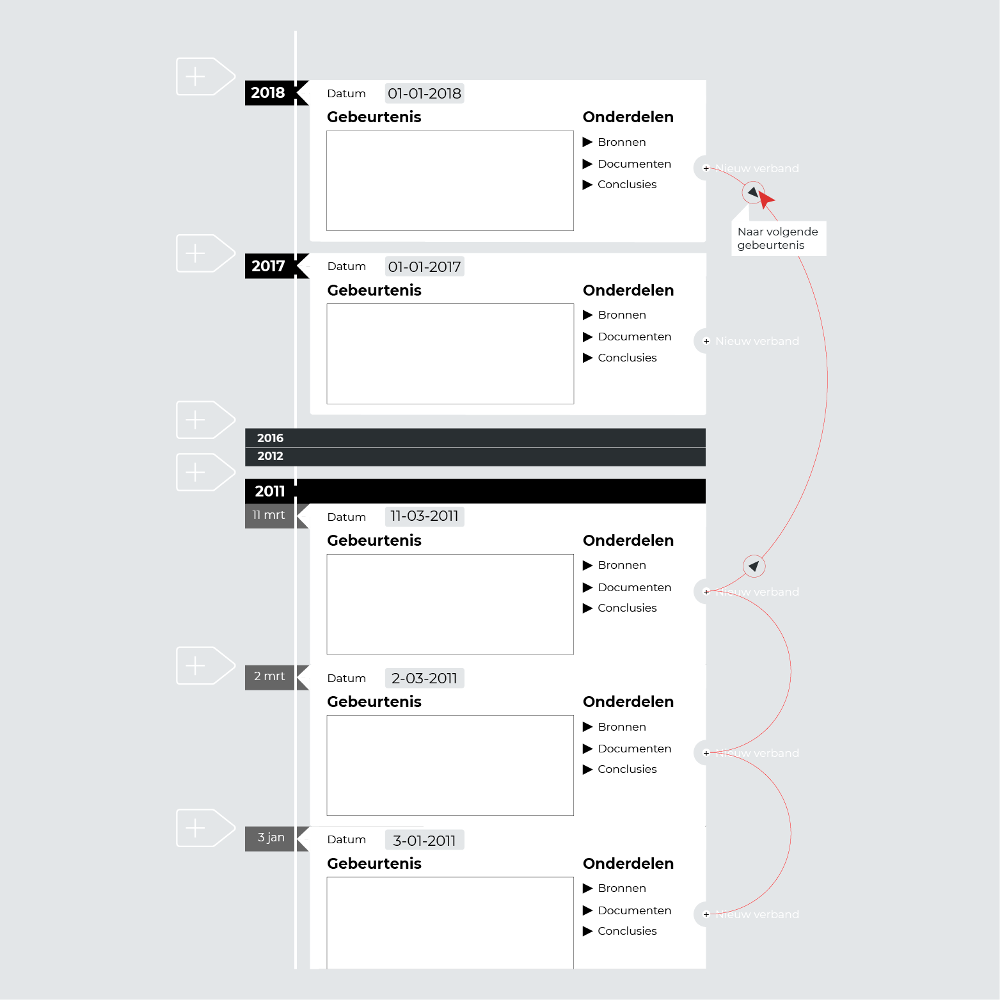


Beschrijvingen toevoegen


## Onderzoeksmethodes
* [Tijdlijn analyse](https://jorik.gitbook.io/project-blauwdruk/research_methods/analyse_content/tijdlijn)
* [Interviews met als onderwerp: tijdlijn](https://jorik.gitbook.io/project-blauwdruk/research_methods/interview/onderzoeksjournalist/tijdlijn)
* [Morfologische-kaart](https://jorik.gitbook.io/project-blauwdruk/research_methods/morfologische-kaart/tijdlijn)

__Deze tijdlijn bestaat uit 3 delen:__
* Datums
* Gebeurtenis beschrijving + onderdelen
* Verbanden van opeenvolging van gebeurtenissen.
