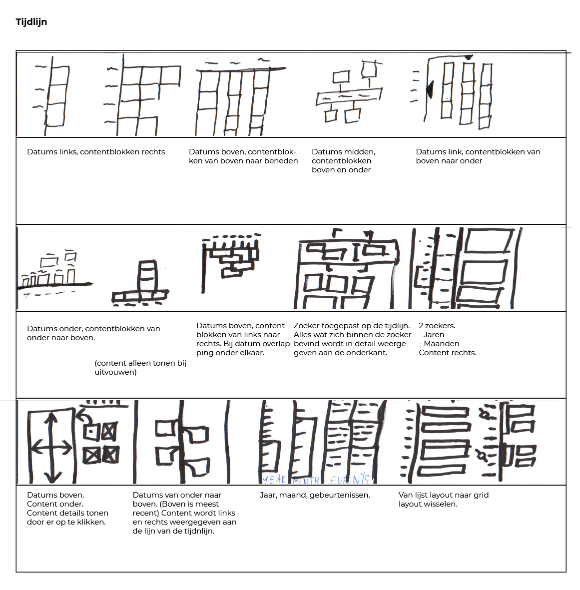

Het zoeken naar de beste indeling van een tijdsweergave.

__Onderdelen:__
* Tijdindicatie
* Gebeurtenis
* Koppelingen (betrokkenen) met: bronnen, documenten, etc.

De tijdsweergave voor het gebruik en bekijken van een tijdlijn is niet voor iedereen hetzelfde.

__Wanneer je gebeurtenissen toevoegt aan een tijdlijn:__
In het beginstadium is het logisch om met de oudste gebeurtenissen beginnen en steeds een meer recente gebeurtenis toe te voegen. Uit eindelijk staan de meest recente gebeurtenissen bovenaan en de oudste onderaan.

__Wanneer je de tijdlijn wil bekijken:__
Een tijdlijn lees je vaak in een chronologsche volgorde van oud naar nieuw. Het is toch ook onlogisch om een boek achterstevoren te lezen? Een tijdlijn verteld net als een boek een verhaal.

Om de gevarieerde tijdsweergave op te lossen is het handig om de tijdsvolgorde om te draaien.

Koppelingen (bronnen, documenten etc.) hebben nu een eigen detail weergave. (Meer of minder informatie tonen)

Hoofdstukken toevoegen binnen een tijdsweergave.

__Deze tijdsweergave bestaat uit 3 delen:__
* Datums (linkerkant)
* Gebeurtenis beschrijving + onderdelen (midden)
* Verbanden van opeenvolging van gebeurtenissen. (rechterkant)

