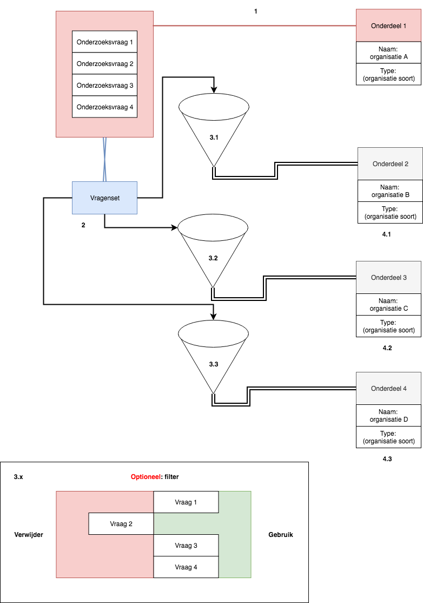

## Onderzoeksvraag

Onderzoeksvragen spelen een belangrijke rol in het onderzoeksproces van de onderzoeksjournalist. Deze vragen hebben als functie om op zoek te gaan naar verborgen informatie en er achter  komen wat er nu eigenlijk echt aan de hand is.

Bij sommige betrokkenen in het journalistieke onderzoek kunnen dezelfde vragen gesteld worden. Vaak zijn deze betrokkenen gekoppeld aan een organisatie of delen ze dezelfde belangen. Kom je betrokkenen tegen die dezelfde belangen hebben, een zelfde soort functie heeft of bij een zelfde soort organisatie werkt, dan kan je de onderzoeksvragen opnieuw stellen.

## Doelen
* Automatisch antwoorden samenvoegen, om beter samen te vatten en conclusies te trekken
* Tijdbesparen met invullen (subdoel)

## Concept zin

Tijdens het invulproces van de onderzoeksjournalist, kunnen onderzoeksvragen van bepaalde betrokkenen`*` opnieuw worden gesteld aan andere betrokkenen binnen hetzelf onderzoek. Dit moet er toe leiden dat je op 1 centraal punt dezelfde onderzoeksvragen kan stellen aan meerdere betrokkenen.

__Voorbeelden van betrokkenen__ `*`
* Verantwoordelijke / slachtoffer
  * Persoon
  * Bedrijf

## Vragenset

Een nieuw entiteit is geboren, de: `vragenlijst`

Dit is lijst met vragen en moet zorgt voor:
* Updatebaarheid
* Herbruikbaarheid

## Werking

1. Er is bijvoorbeeld organisatie waarbij de onderzoeksjournalist onderzoeksvragen stelt.
2. De onderzoeksjournalist kan een lijst maken van de belangrijkste onderzoeksvragen en deze invoeren in de tool. De lijst vragen zijn nu de entiteit `vragenlijst` geworden.
3. Er zijn 3 andere soort gelijke organisaties, waarbij dezelfde soort vragen gesteld kunnen worden: ***4.1***, ***4.2***. en ***4.3***. De `vragenlijst` kan worden hergebruikt bij deze organisaties, met als optie om vragen te filteren ***3.x***.
4. De onderzoeksjournalist kan nu de `vragenlijst` gebruiken om per organisatie de juiste onderzoeksvragen te stellen.

## Betrokkenen als bronnen
Sinds de betrokkenen ook gezien kunnen worden als 'bronnen' en deze als in het systeem voorkomen, is het voor de eenvoud handig om binnen de onderzoeksvragen ook de entiteit 'bronnen' te gebruiken.

