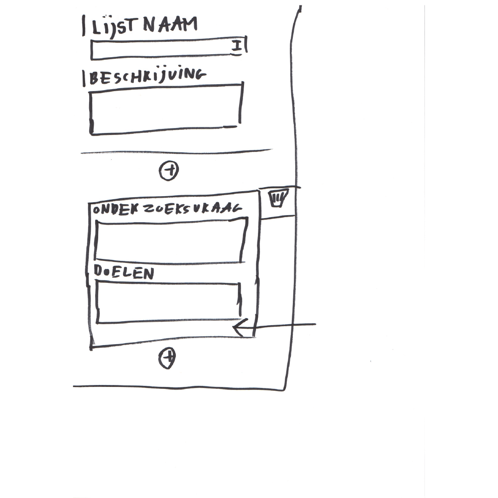
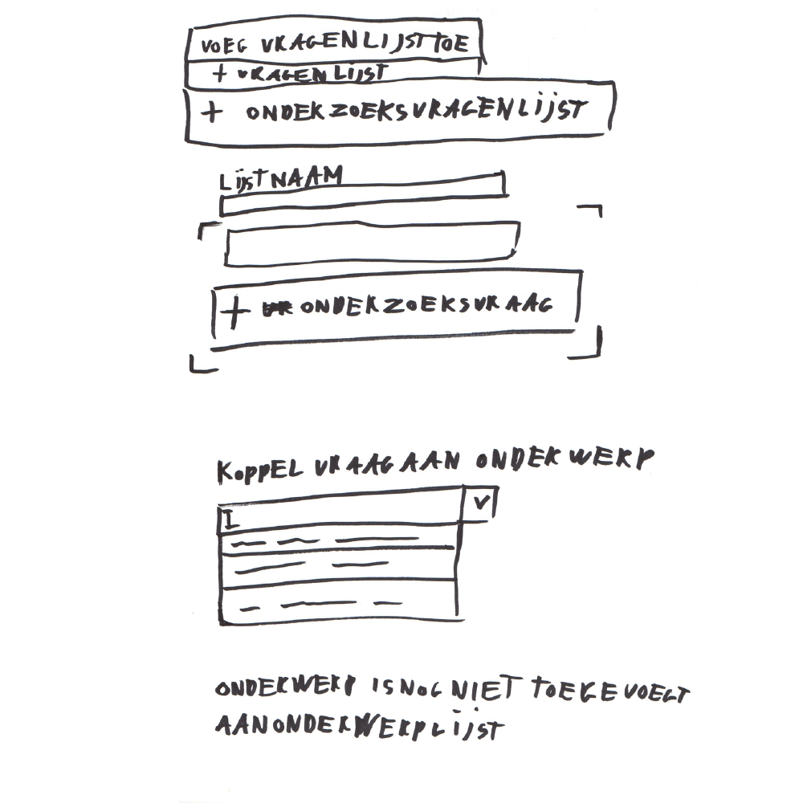
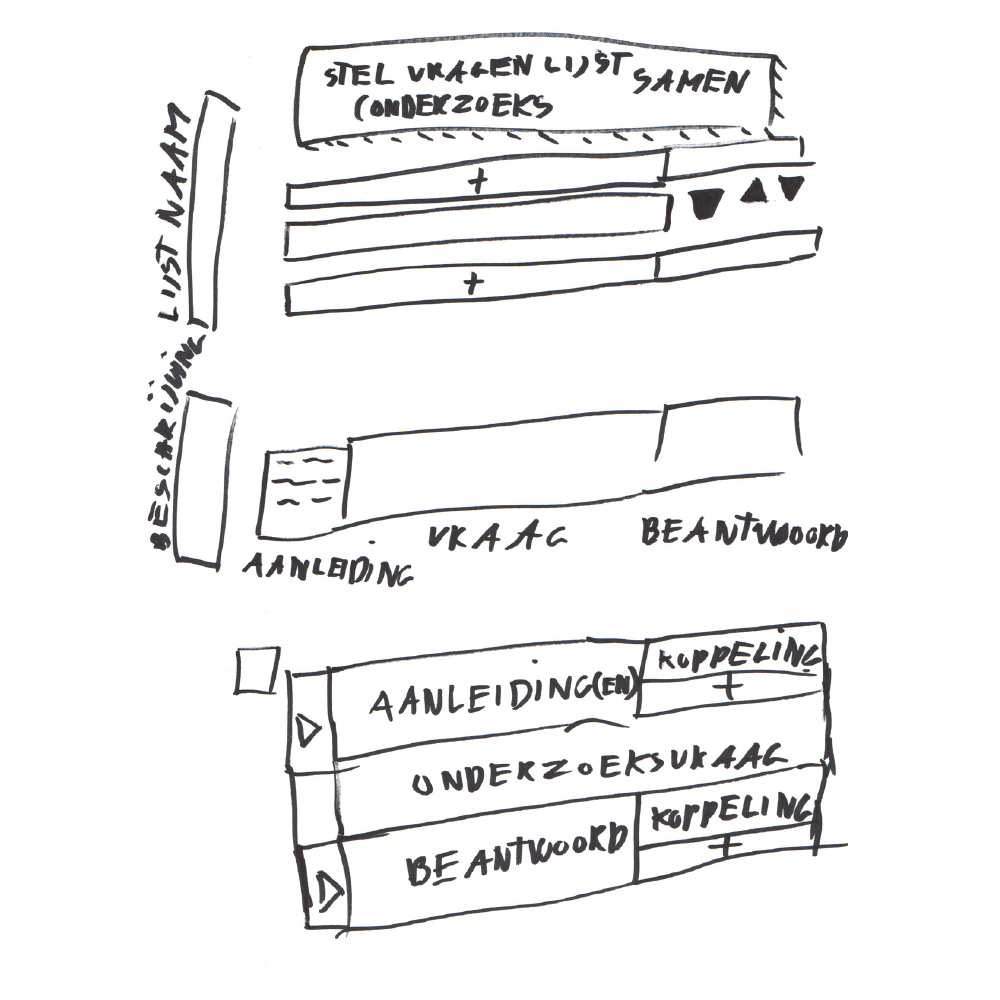
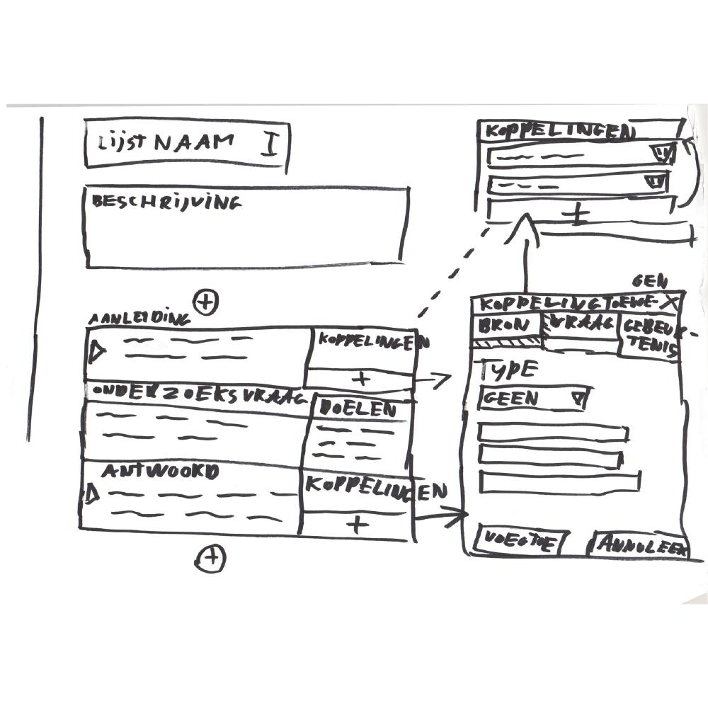
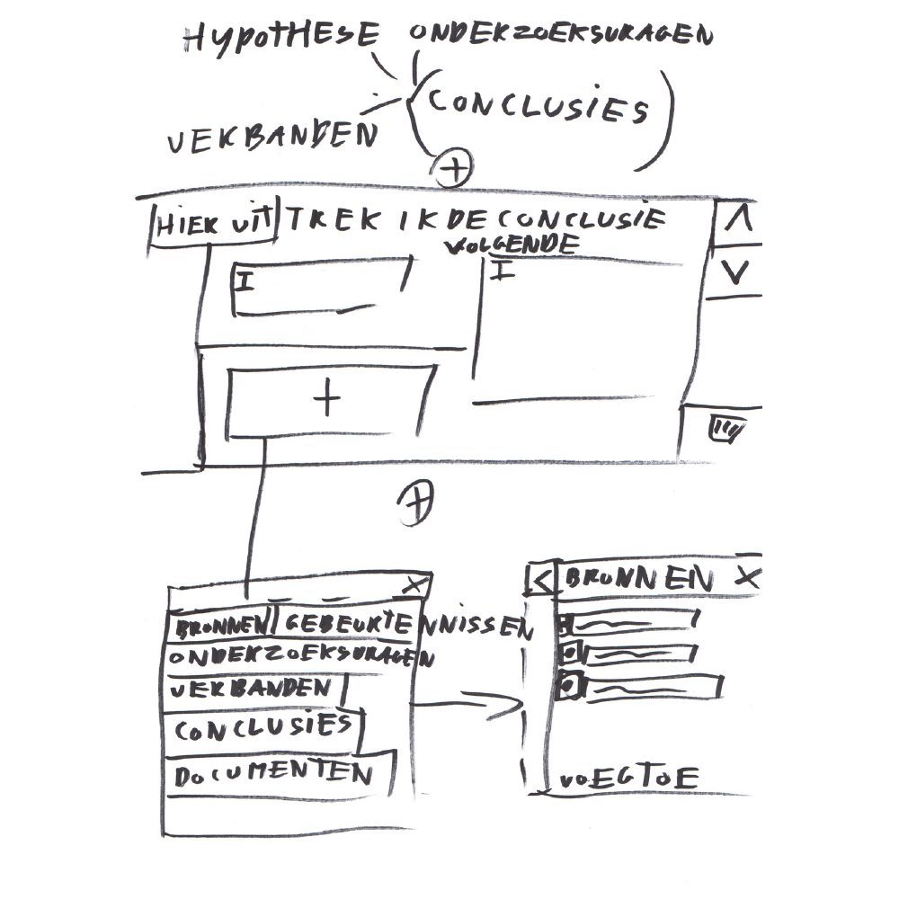
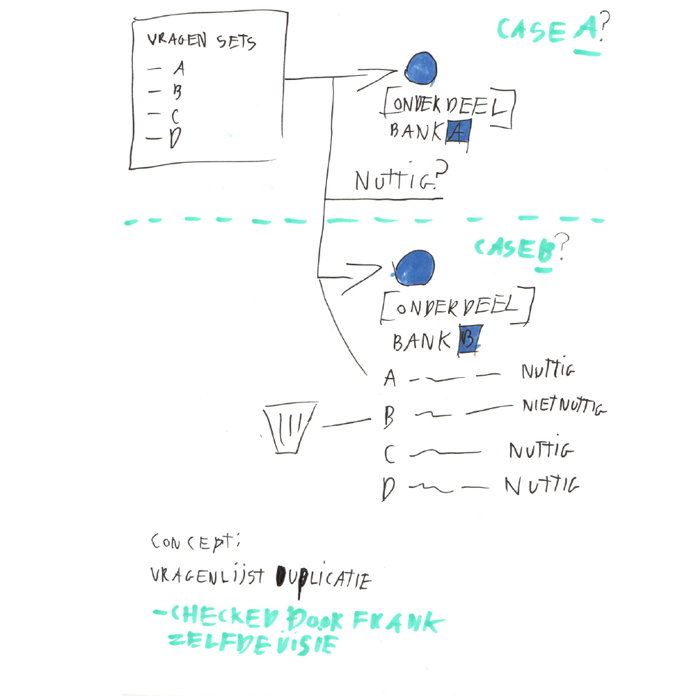
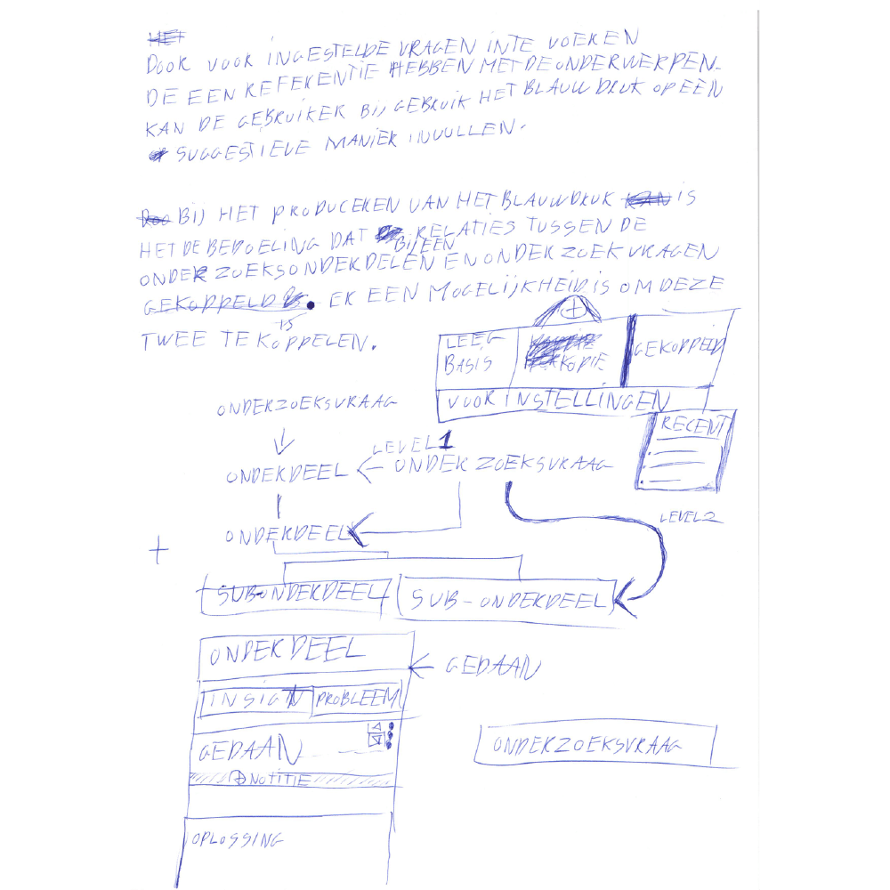
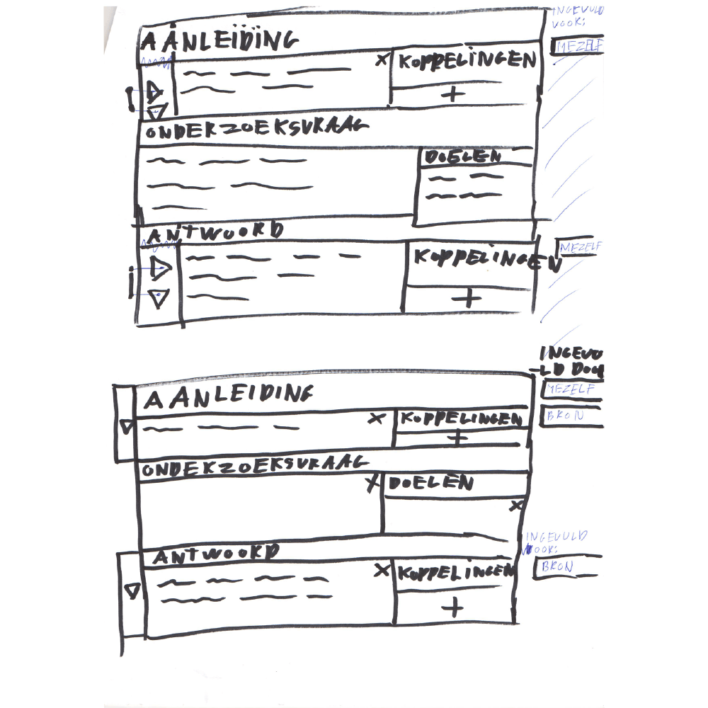
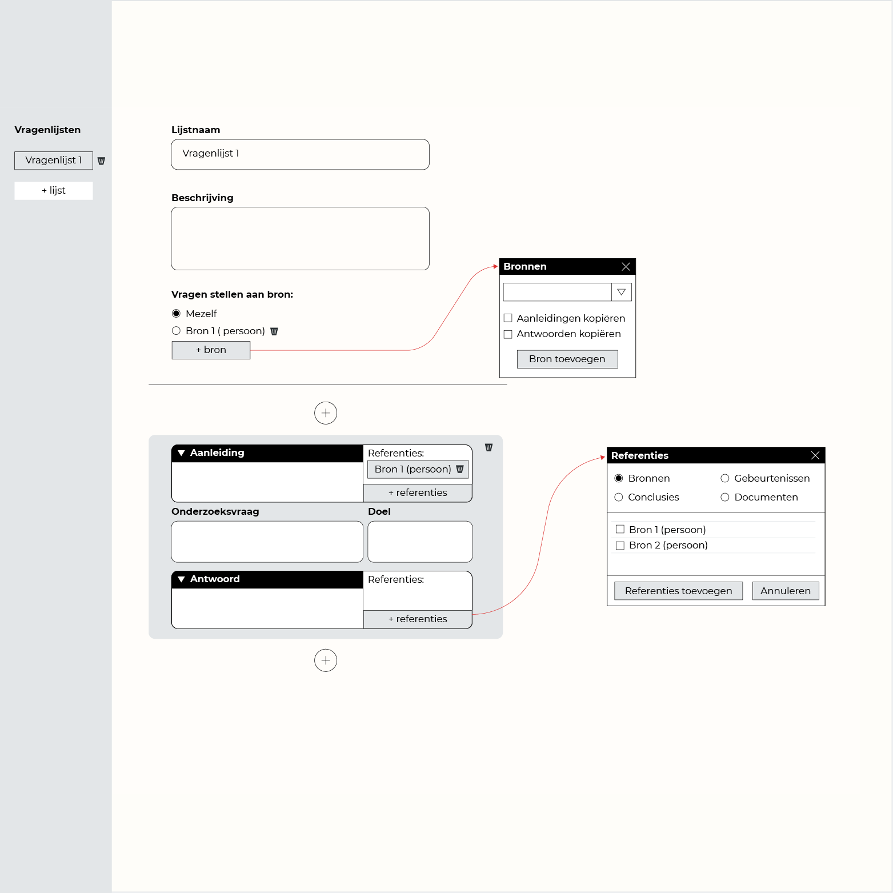

__Eigenschappen van een onderzoeksvraag:__

* De vraag zelf
* Doel van de vraag
* Aanleiding voor het stellen van de vraag
* Antwoorden op de vraag
* De persoon die de vraag stelt (onderzoeksjournalist)
* De persoon die de vraag moet beantwoorden (bron of de onderzoeksjournalist)

__De onderzoeksvragenlijst:__

1. Naam van de lijst
2. Beschrijving van de lijst

Mocht je de vragen willen groeperen onder onderwerp, een specifiek segment van je bronnen of misschien alleen vragen voor jezelf, dan is een boven liggende verdeling nodig.

* Vragenlijst – Iedere bron die belang heeft bij het tegengaan van 'klimaatverandering'
  1. Onderzoeksvraag
  2. Onderzoeksvraag
  3. Onderzoeksvraag
* Vragenlijst – Deze bronnen werken allemaal bij dezelfde organisatie
  1. Onderzoeksvraag
  2. Onderzoeksvraag
* Vragenlijst – Vragen die jezelf moet beantwoorden door deskresearch
  1. Onderzoeksvraag
  2. Onderzoeksvraag
  3. Onderzoeksvraag

__Onderzoeksvraag:__

1. Onderzoeksvraag
2. Doel (van de onderzoeksvraag)

> Misschien is het handig om een onderwerp aan een onderzoeksvraag te hangen? 

Ik zie er zelf nog niet het nut van in, maar misschien heb je vraag die financiën gaat of juist over zorg.

__De onderzoeksvraag indelen in:__

1. Aanleiding
  * Koppeling met onderdelen* die bij de aanleiding horen 
2. Onderzoeksvraag
3. Beantwoorden
  * Koppeling met onderdelen* die bij de beantwoording horen

__\* Onderdelen:__

* Bronnen
* Documenten
* Gebeurtenissen
* etc.

* Doel (van de onderzoeksvraag)
* Modal gebruikersinterface toegevoegd wanneer je onderdelen (bronnen, documenten, gebeurtenisse etc.) aan de onderzoeksvraag koppeld.

> Zou je hier al van je onderzoeksvragen conclusies kunnen trekken?

Onderzoeksvragen hergebruiken.

Per onderzoeksvragenlijst zou je aan kunnen geven aan welke bron je de vraag stelt. Bij het toevoegen van een nieuwe bron blijft de onderzoeksvraag blijft staan, maar de aanleiding voor het stellen van de vraag en het antwoord wordt leeggehaald. Zo kan je per bron opnieuw defineren waarom je deze onderzoeksvraag aan deze bron stuurt. Ook heb je nu per bron een uniek antwoord.

Wanneer de onderzoeksjournalist tekst in de aanleiding of het antwoord veld heeft getyped, verschijnt de geselecteerde bron naast de onderzoeksvraag.

Onderzoeksvragen opstellen en deze stellen aan bronnen(personen/organisaties).
