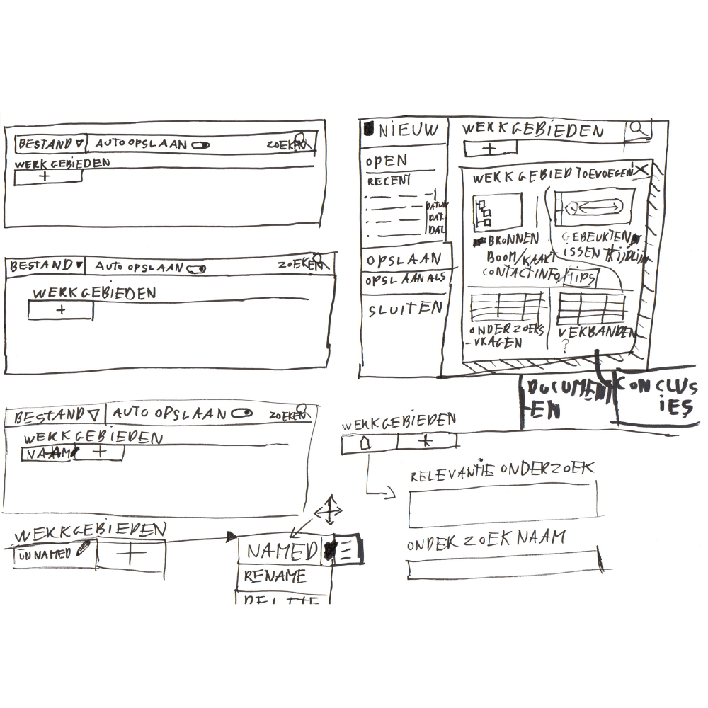

Het eerste ontwerp had de functie om zelf de onderzoeksjournalist de werkgebieden te laten toevoegen. Met de voeg toe knop `[+]` knop. Dit zou cognitieve lading lager moeten maken, door de aantal werkgebieden te limiteren tot hoeveel je toevoegt. Althans dat was het idee, uit eindelijk heb je net zoveel opties elke keer wanneer je een werkgebied wil toevoegen.

Dit is een snelle schets voor het opslaan van een project. Dit valt buiten het concept werkgebieden, maar het hoort er toch een beetje bij omdat een project eigenlijk ook een werkgebied is.

Digitale schets.

Onder bronnen zijn deze sub-werkgebieden zichtbaar:
* Documenten
* Wederhoor

Bronnen, documenten en wederhoor lopen vaak in elkaar over, vandaar dat ik deze heb samengevoegt.

* Bronnen zijn vaak in bezit van documenten. (Sommige onderzoeksjournalisten beschouwen documenten ook als bronnen)
* Bij bronnen wordt wederhoor gepleegd om te controleren of de informatie valide is.
