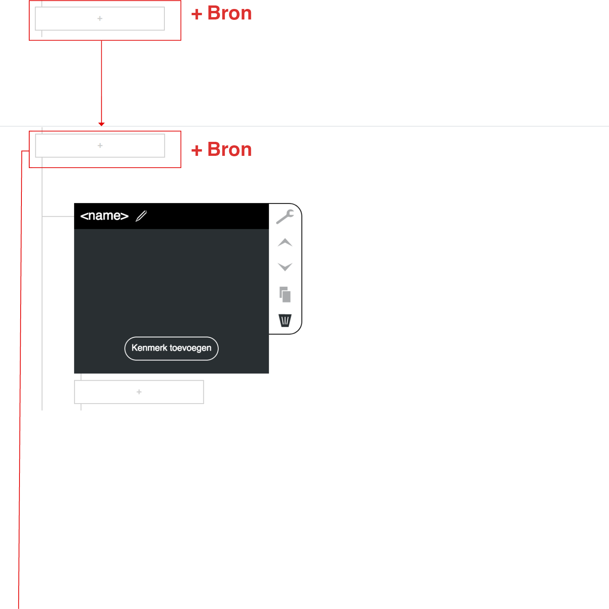
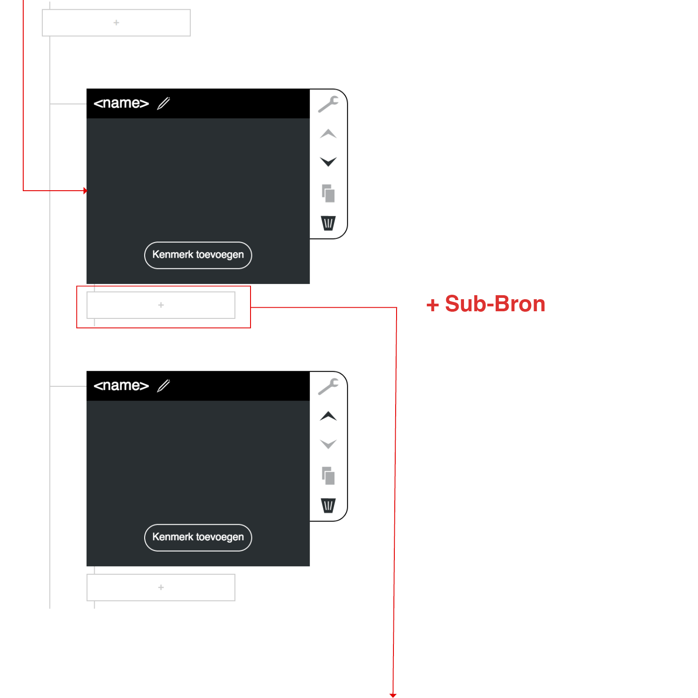
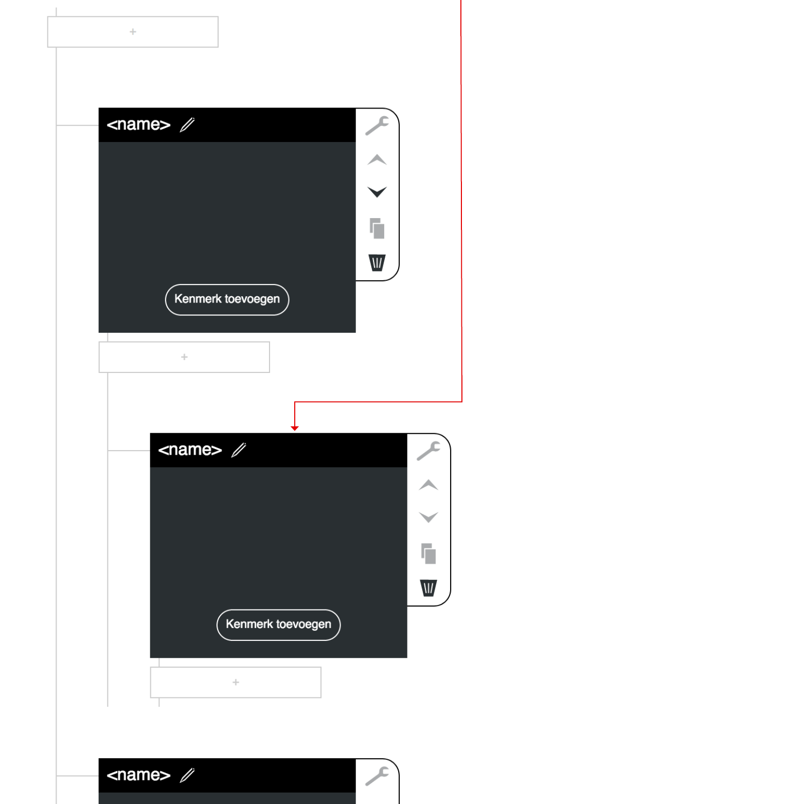

Prototype 1.1.0 was een vereenvoudigede versie van 1.0.0. Dus alleen de Gebruikersinterface van de bronnen. Met als secondaire doel om de pattern [InplaceEditor](http://ui-patterns.com/patterns/InplaceEditor) te testen.

[Link naar prototype v1_1](https://oege.ie.hva.nl/~essenj004/FTM/blauwdruk/input/v1.1.0/)
Dit prototype was special bedoeld voor bij de Feedback Frenzy.

## Screenshots (voorvertoning)

