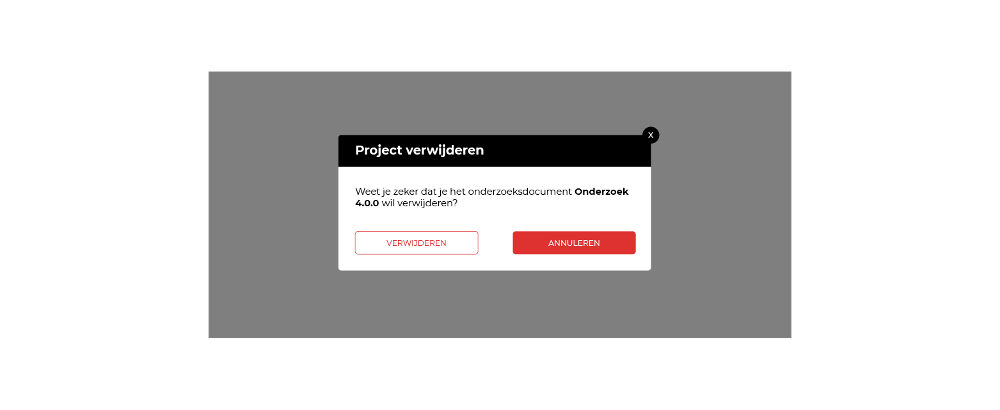

## Herontwerp

Hieronder zijn de nieuwe schermen van dit deelproduct te vinden.

### Hoofdmenu

De navigatie onderdelen zijn specifieker hernoemd en hebben nu 2 nieuwe functies.

* New project *Het aanmaken van een nieuw project*
* Projecten *De bovenste laag van de applicatie: elk project is een onderzoek*
* Recent __Nieuwe functie__
* Opslaan *Opslaan van een project*
* Opslaan als... *Opslaan van een project (onder een andere naam)*
* Exporteren __Nieuwe functie__

__Nieuwe functies:__
* Recent *De recente projecten*
* Exporteren *Exporteren naar het ontwerp dat in traject 2 ontwikkeld wordt*

#### Recent
Dit navigatie geeft de gebruiker de mogelijkheid om eenvoudig een recent bestand te openen. Deze functie moet worden gezien als experimenteel.

#### Exporteren
Dit navigatie onderdeel gaat opent de pagina exporteren. Een uitgebreide beschrijving is verder hieronder te vinden.

<!--<<TODO>>-->

### Project

Op deze pagina zijn alle projecten te zien. Elk project staat gelijk aan een journalistiek onderzoek dat binnen dit format is ingevuld.

__Dit scherm bestaat uit:__
* Voeg project toe
* De lijst projecten
* Sorteer en filter functies.

Dit is het modal dat te voorschijn komt op het moment dat je op de knop `+ project` drukt. Als je een project wil toevoegen is een naam verplicht, de voeg knop is standaard uitgeschakeld tot dat er 1 of meer tekens worden ingevoerd.

Na het invullen van de project kan je het project toevoegen

#### Micro-interactie

__Initiale status__

De knop `Toevoegen` is uitgeschakeld.

__Trigger__

Tekens typen in het invoerveld.

(JavaScript event: 'input')

__Rules__

1. Is er 1 of meer tekens ingevoerd, doe feedback A.
2. Is er minder dan 1 teken ingevoerd, doe feedback B.

(Spaties tellen niet als tekens.)

__Feedback__

A: Schakel knop `Toevoegen` in.
B: Schakel knop `Toevoegen` uit.

Het verwijderen van een project vereist een extra bevestigingsstap. Het zou zonde zijn als je perongelijk je project verwijderd.

### Algemene project informatie

De algemene informatie van je project wordt hier weergegeven. Hier kan je ook de naam van het project veranderen.

### Bronnen

De bronnen van de onderzoeksjournalist zijn op deze pagina te beheren. Aan elke bron kan je kenmerken hangen. Per eigenschap kan je kiezen welke kenmerken je wil tonen wanneer de  [details element](https://developer.mozilla.org/en-US/docs/Web/HTML/Element/details) van de bron gesloten is. Met als uitgangspunt om alleen de informatie te tonen die voor jouw van belang is. Moet je bijvoorbeeld deze bron nog een paar keer bellen? Vink dan de checkbox aan naast het telefoonnummer.

### Documenten

### Gebeurtenissen

__Belangrijke interactie elementen op deze pagina:__

* Oudste > nieuwste
* + GEBEURTENIS
* Nieuw verbandenweb
* Koppelingen

#### Oudste > nieuwste

De tijd van een tijdlijn omdraaien is een belangrijke functionaliteit. Als je de tijdlijn wil gebruiken om aan te vullen is het logischer om de nieuwste onderdelen boven aan te hebben. Maar wanneer je de opeenvolging van gebeurtenissen als verhaal wil beschouwen is het veel logischer om te beginnen met de oudste onderdelen.

#### + GEBEURTENIS
Voeg een nieuwe gebeurtenis toe aan de tijdlijn. Deze word toegevoegd op de plek waar je momenteel staat in de tijdlijn, ook al heb je nog geen tijd ingesteld. De gebeurtenis krijgt een tijd toegekend die precies tussen de gebeurtenissen op het scherm in valt.

__Gebeurtenissen zichtbaar op het scherm:__
* Datum 12-9-2019
* Datum 15-9-2019

__<__ Midden 16-9-2019 + nieuwe gebeurtenis.

* Datum 17-9-2019
* Datum 19-9-2019

Deze gegenereerde datum wordt alleen als placeholder gebruikt voor gebruiksvriendlijkheid.

#### Nieuw verbanden web

Aan de rechterkant van de gebruikersinterface zijn rode cirkels zichtbaar met een plusteken erbij. Een label met de tekst 'Nieuw verbanden web' staat er naast. Deze functie kan je gebruiken om snel een verbanden web te maken vanaf deze gebeurtenis. Wanneer je daarop klikt zal je naar de pagina verbanden gaan, een nieuw 'verbanden web' wordt aangemaakt en het eerst volgende verband zal beginnen met de gebeurtenis waar de voegtoe knop (rode cirkel) aanvast zat.

De verbanden die toegevoegd zijn worden automatisch zichtbaar in de tijdlijn.

Nog onduidelijk wat een verband inhoudt? Lees verder bij het hoofdstuk verbanden iets verder hieronder.

#### Koppelingen

Deze modal komt tevoorschijn wanneer je op de knop VOEG ONDERDEEL TOE drukt van de vorige afbeelding. Je hebt nu de mogelijkheid om een koppeling toe te voegen naar een: bron, document of onderzoeksvraag.

### Verbanden

### Filter

Om rekening te houden met grote projecten waarbij veel onderdelen aanwezig zijn, kunnen filters handig zijn. Het filter systeem bestaat uit de zoekbalk, de eenvoudige filter waarbij je snel naar een onderdeel zoekt op naam en de geavanceerde filters. De geavanceerde filters kan je gebruiken door de checkbox met de label "Filter" aan te vinken. De logica van dit filtersysteem is gebaseerd op de filter gebruikersinterface die Follow the Money ook in het CMS gebruikt.

### Export

Exporteer je project naar een doorzoekbaar document. Alle informatie van je document is standaard uitgevinkt voor de veiligeheid. De gebruiker moet voor elke datapunt bevestigen of deze in het doorzoekbare document komt. 

#### Gekoppelde onderdelen
Gekoppelde onderdelen binnen gebeurtenissen of verbanden worden alleen toegevoegd wanneer ze zelf zijn ingeschakeld.

__Bijvoorbeeld:__

Binnen een gebeurtenis komt een bron voor. Deze bron is een klokkenluider en heeft deze gebeurtenis gemeld aan de onderzoeksjournalist en wil graag anoniem blijven. Als de bron niet toegevoegd is aan het doorzoekbaar document zal deze ook niet terugkomen in de gekoppelde gebeurtenissen. Je ziet dan dat deze doorgestreept is met een rode lijn.

__Nog niet opgelost probleem in deze versie van het ontwerp:__

Het design heeft overigens nog twee problemen, die ik nog niet heb opgelost. 
* "Wat als de bron op meerde plekken in het onderzoeksdocument voor komt, maar alleen bij bepaalde gebeurtenissen mag terugkomen?" 
* Checkboxen die meer content weergeven, kunnen de indrukwekken dat wanneer deze worden aangekruist, de vinkjes van de sub-onderdelen ook op dat moment worden aangekruist.

__Indrukt wekt dat:__

- [x] Wanneer deze aangekruist wordt,

__...__

- [x] Wanneer deze aangekruist wordt,
  - [x] deze meegaat
  - [x] en deze
  - [x] en deze

