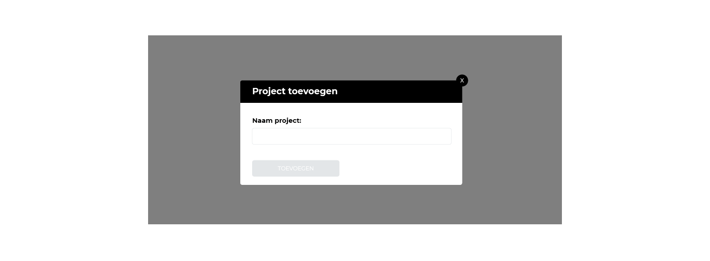
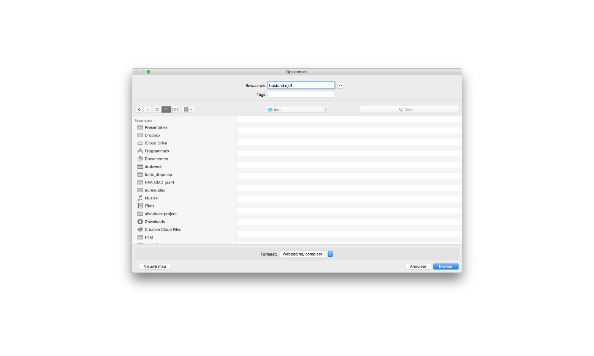

## Onderdelen

### Applicatie beheer

### Project

Op deze pagina zijn alle projecten te zien. Elk project staat gelijk aan een journalistiek onderzoek dat binnen dit formaat is ingevuld.

Als je een project wil toevoegen is een naam verplicht.

Na het invullen van de project kan je het project toevoegen

Het verwijderen van een project vereist een extra bevestigingsstap. Het zou zonde zijn als je perongelijk je project verwijderd.

### Algemene project informatie

De algemene informatie van je project wordt hier weergegeven. Hier kan je ook de naam van het project veranderen.

### Bronnen

De bronnen van de onderzoeksjournalist zijn op deze pagina te beheren. Aan elke bron kan je kenmerken hangen. Per eigenschap kan je kiezen welke kenmerken je wil tonen wanneer de venster details van de bron gesloten is. Met als uitgangspunt om alleen de informatie te tonen die voor jouw van belang is. Moet je bijvoorbeeld deze bron nog een paar keer bellen? Vink dan de checkbox aan naast het telefoonnummer.

### Documenten

### Gebeurtenissen

### Verbanden

### Filter

### Export

## Ontwikkeling van deze pagina's staan op pauze
* Onderzoeksvragen
Het ontwerp het weergeven van de onderzoeksvragen is nog niet helemaal duidelijk. Daarom staat het de ontwikkeling van deze pagina tijdelijk op pauze.

* Conclusies
Conclusies zijn handig, maar het is nog niet helemaal duidelijk of het een aparte pagina voor moet komen of het geïntegreerd moet worden in de onderzoeksvragen pagina.