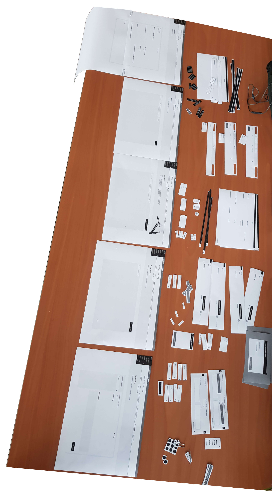
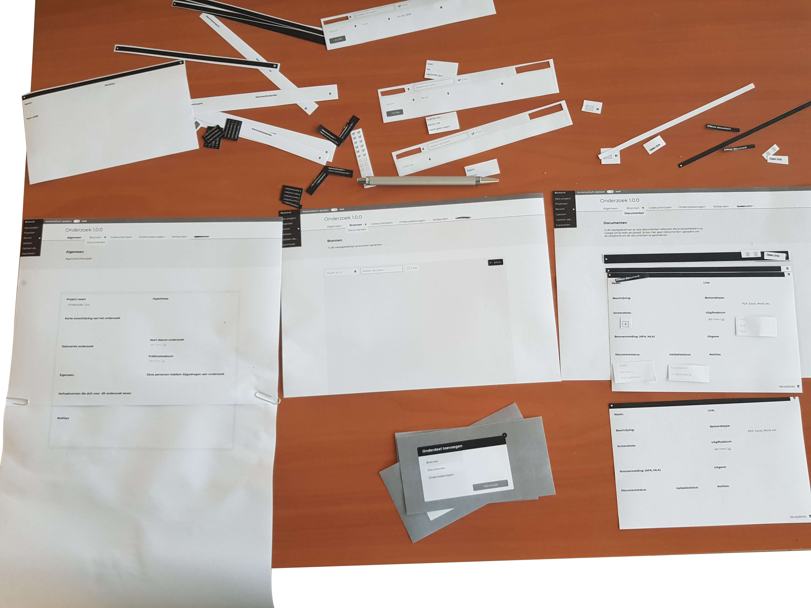
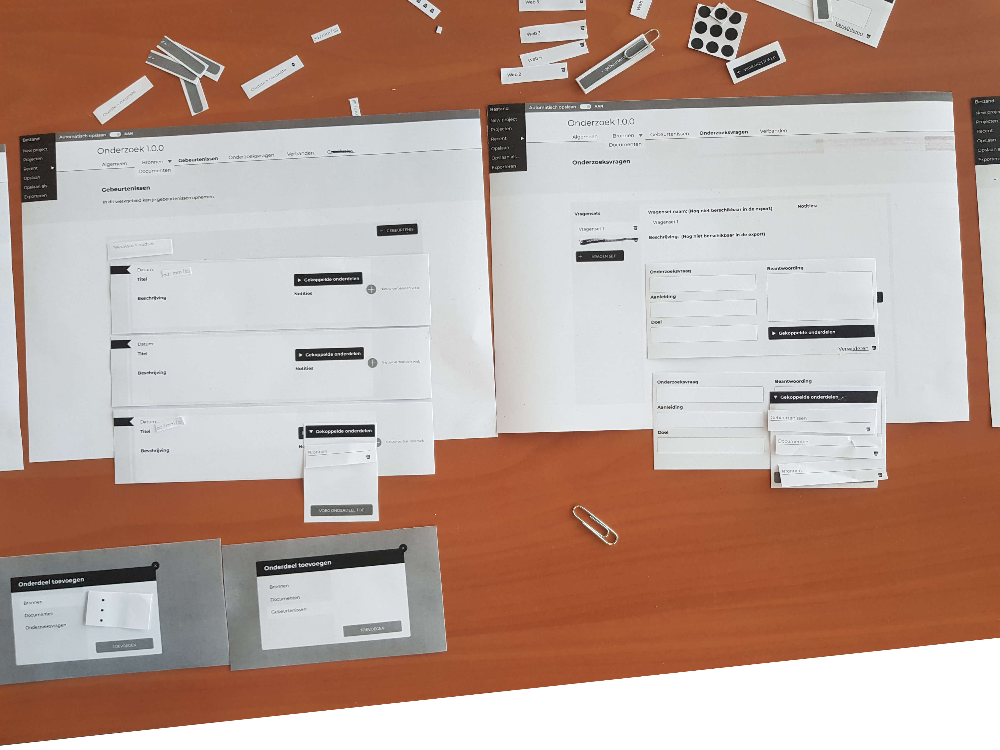
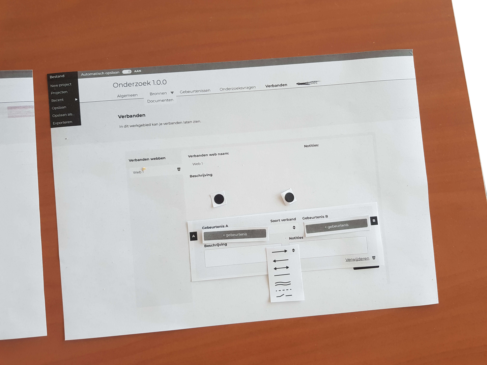

## Gebruikerstest

Met het ontwerp invoeren van onderzoeksdata input_v2_1_0

__Uitgevoerd met:__
* Siem Eikelenboom (onderzoeksjournalist)
* Karin Spaink (eindredacteur)

### Doel
Valideren of dit het product volledig bruikbaar is voor de onderzoeksjournalist en bevindingen verzamelen voor een visie van het ontwerp.

### Testplan

#### Voorbereiding
1. Zet het prototype "invoeren van onderzoeksdata input_v2_1_0"  klaar
2. Laat ook het prototype "Visuele weergave" zien, om het idee te geven wat de uitkomst is van zijn input.
3. Vraag aan de participant om het onderzoek waarmee hij of zij nu bezig is te gebruiken in de gebruikerstest. (Het onderzoek hoeft er niet fysiek bij gepakt te worden)

##### Tijdens de test
* Geef de participant de instructie om zijn of haar onderzoek in te vullen in de applicatie.

### Paper prototype

### Validatie
* De gebruiker is bewust waar elke informatietype voor staat. Bij een aantal onderdelen is het wel noodzakelijk dat de beschrijving wordt gelezen.
* De gebruiker vind de feature automatisch opslaan een toegevoegde waarde voor het invullen van de gegevens.
* De gebruiker slaagde er in om bij elke informatietype informatie neer te schrijven. 
* De gebruiker geeft aan dit product wel te willen gebruiken als tool om het onderzoek in te documenteren.

### Bevindingen en aanbeveling

---
 

-

 
---

__Bevinding:__ Verbeteren van de beschrijving van het werkgebied: Bronnen

__Aanbeveling:__ Definiëren van het soort bron, dat bij bronnen ingevuld moeten worden. (In de beschrijving van het werkgebied)

---
 

-

 
---

__Bevinding:__ De bronvermelding stijlen APA en MLA zijn niet bekend bij iedereen.

__Aanbeveling:__ Voeg een extra beschrijving toe wat deze stijlen inhouden.

---
 

-

 
---

__Bevinding:__ Nieuw informatietype.

__Aanbeveling:__ De informatietype 'bevindingen' in de plaats van conclusies zou ook een goede toevoeging kunnen zijn.

---
 

-

 
---

__Bevinding:__ Omvangstatus, deze toont met bijvoorbeeld een visualisatie in hoeverre de informatie is ingevuld.

__Aanbeveling:__ Dit kan nuttig zijn wanneer wanneer je lege onderdelen toevoegt in het product.

---
 

-

 
---

__Bevinding:__ Verbanden sorteren op type relatiesoort.

__Aanbeveling:__ Dit kan nuttig zijn, maar eerste moet het gebruik van deze experimentele feature onderzocht worden.

---
 

-

 
---

__Bevinding:__ De onderzoeksvragen zijn niet inklapbaar. (Meer en minder details te tonen)

__Aanbeveling:__ Om consistent te zijn zouden deze ook inklapbaar moeten zijn, net als de bronnen en documenten.

