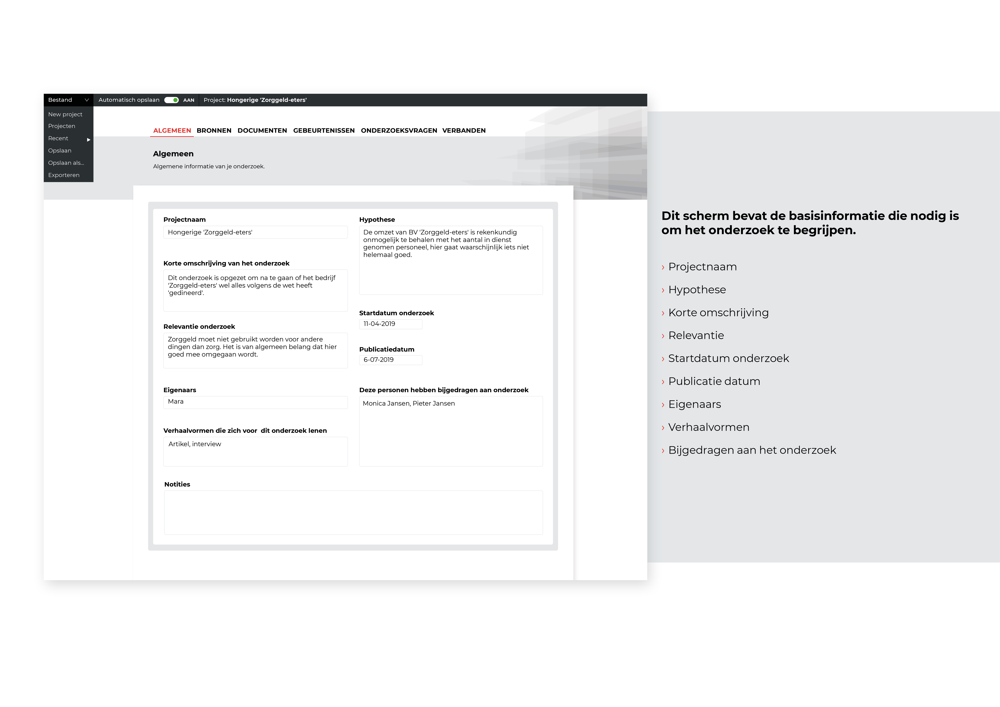
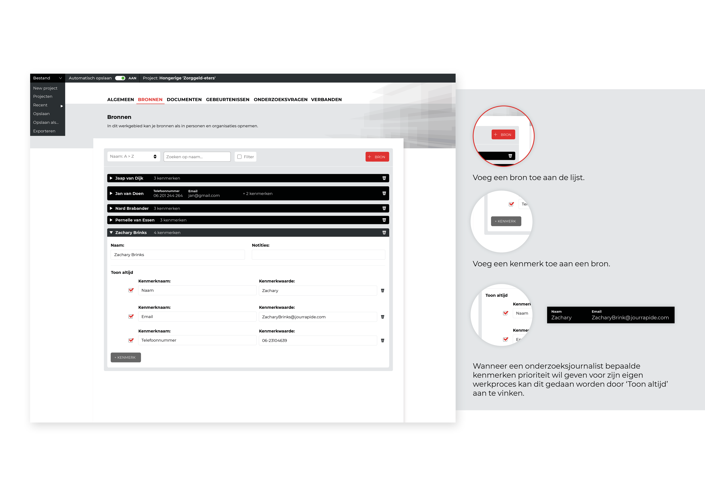
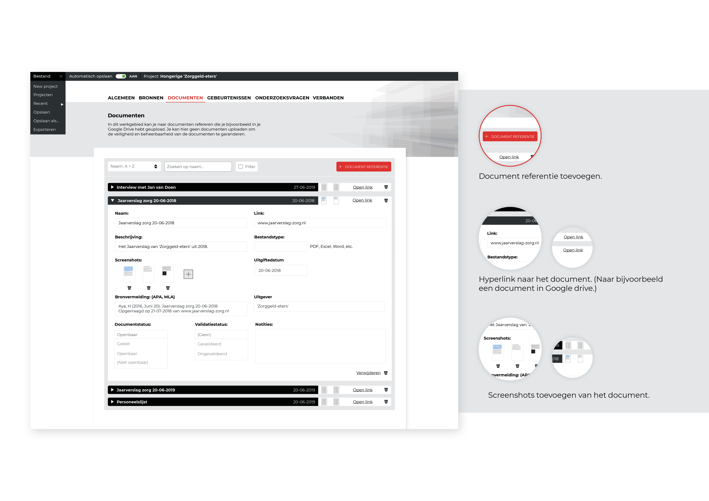
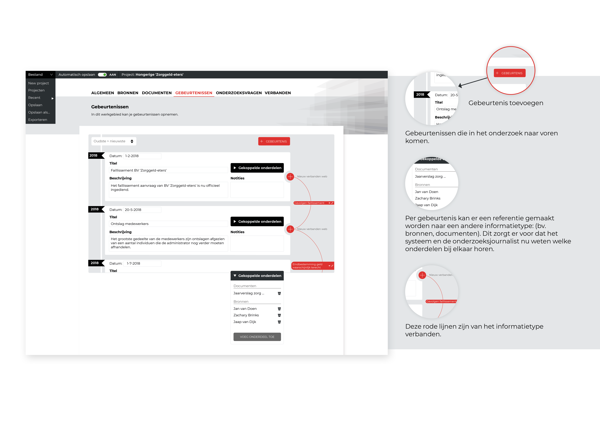
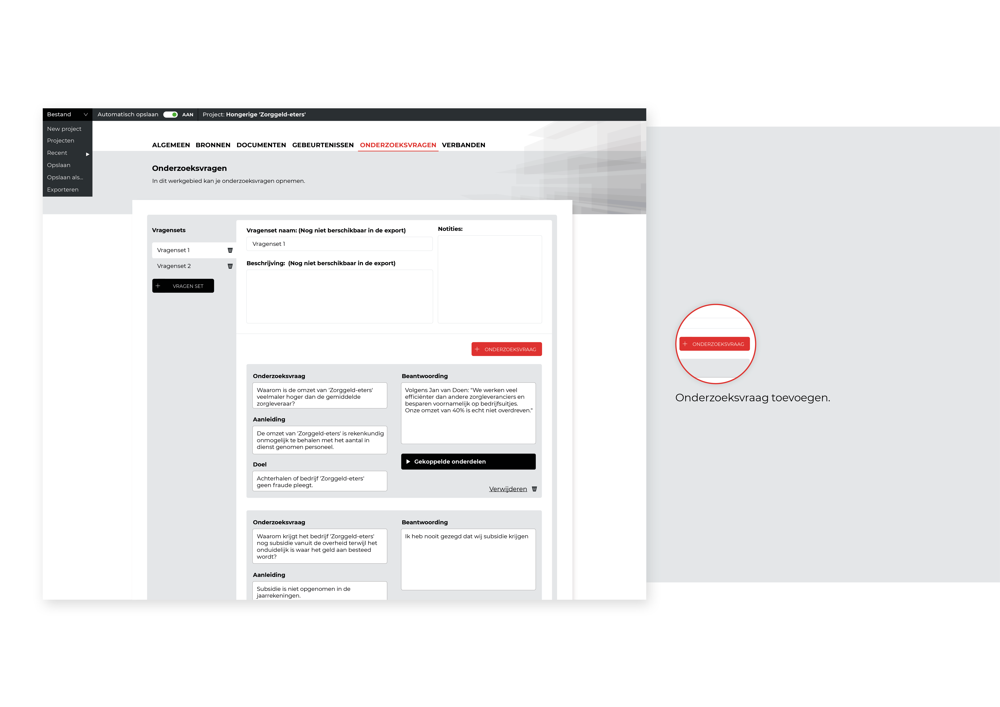
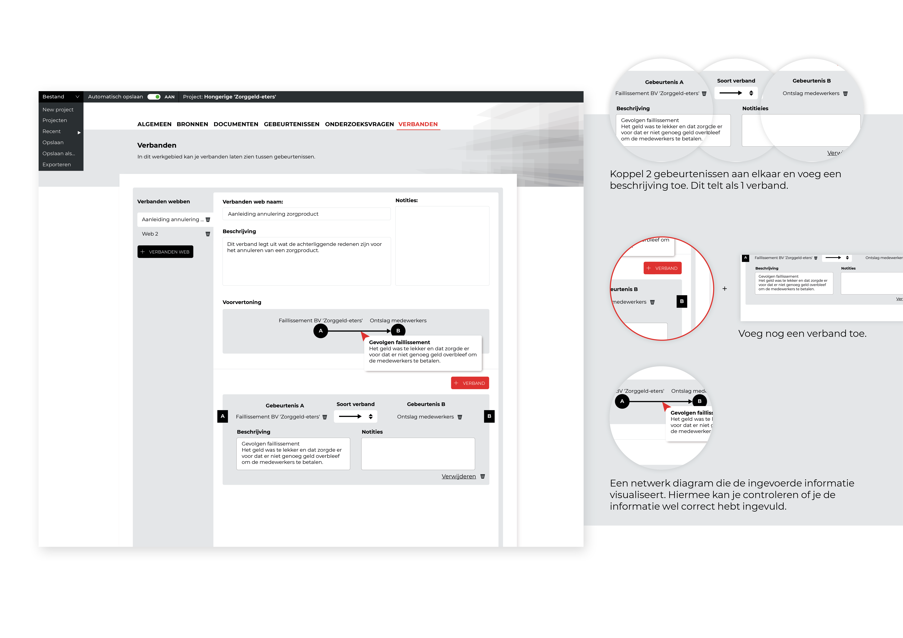
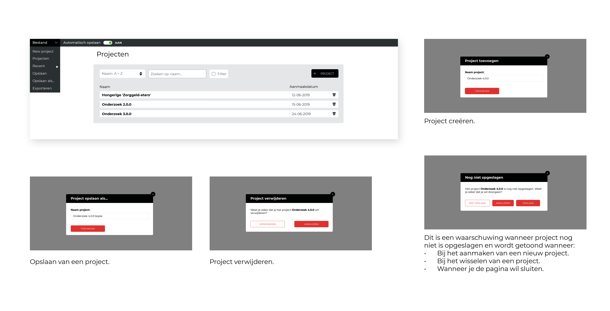
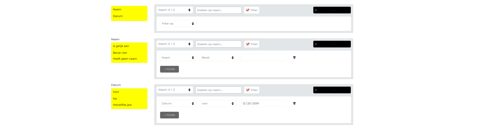
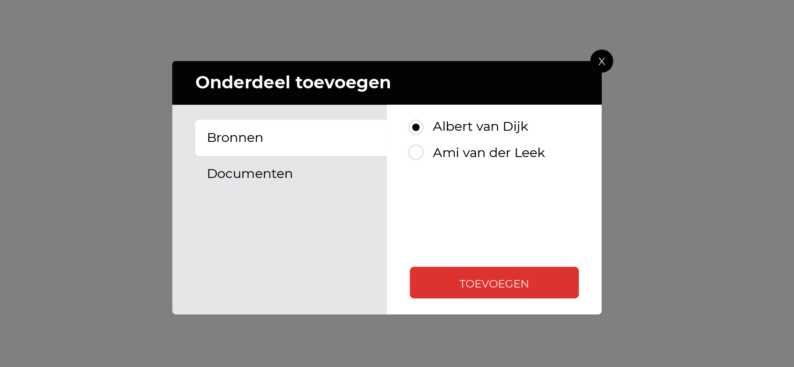
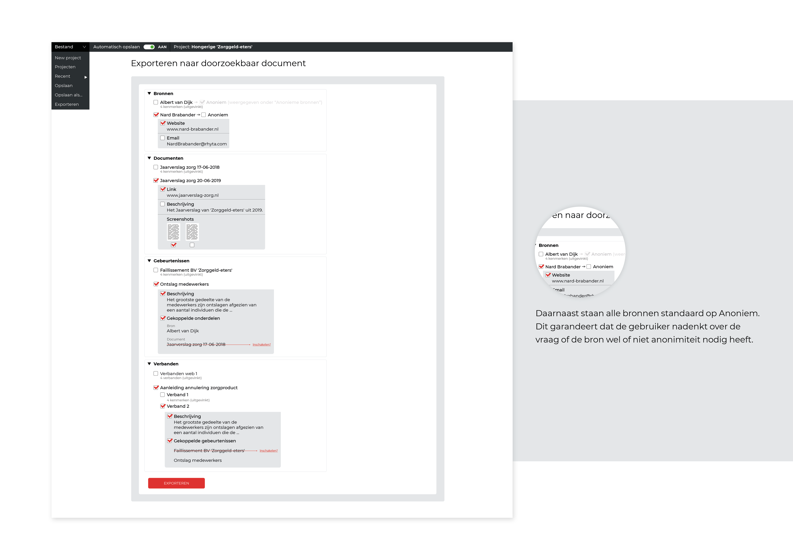

In dit deelproduct wordt de onderzoeksdata ingevoerd, zodat deze gebruikt kan worden in het andere deelproduct 'visuele weergave'.

## Algemene informatie

De onderzoeksjournalist vult hier de algemene informatie in van zijn onderzoek met als doel om de lezer in te leiden.

## Bronnen

De gebruiker voegt hier zijn bronnen toe als referentiemateriaal. Voor elke bron bestaat uit een naam, kenmerken en een (privé) notitieveld.

## Documenten

De gebruiker beheerd hier zijn document-referenties. Deze kan hij of zij gebruiken als bewijsmateriaal binnen het onderzoek.

## Gebeurtenissen

De gebruiker kan gebeurtenissen bijhouden om het onderzoeksverhaal stapsgewijs te vertellen. Hij of zij kan het ook gebruiken om te controleren of er nog gebeurtenissen missen. 

## Onderzoeksvragen

De gebruiker kan hier zijn onderzoeksvragen beheren. Dat doet hij door een onderzoeksvraag toe te voegen aan een vragenset. De gebruiker kan zelf bepalen welke velden voor hem relevant zijn, maar alles compleet in vullen is niet al te ingewikkeld wanneer de velden al klaar staan.

## Verbanden

In dit scherm kan de onderzoeksjournalist zijn verbanden trekken tussen gebeurtenissen.

## Projectmanagement

Wanneer een onderzoek wordt gestart, is het belangrijk dat deze opgeslagen kan worden. Dit deel van de gebruikersinteractie valt onder projectmanagement.

## Filters

Filters kunnen worden toegevoegd om een specifiek item te vinden. Deze feature is van belang bij grote onderzoeken.

## Het koppelen van onderdelen

Bronnen en documenten kunnen worden gekoppeld aan gebeurtenissen en onderzoeksvragen.

## Exporteren naar de visuele weergave

Dit is het exportscherm. Hiermee kan de gebruiker een project exporteren naar de visuele weergave. Van input naar output.
Per onderdeel van de data vink je aan wat je toe wilt voegen. Dit betekent dat elke entiteit en eigenschap apart aangevinkt moeten worden. Dit zorgt ervoor dat de  onderzoeksjournalist elk onderdeel langs moet gaan en actief checkt of de informatie veilig is om op te nemen in de export.

[De visuele weergave](https://jorik.gitbook.io/project-blauwdruk/traject-2/eindproduct)

Daarnaast staan alle bronnen standaard op Anoniem. Dit garandeert dat de gebruiker nadenkt over de vraag of de bron wel of niet anonimiteit nodig heeft.

Deze keuzes zijn gemaakt op basis van de gevoeligheid van de data, voornamelijk voor de bronnen. Lees hier meer over in [hoofdstuk Ethiek](https://jorik.gitbook.io/project-blauwdruk/productspecificaties/ethiek).

