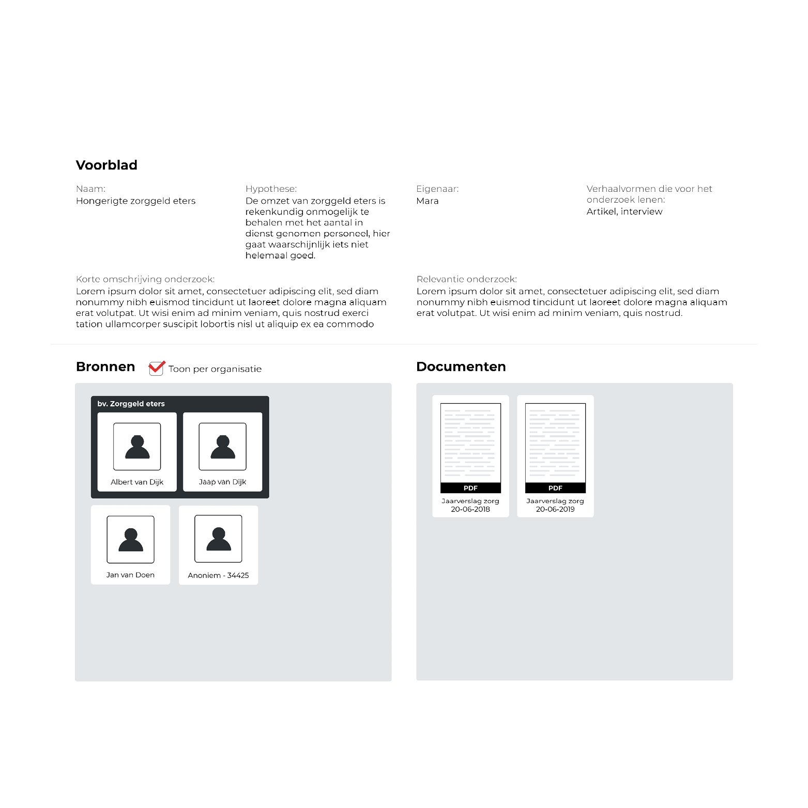
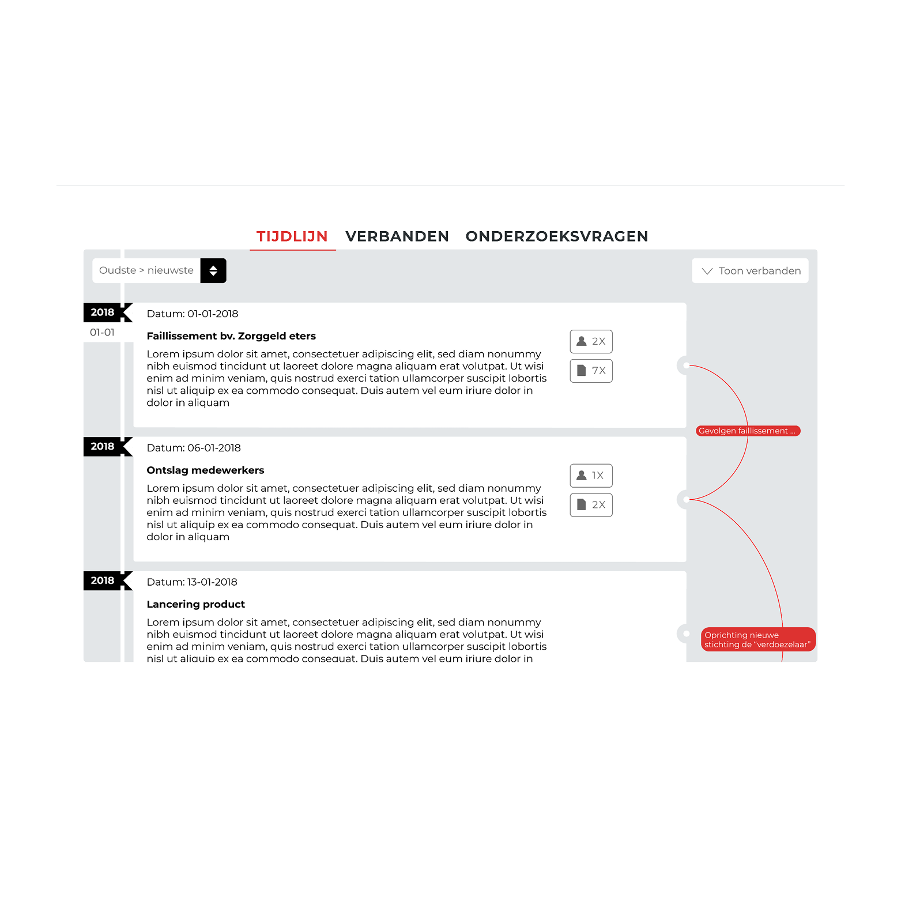
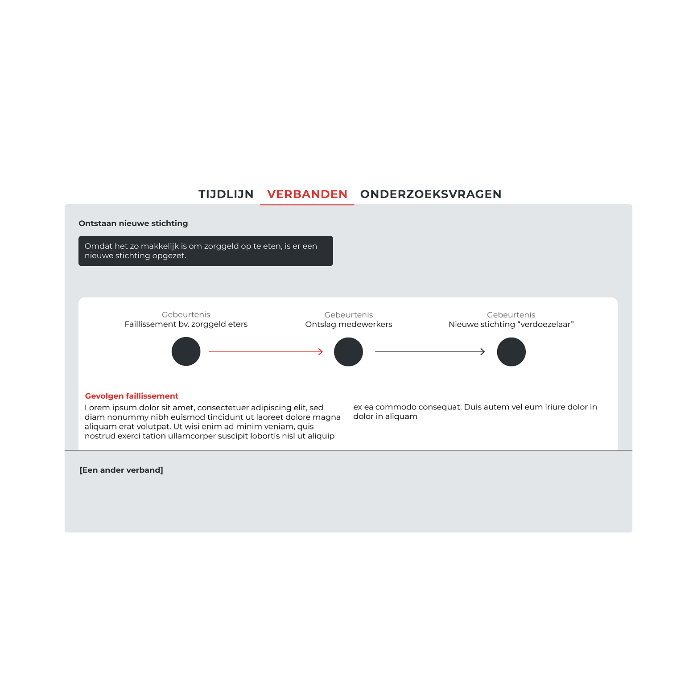
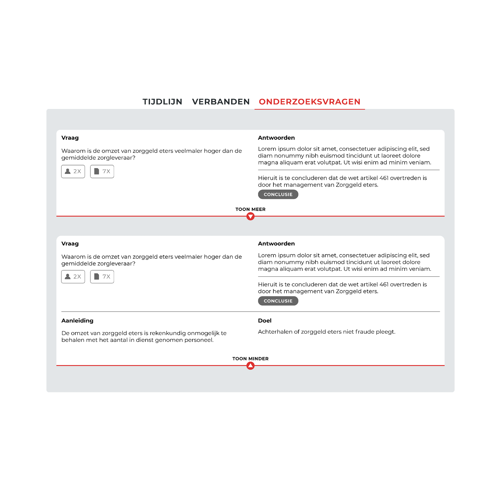
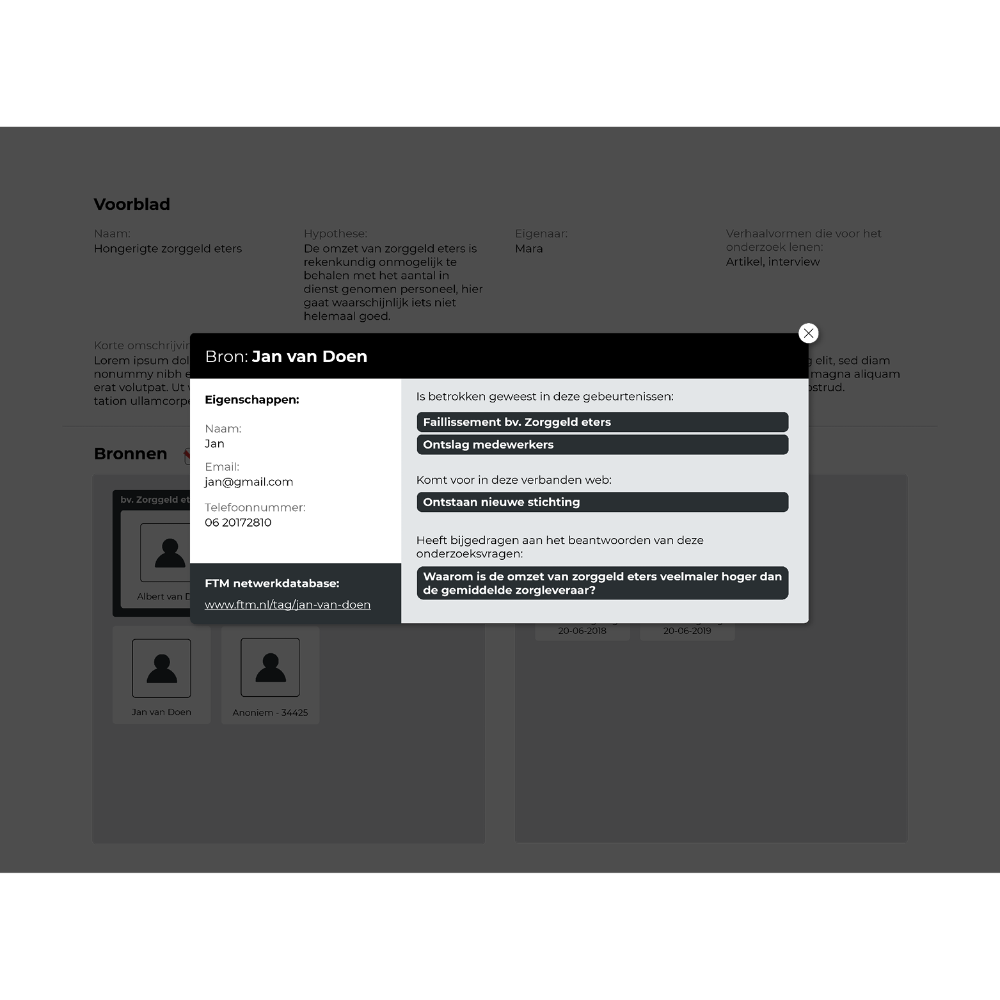
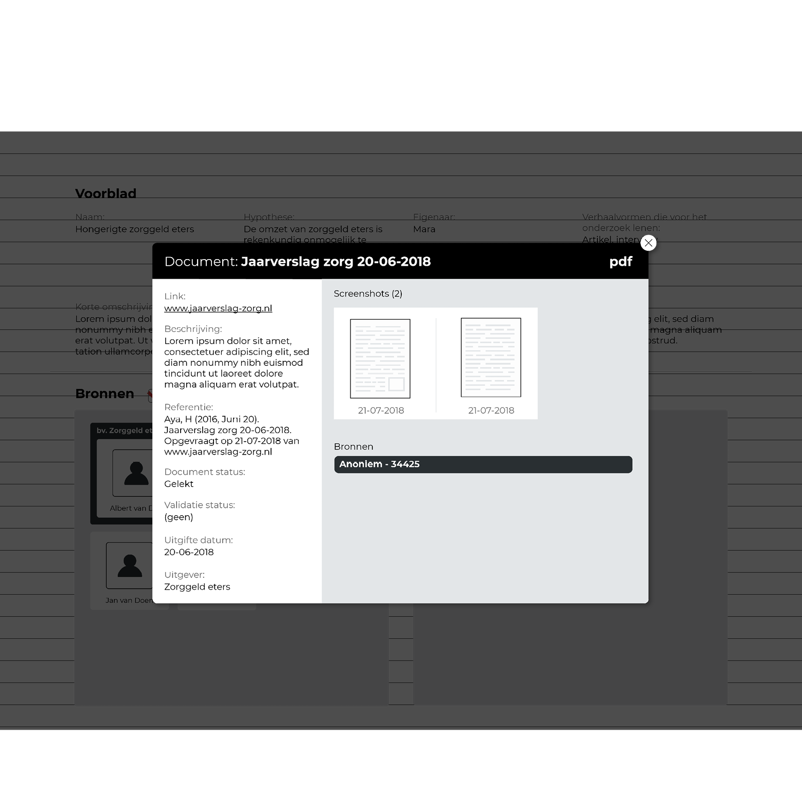

## Opbouw

__Dit ontwerp is opgebouwd uit het volgende onderdelen:__
* Voorblad
* Bronnen & documenten
* Onderzoeksproces(sen)

De inspiratie van deze indeling kwam vanuit de [content analyse van een Proces-verbaal](https://app.gitbook.com/@jorik/s/project-blauwdruk/research_methods/analyse_content/proces-verbaal).

__De indeling van een Proces-verbaal:__
* Voorblad
* Algemene Paragraaf
* Verdachte-paragraaf
* Zaaks-paragraaf

De __Voorblad__ en __Algemene Paragraaf__ heb ik samengevoegd in het ontwerp. Voorbladen voor webpagina's zijn naar mijn mening overbodig, tenzij je helemaal geen idee hebt waar je naar kijkt.

De __Verdachte-paragraaf__ heb ik ingedeeld met __Bronnen en documenten__. Bronnen en documenten kan je beide zien als informatie voorzieningen.

Als laatste de is de __Zaaks-paragraaf__ gebruikt om het onderzoek te beschrijven via de indeling __Tijdlijn__, __Verbanden__ en __Onderzoeksvragen__. Voornamelijk de tijdlijn in combinatie met verbanden zou het verhaal beter doorzoekbaar kunnen maken.

## Designs

