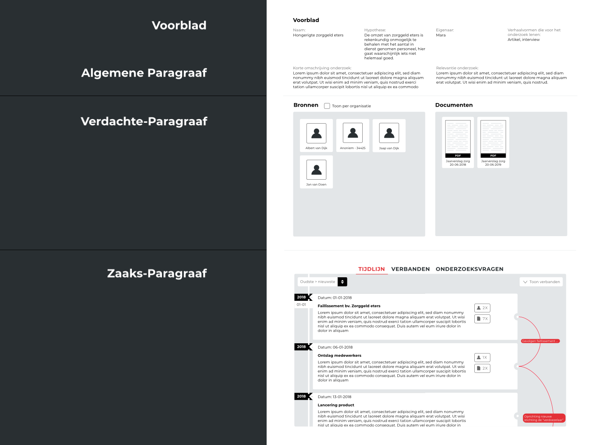

Dit concept `Visuele weergave` is zoals je zou verwachten gebaseerd op `invoeren van onderzoeksdata`. De data die daar is ingevoerd, moet hier weer terugkomen.

## Opbouw

__Dit concept is opgebouwd uit het volgende onderdelen:__
* Voorblad
* Bronnen & documenten
* Onderzoeksproces(sen)

De inspiratie van deze indeling kwam vanuit de [content analyse van een Proces-verbaal](https://jorik.gitbook.io/project-blauwdruk/research_methods/analyse_content/proces-verbaal).

__Indeling van een Proces-verbaal:__
* Voorblad
* Algemene Paragraaf
* Verdachte-paragraaf
* Zaaks-paragraaf

### Waarom deze indeling?
Het onderzoek begint met een __voorblad en algemene informatie__. Dit is relevant voor het inleiden van het onderzoek voor een nieuwe lezer of voor jezelf wanneer je op een later moment terugkijkt op het onderzoek. 

Het __verdachte-paragraaf__ gaat over de betrokkenen. Deze voorzien het onderzoek van een lijst met betrokkenen en informatie wanneer een betrokken persoon een verklaring aflegt. Bij een journalistiek onderzoek zijn er ook bronnen betrokken, deze spelen ook een rol in het verhaal en voorzien het onderzoek van informatie. Door de bronnen eerder in te leiden dan het rest van het verhaal, weet de lezer waar de informatie van afkomstig is en hiermee bewijst hij of zij ook dat het onderzoek ergens op gebaseerd is. Een stukje transparantie nog voor je het verhaal leest. Sommige bronnen geven ook al een stukje context mee waardoor je sneller begrijpt over wat voor onderwerp het gaat. Mocht er bijvoorbeeld een naam van een bank (voor deponeren van je geld) worden genoemd en dat in combinatie van de algemene informatie, dan kan je een beter beeld scheppen over de context van het journalistiek verhaal.

Het laatste onderdeel, de __zaaks-paragraaf__ gaat voornamelijk over de context en hoe alle onderdelen samenkomen. Dit onderdeel is vergelijkbaar met het onderzoeksverhaal waarin chronologisch alle gebeurtenissen worden aangestipt en de verbanden worden toegelicht.

### Samenvoegen

De __Voorblad__ en __Algemene Paragraaf__ heb ik samengevoegd in het concept. Voorbladen voor webpagina's zijn naar mijn mening overbodig, tenzij je helemaal geen idee hebt waar je naar kijkt.

De __Verdachte-paragraaf__ heb ik ingedeeld met __Bronnen en documenten__. Bronnen en documenten kan je beide zien als informatie voorzieningen.

Als laatste de is de __Zaaks-paragraaf__ gebruikt om het onderzoek te beschrijven via de indeling __Tijdlijn__, __Verbanden__ en __Onderzoeksvragen__. Voornamelijk de tijdlijn in combinatie met verbanden zou het verhaal beter doorzoekbaar kunnen maken.

