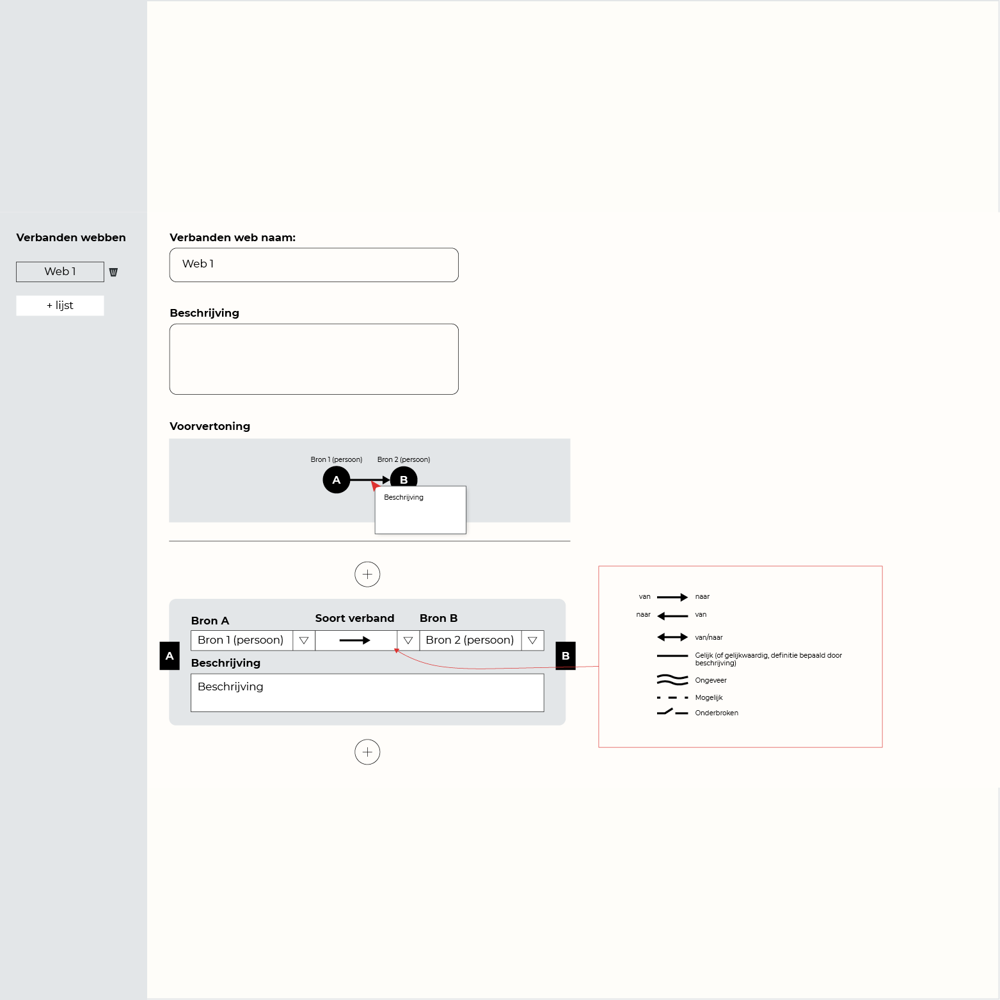

## Vanuit: Invoeren van onderzoeksdata

## Naar: Visuele weergave

## Data

### Succesvol vertaald

- [x] Verbandenweb
- [x] Naam verbandenweb
- [x] Beschrijving verbandenweb
- [ ] Entiteit waartussen verbanden worden getrokken

De entiteit waartussen verbanden getrokken kunnen worden zijn aanwezig, maar de type entiteit is niet hetzelfde.
- Invoeren van onderzoeksdata: Entiteittype is 'bron'.
- Visuele weergave: Entiteittype is 'gebeurtenis'.

- [x] Verband beschrijving
- [x] Soort verband (Pijl)

## Aanpassingen

### Invoeren van onderzoeksdata
- Entiteittype moet worden omgezet naar 'gebeurtenis'.