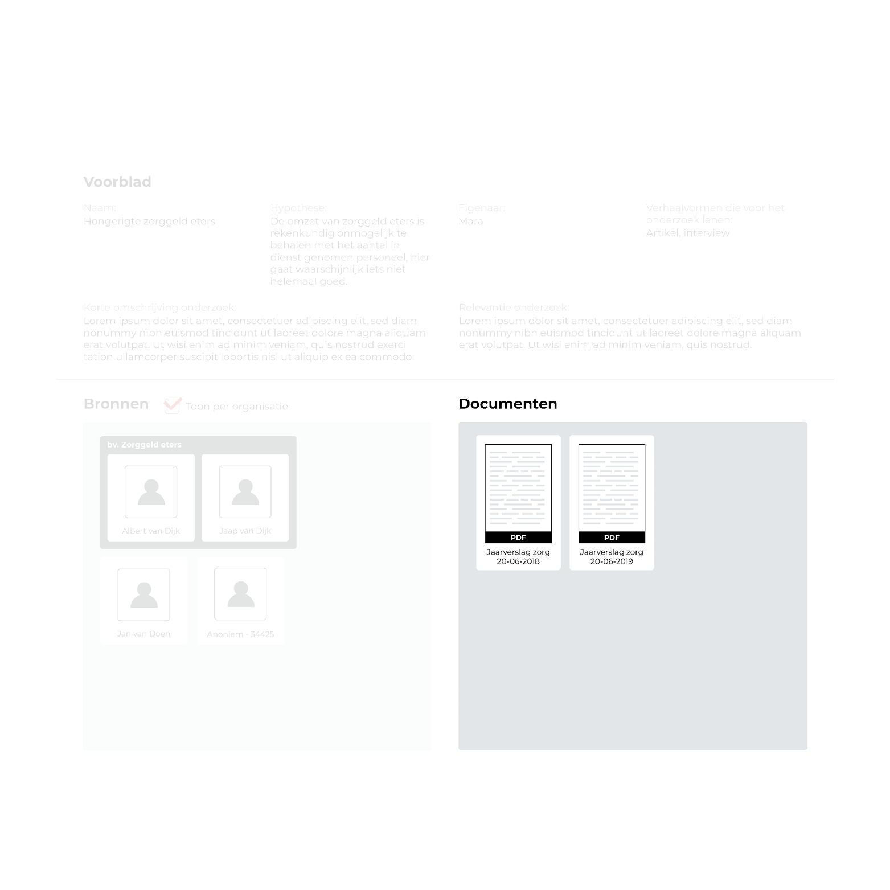

Zie hier onder het concept voor het weergeven van de document referenties. Hiermee kan de onderzoeksjournalist detailinformatie opvragen voor een document.

Er zijn twee ingevoerde document referenties beschikbaar. Beide zijn het jaarverslagen met het bestandstype PDF. 

Voor elk document-referentie is weergegeven als een item waarop je kan klikken. Deze bestaat uit een naam en een afbeelding. De afbeelding is bedoeld als herkenningspunt van het document. Het eerst screenshot dat geüpload is wordt hiervoor gebruikt.

<!-- De bronnen en documenten staan naast elkaar omdat ze beide beginpunten zijn en elkaar van informatie voorzien. Zo zorgen bronnen voor documenten en documenten leiden weer tot nieuwe bronnen.

Detailinformatie voor bio:
Ik heb voor beide informatietypes gekozen voor knoppen. De gebruiker wil detailinformatie bekijken om te begrijpen waarom dit onderdeel toegevoegd is aan het onderzoek. De knop bestaat uit een afbeelding en de naam van het bijbehorende item. De afbeelding is gebruikt om context te bieden voor inhoud dat gaat komen. -->

Deze modal krijg je te zien wanneer je op een document klikt. 

Het modal bestaat uit de documentnaam, een lijst met kenmerken en aan de rechterkant alle gekoppelde onderdelen. De kenmerken staan direct onder de het documentnaam om aan te geven dat ze hier bij horen.

## Data

### Succesvol vertaald

- [x] Naam
- [x] Link (url)
- [x] Beschrijving
- [x] Screenshots
- [x] Screenshot creatiedatum
- [x] Bestandstype
- [x] Referentie (APA)
- [ ] Bron / contact persoon
- De datum voor bron / contact persoon is wel bij beide aanwezig maar niet koppelbaar.
  - Invoeren van onderzoeksdata: Invulveld met suggestielijst
  - Visuele weergave: Entiteit koppeling met de bron.

 

- [x] Document status
- [x] Validatie status
- [x] Uitgiftedatum

