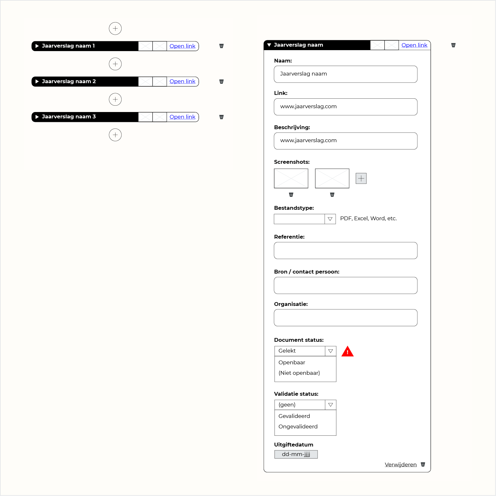

## Vanuit: Invoeren van onderzoeksdata

## Naar: Visuele weergave

Deze overlay krijg je te zien wanneer je op een document klikt. Dit zou bijvoorbeeld een jaarverslag kunnen zijn.

## Data

### Succesvol vertaald

- [x] Naam
- [x] Link (url)
- [x] Beschrijving
- [x] Screenshots
- [x] Screenshot creatiedatum
- [x] Bestandstype
- [x] Referentie (APA)
- [ ] Bron / contact persoon

De datum voor bron / contact persoon is wel bij beide aanwezig maar niet koppelbaar.
- Invoeren van onderzoeksdata: Invulveld met suggestielijst
- Visuele weergave: Entiteit koppeling met de bron.

- [x] Document status
- [x] Validatie status
- [x] Uitgiftedatum

