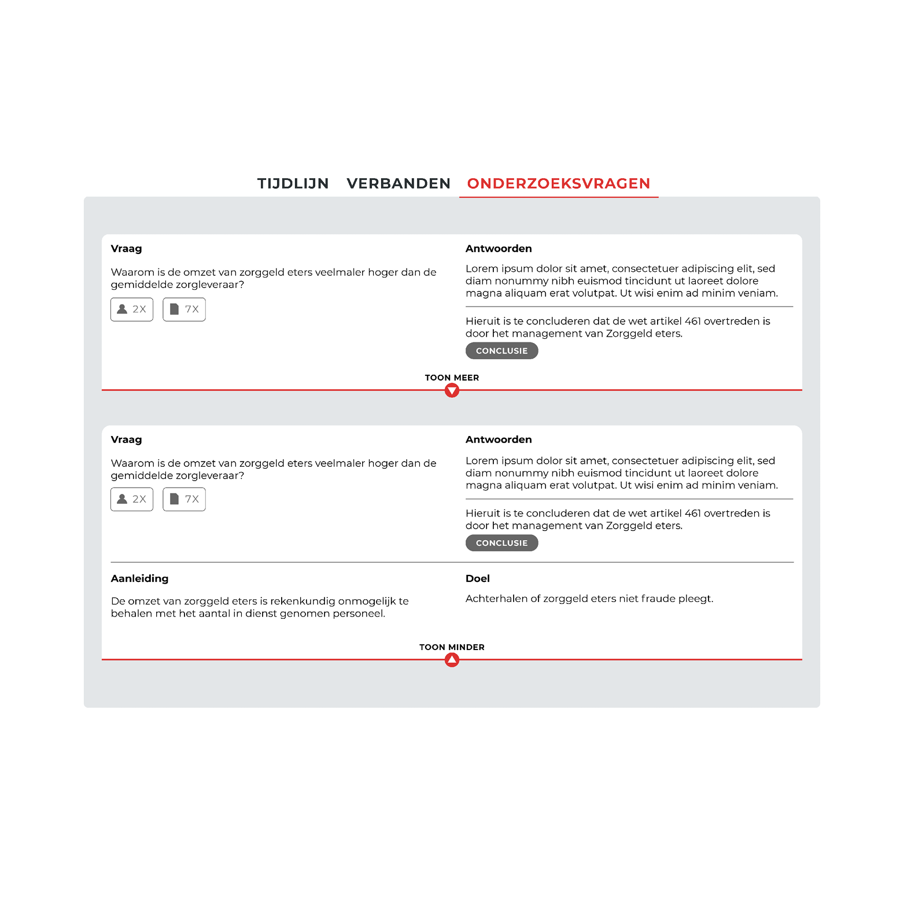

Op dit scherm staan alle onderzoeksvragen die gesteld zijn in het onderzoek. De beantwoording op deze vragen zijn aan de rechterkant weergegeven. 

## Data

### Succesvol vertaald
- [ ] Vragenlijst naam
- [ ] Vragenlijst beschrijving
- [x] Onderzoeksvragen
- [x] Antwoord op onderzoeksvraag
- [ ] Referenties/koppelingen met bronnen, documenten.
* Mist nog: Gebeurtenissen en conclusies
- [x] Aanleiding van onderzoeksvraag
- [x] Doel van onderzoeksvraag 

### Mist nog
- Definitie antwoord (conclusie)
__Mist in: Invoeren van onderzoeksdata__
- Ondersteuning voor meerdere aanleidingen
__Mist in: Visuele weergave__

## Aanpassingen

Een re-design is nodig voor 'onderzoeksvragen - Invoeren van onderzoeksdata', de data loopt te ver uit een.