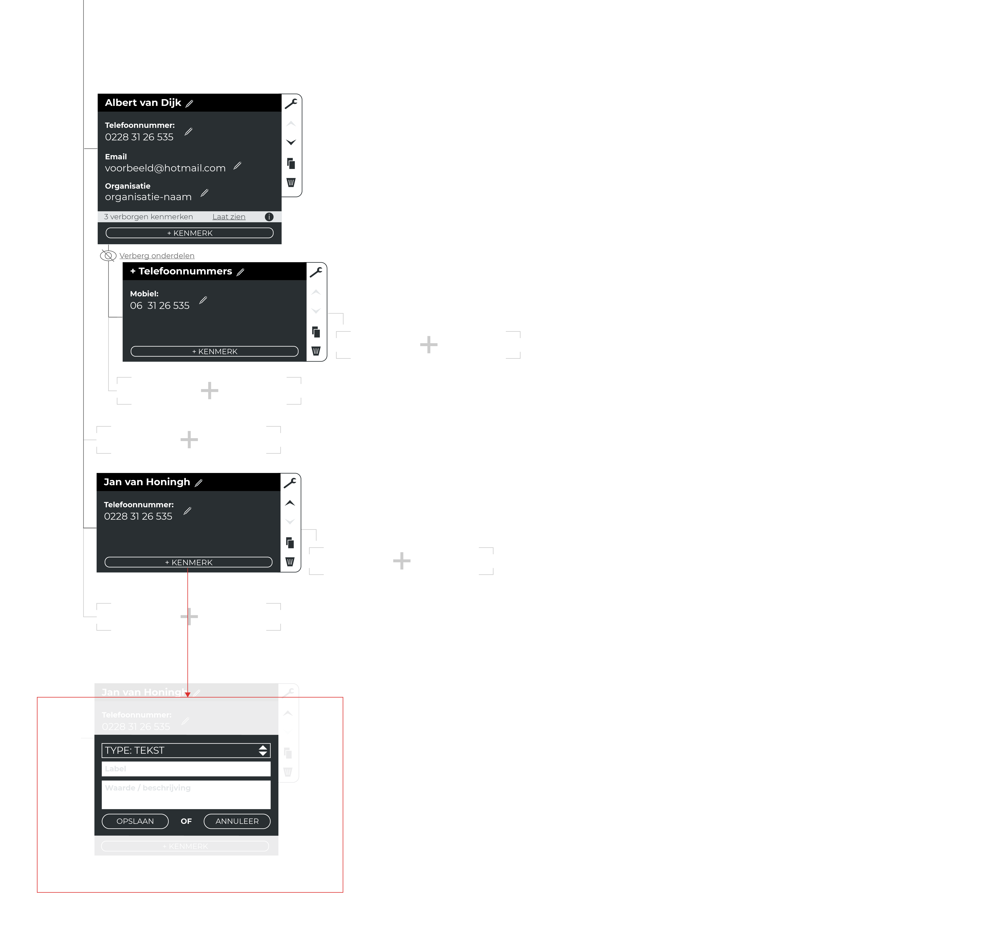

## Vanuit: Invoeren van onderzoeksdata

## Naar: Visuele weergave

Deze overlay krijg je te zien wanneer je op een bron klikt.

## Data

### Succesvol vertaald
- [x] Naam
- [x] Eigenschappen
- [ ] Vader-kind hiërarchie en wellicht overerven van eigenschappen

### Geschrapt voor volgend ontwerp 
- Vader-kind hiërarchie en wellicht overerven van eigenschappen
__Geschrapt uit: Invoeren van onderzoeksdata__

### Mist nog
- Een indicatie dat je per organisatie kan groeperen. De gebruiker weet niet dat als hij de label met de tekst 'organisatie' voorziet, dat in de visuele weergave je daarop kan groeperen.
__Mist in: Invoeren van onderzoeksdata__

## Aanpassingen

Een re-design is nodig voor 'Invoeren van onderzoeksdata' en concept 'Boom hiërarchie' vervalt voor nu. Vanuit het concept 'Boom hiërarchie' is de bedrijfstructuurweergave niet nuttig in deze visualisatie. Wellicht heeft een 'bedrijfstructuur' zijn eigen werkgebied en waargave nodig. Ik hoop deze terug te gaan zien in de productvisie.