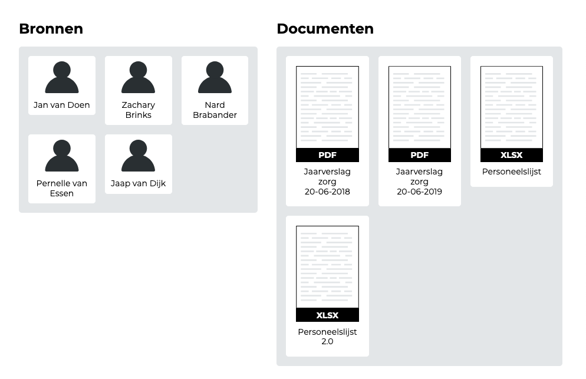
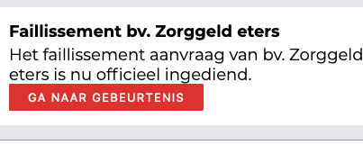
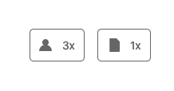
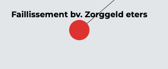
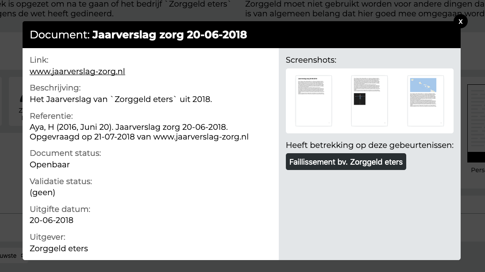

[Link naar prototype](https://oege.ie.hva.nl/~essenj004/FTM/blauwdruk/output/version-1.0.0/)

## Gebruikerstest 1

Gebruikerstest test met [Arne van der Wal](https://www.ftm.nl/auteur/Arne-van-der-Wal) \(Onderzoeksjournalist\)

### Feedback

#### Voorblad

> Deze gegevens missen nog op het voorblad:
> * Publicatie datum
> * Startdatum (Start onderzoek)
> * Mensen die hebben bijgedragen aan het onderzoek

> Wat als er te veel informatie op het voorblad staat? Kan dat misschien ingeklapt worden?

#### Bronnen en documenten

> Wat als je meer dan 100 bronnen en documenten hebt op dit scherm?

> Is de volgorde van de bronnen en documenten op alfabetische volgorde?

#### Verbanden

Wanneer je in het netwerk-diagram een gebeurtenis aanklikt komt deze knop te voorschijn:

__Na het klikken op de knop Ga naar gebeurtenis:__

> Arne: ???

De tekst in de knop is niet duidelijk. De tekst had eigenlijk moeten zijn: __"Ga naar gebeurtenis in tijdlijn"__

#### Onderzoeksvragen

> Ik zie hier nog niet de meerwaarde van in.

### Observatie

#### Tijdlijn

De referentie knoppen binnen de tijdlijn worden nog niet gebruikt. Na de reden achter deze verschijnsel gevraagd te hebben, bleek de verwachte gebruikersinterface-feedback na het klikken op de knop onduidelijk. Het was overigens wel duidelijk dat deze te maken hadden met bronnen en documenten.

#### Verbanden

De gebruiker verwachte niet dat je (muis) interactie kan hebben met het netwerkdiagram.

## Gebruikerstest 2

Gebruikerstest test met [Peter Hendriks](https://www.ftm.nl/auteur/peter-hendriks) \(Onderzoeksjournalist\)

### Observatie

#### Verbanden

Bij de netwerkdiagram is het niet duidelijk dat je er interactie mee kan hebben. Is misschien een zero-state noodzakelijk?

## Gebruikerstest 3

Gebruikerstest test met [Luuk van der Sterren](https://www.ftm.nl/auteur/luuk-van-der-sterren) \(Eindredacteur\)

### Feedback

> Ik zou graag de documenten ingesloten willen hebben.

Luuk zou graag willen dat de documenten zijn ingesloten in het product. Dit is niet het geval, in dit product wordt alleen naar documenten gerefereerd.

Hij heeft er baat bij dat documenten in het product opgenomen kunnen worden vanuit een redactie perspectief.

## Gebruikerstest 4

Gebruikerstest test met [Ties Joosten](https://www.ftm.nl/auteur/ties-joosten) \(Onderzoeksjournalist\)

### Feedback

> De informatie telefoonnummer te gevoelig, deze staat in principe al op je telefoon. Deze hoeft niet in het product.

(Dit is een keuze van de onderzoeksjournalist. Het ligt er maar net aan wie het product moet bekijken)

## Gebruikerstest 5

Gebruikerstest test met [Jan-willem Sanders](https://www.ftm.nl/medewerkers/) \(Uitgever en opdrachtgever\)

### Feedback

#### Onderzoeksvragen

> Hoofdvraag? Waar wordt die uitgelicht?

> Conclusie knop, hoe werkt dat?

> Subvraag / deelvraag, met wat voor vraag heb ik te maken?

> Voor inspiratie kijk naar een 'Antwoorden boom'

> Verwachte volgorde 
> 1. Aanleiding 
> 2. Vraag
> 3. Doel
> 4. Antwoord / Inzichten

## Gebruikerstest 6

Gebruikerstest test met [Frank Meijer](https://www.ftm.nl/medewerkers/) \(Onderzoeksjournalist\)

### Feedback

#### Bronnen

> Welke bronnen heb ik al gesproken? (wederhoor)

## Feedback ronde

Met Charl en Sadjad

### Feedback

#### Tijdlijn

> Is het mogelijk om een gebeurtenis te markeren op basis van bronnen en documeten?

#### Verbanden

> De logica hoe verbanden in elkaar zitten is momenteel nog niet duidelijk en dat heeft er mee te maken dat de positie van de 'gebeurtenissen' binnen het netwerkdiagram nog geen meerwaarde hebben.

Kan tijd misschien ook binnen dit diagram een rol spelen?

__Toevoeging om deze verwarring te voorkomen:__

De pijlen (->) bij de verbanden missen momenteel nog, deze zitten wel in het ontwerp: "Invoeren van onderzoeksdata". Als er geen pijlen in staan dan is het niet altijd even duidelijk in welke volgorde je het verband moet lezen.

#### Onderzoeksvragen

Vanuit de feedback van Arne was de meerwaarde van het onderdeel onderzoeksvragen niet helemaal duidelijk. Ik heb daarom dit voorgelegd.

Tip van Charl: Verplaats de aanleiding naar boven.

