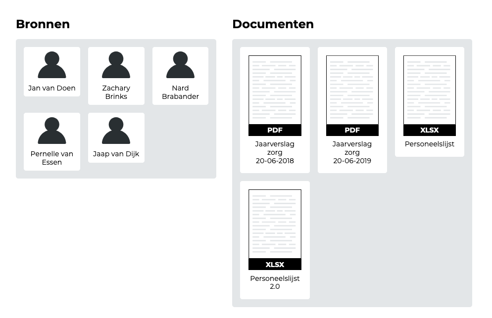
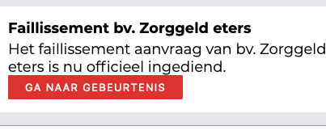
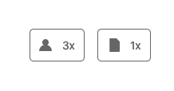
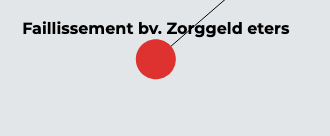

[Link naar prototype](https://oege.ie.hva.nl/~essenj004/FTM/blauwdruk/output/version-1.0.0/)

## Gebruikerstest 1

Prototype test met [Arne van der Wal](https://www.ftm.nl/auteur/Arne-van-der-Wal)

### Feedback

#### Voorblad

> Deze gegevens missen nog op het voorblad:
> * Publicatie datum
> * Startdatum (Start onderzoek)
> * Mensen die hebben bijgedragen aan het onderzoek

> Wat als er te veel informatie op het voorblad staat? Kan dat misschien ingeklapt worden?

#### Bronnen en documenten

> Wat als je meer dan 100 bronnen en documenten hebt op dit scherm?

> Is de volgorde van de bronnen en documenten op alphabetische volgorde?

#### Verbanden

Wanneer je in het netwerk-diagram een gebeurtenis aanklikt komt deze knop te voorschijn:

__Na het klikken op de knop Ga naar gebeurtenis:__

> Arne: ???

De tekst in de knop is niet duidelijk. De tekst had eigenlijk moeten zijn: __"Ga naar gebeurtenis in tijdlijn"__

#### Onderzoeksvragen

> Ik zie hier nog niet het meerwaarde van in.

### Observatie

#### Tijdlijn

De referentie knoppen binnen de tijdlijn worden nog niet gebruikt. Na de reden achter deze verschijnsel gevraagd te hebben, bleek de verwachte gebruikersinterface-feedback na het klikken op de knop onduidelijk. Het was overigens wel duidelijk dat deze te maken hadden met bronnen en documenten.

#### Verbanden

De gebruiker verwachte niet dat je (muis) interactie kan hebben met het netwerkdiagram.

## Feedback ronde 1

Met Charl en 

### Feedback

#### Tijdlijn

> Is het mogelijk om een gebeurtenis te markeren op basis van bronnen en documeten?

#### Verbanden

> De logica hoe verbanden in elkaar zitten is momenteel nog niet duidelijk en dat heeft er mee te maken dat de positie van de 'gebeurtenissen' binnen het netwerkdiagram nog geen meerwaarde hebben.

Kan tijd misschien ook binnen dit diagram een rol spelen?

__Toevoeging om deze verwarring te voorkomen:__

De pijlen (->) bij de verbanden missen momenteel nog, deze zitten wel in het ontwerp: "Invoeren van onderzoeksdata". Als er geen pijlen in staan dan is het niet altijd even duidelijk in welke volgorde je het verband moet lezen.

#### Onderzoeksvragen

Vanuit de feedback van Arne was de meerwaarde van het onderdeel onderzoeksvragen niet helemaal duidelijk. Ik heb daarom dit voorgelegt.

