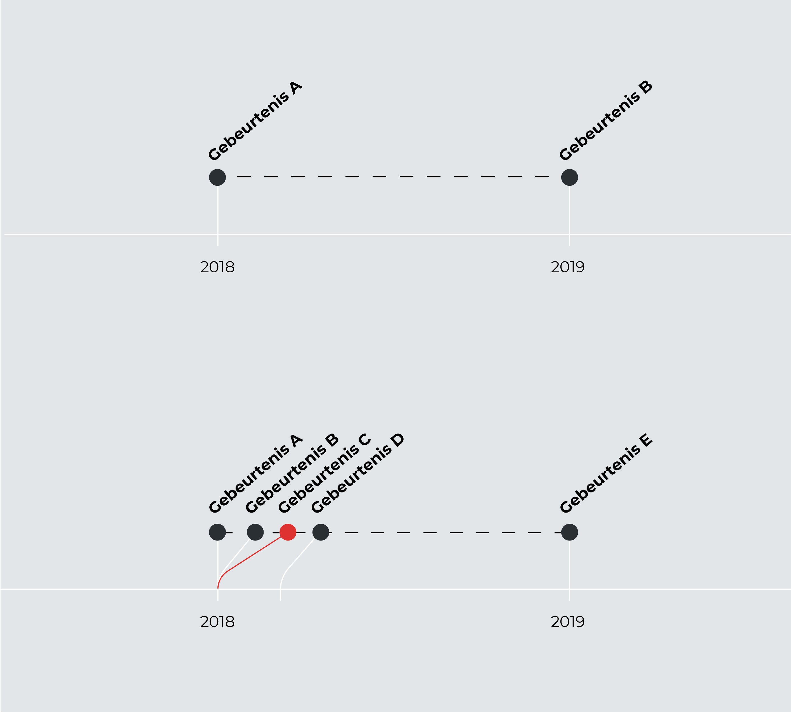
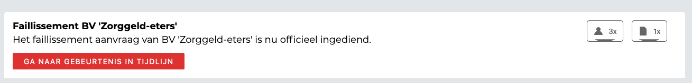

## Aanpassingen ten opzichte van 1.0.0

### Algemene informatie

### Gekoppelde onderdelen

 

De nieuwe weergave van de gekoppelde onderdelen. Uit de gebruikerstest leek het er op dat de werking van de knoppen niet duidelijk was. Nu zit er een pijl op die laat zien dat er onder de knop iets te voorschijn komt.
[Vanuit Feedback](https://jorik.gitbook.io/project-blauwdruk/ontwerpproces/output/prototype#voorblad)

### Verbanden

Deze informatie was nog niet toegevoegd in versie 1.0.0.

In deze weergave staan de verbanden + gebeurtenissen op een eigen tijdslijn. 
[Vanuit feedback](https://jorik.gitbook.io/project-blauwdruk/ontwerpproces/output/prototype#verbanden-3)

Wanneer gebeurtenissen op dezelfde datum voorkomen, kan dat voor weergave problemen zorgen. Om dit op te lossen worden de gebeurtenissen naar rechts geschoven, maar de pijl blijft wel op de juiste datum staan.

Je kan altijd nog terug naar de vorige weergave.

* De tekst van Call to action knop aangepast, van 'Ga naar gebeurtenis' naar 'Ga naar gebeurtenis in tijdlijn'. [Vanuit feedback](https://jorik.gitbook.io/project-blauwdruk/ontwerpproces/output/prototype#verbanden)
* Gekoppelde onderdelen (bronnen en documenten) zijn nu ook op deze pagina te vinden.