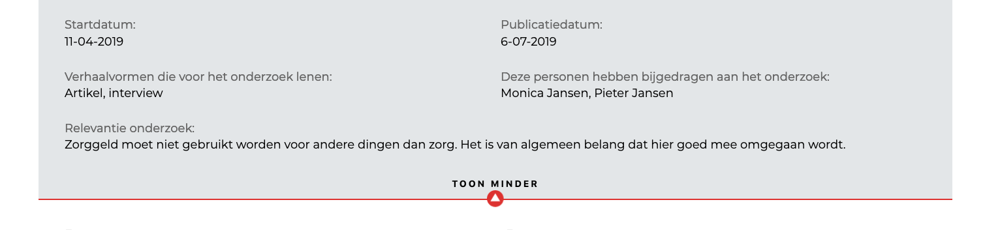
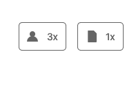
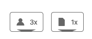
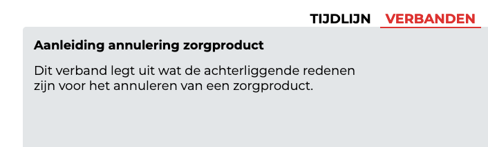
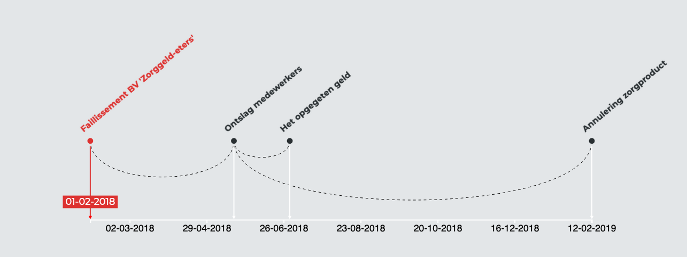
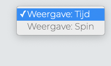

## Aanpassingen ten opzichte van 1.0.0

### Algemene informatie

### Gekoppelde onderdelen

De nieuwe weergave van de gekoppelde onderdelen. Uit de gebruikerstest leek het er op dat de werking van de knoppen niet duidelijk was. Nu zit er een pijl op die laat zien dat er onder de knop iets te voorschijn komt.

### Verbanden

Deze informatie was nog niet toegevoegd in versie 1.0.0.

In deze weergave staan de verbanden op een eigen tijdslijn.

Je kan altijd nog terug naar de vorige weergave.