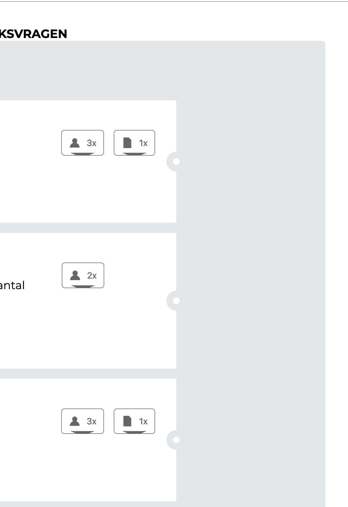
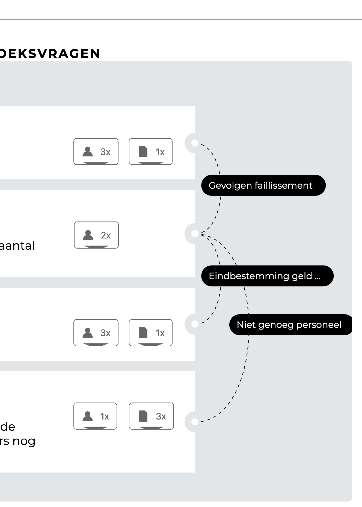
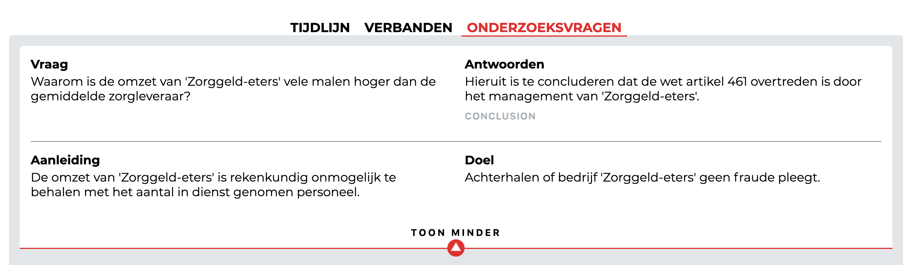
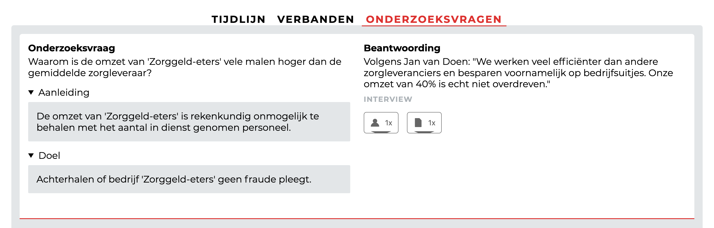

## Aanpassingen ten opzichte van output_1.1.0

### Tijdlijn met verbanden

In de versie output_1.1.0 mist nog de verbanden weergave naast de tijdlijn. Deze heb ik in output_1.2 toegevoegd.

Dit geeft de onderzoeksjournalist direct inzicht in de verbanden tussen de gebeurtenissen. Dit is ook af te lezen in de verbanden sectie, maar daar is elk verbanden-web apart zichtbaar. Juist in de tijdlijn sectie kan je deze parallel tonen.

Verbanden-web: Verbanden die bij elkaar horen.

### Onderzoeksvraag

De indeling van de onderzoeksvraag was niet helder voor de gebruiker.

De aanleiding en het doel van de onderzoeksvraag, zijn nu verplaatst onder de vraag. 

De gekoppelde onderdelen (bronnen/documenten) zijn nu te zien bij de onderzoeksvraag.

De knop om meer content te tonen is alleen zichtbaar wanneer de beantwoording uit meer dan 10 regels tekst bestaat.