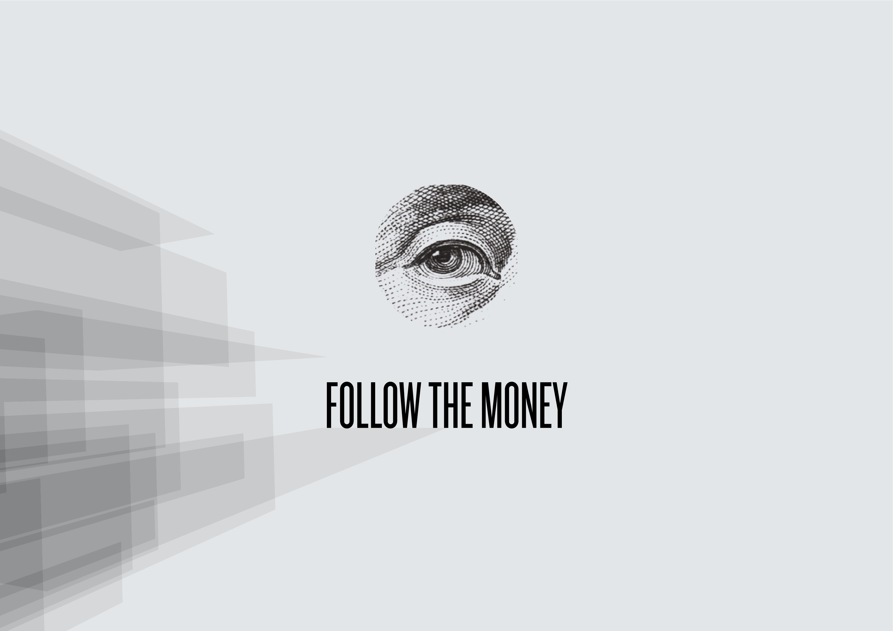

## Hyperlink naar het prototype

https://iiyama12.github.io/Project-blauwdruk_html-content/prototypes/output/version-4.0.0/

## Hyperlink naar de prototype video

https://iiyama12.github.io/Project-blauwdruk_html-content/video/prototype-1.2.0.mp4

## Gebruikerstest

### Doel
Valideren of dit het product volledig bruikbaar is voor de onderzoeksjournalist en bevindingen verzamelen voor een visie van het ontwerp.

### Testplan

#### Voorbereiding
1. Zet het prototype "Visuele weergave output_v1_2" klaar

#### Tijdens de test
* Vraag de participant om door het prototype / voorbeeld onderzoek heen te bladeren.
* Wanneer de participant gewend is aan de gebruikersintface, stel de volgende vragen:
  * "Hoe kan je de zien welke bronnen bij een gebeurtenis horen?"
  * "Hoe kom je er achter waarom een onderzoeksvraag gesteld is en waar zou je deze informatie kunnen vinden?"

#### Na de test
* Vraag de participant wat hij of zij nog mist.