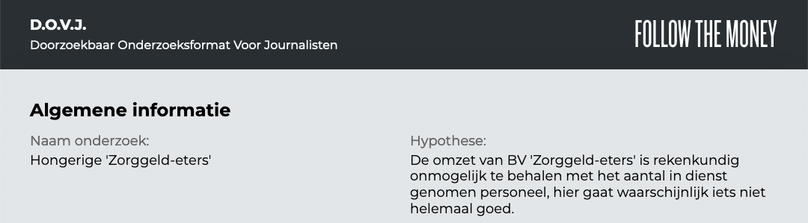
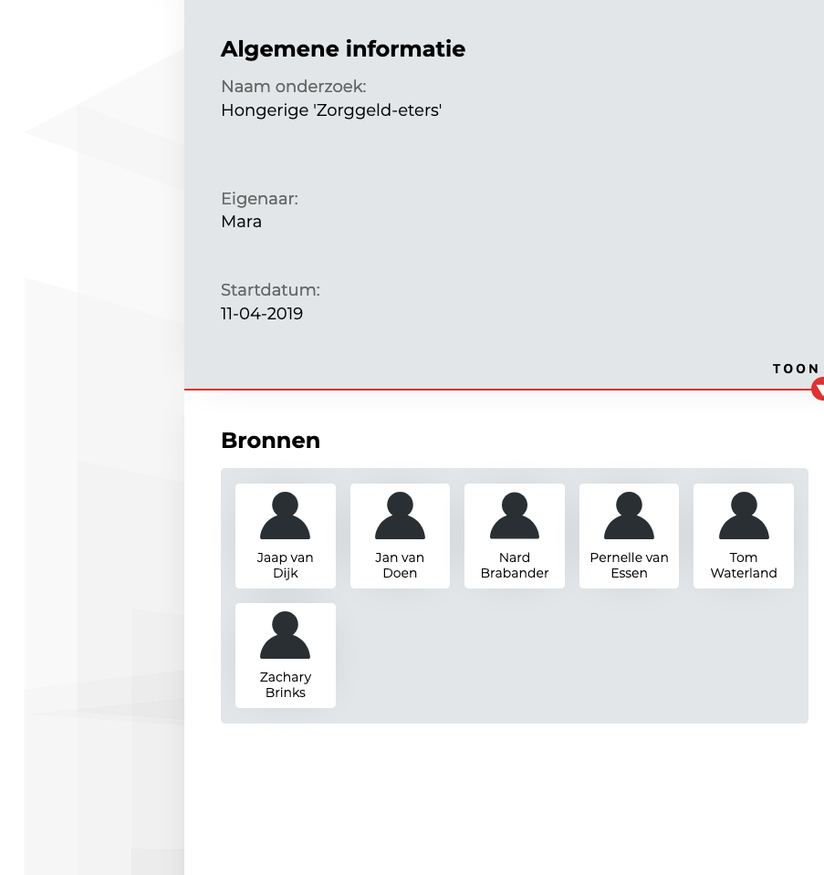
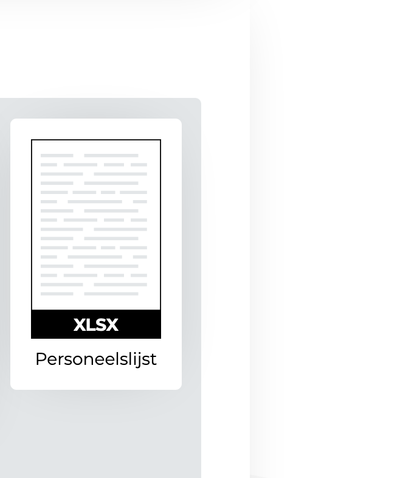
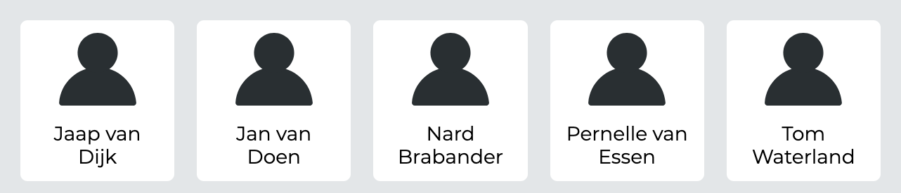
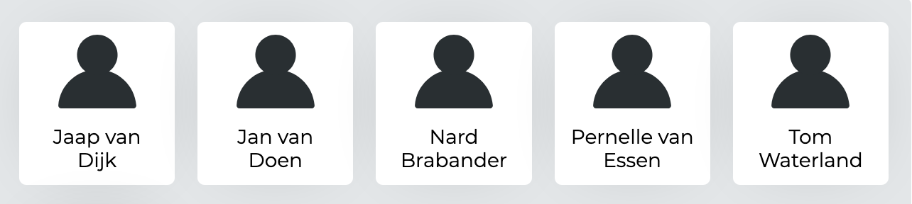

Er heeft nog extra vormgeef iteratie plaatsgevonden en de aanleiding hiervan was de feedback over de vormgeving door de derde lezer. De feedback was niet heel erg specifiek, dus ik heb even scherp naar het ontwerp gekeken en opschreven waar nog stappen in de vormgeving gezet kunnen worden.

__Uit eindelijk kwam ik op deze punten:__

* Productnaam en branding is niet aanwezig
* Achtergrond voelt te 'leeg'
* Extra nadruk leggen op het los weergeven van onderdelen van de achtergrond met bijvoorbeeld slagschaduw. Dit helpt om hiërarchie te bepalen en om klikbaarheid te verduidelijken.

## Productnaam en branding

Bovenaan het ontwerp heb ik nu het productnaam en het logo geplaatst. Het beeldmerk is niet geplaatst omdat deze in deze bovenbalk niet tot zijn recht komt.

## Achtergrond

De achtergrond was in versie 1.2 was helemaal wit. Nu is er een achtergrond afbeelding toegevoegd die de achtergrond iets speelser maakt is subtiel toegepast zodat deze niet voor afleiding zorgt.

## Nadruk: Onderdelen los van elkaar weergeven

### Pagina en achtergrond

Witte achtergrond onderscheiden van het pagina onderdeel door middel van een schaduw.

### Items

Items meer klikbaar laten aanvullen door middel van een schaduw.

