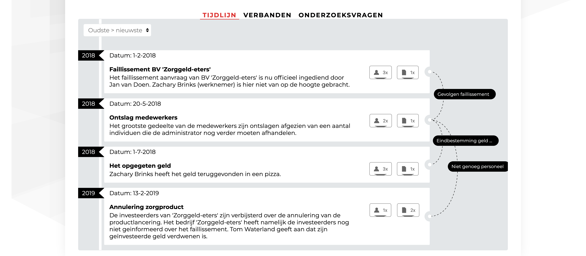

Dit is het eindproduct van dit traject. Je kijkt nu naar een doorzoekbare versie van een journalistiek onderzoek.

Het product bied transparantie en toegankelijkheid voor een journalistiek onderzoek. Dit doet het product door de onderzoek informatie aan elkaar te koppelen, zodat de gebruiker kan zien welke onderdelen bij elkaar horen en eenvoudig kan laten doorklikken naar detailinformatie.

Ook kan het product de onderzoeksjournalist helpen met het vinden van invalshoeken voor een onderzoek met een zelfde soort casus. Dit doet het product indirect door uit te leggen hoe de informatie tot stand is gekomen, welke (soort) bronnen er gesproken zijn en welke onderzoeksvragen je ook bij jouw casus zou kunnen stellen.

[Laatste prototype](https://iiyama12.github.io/Project-blauwdruk_html-content/prototypes/output/version-4.1.0-gebruikerstest/)

## Algemene informatie

De gebruiker kan hier de inleiding van het onderzoek lezen met daarbij de belangrijkste meta-informatie.

## Bronnen en documenten

De gebruiker kan hier de bouwstenen vinden van het onderzoek. Deze dienen als zowel voor bewijsmateriaal als invalshoeken voor het spreken van bepaalde bronnen die je nog niet gesproken hebt. Wanneer er op een bron of document wordt gedrukt opent een modal met detailinformatie. De gebruiker wordt hierdoor niet uit zijn workflow gehaald. Zie het modal verderop in de documentatie.

## Tijdlijn

De gebruiker kan het onderzoeksverhaal volgen door de gebeurtenissen stuk voor stuk te bekijken. Dit scheelt leestijd in vergelijking met het lezen van een heel artikel. Per gebeurtenis kan de gebruiker zien welke bronnen en documenten er mee te maken hebben gehad. Ingeval van documenten dient dit als bewijs en zorgt voor direct toegang tot de detailinformatie.

## Verbanden

De gebruiker kan oorzaken en gevolgen van gebeurtenissen bekijken en hierdoor het verhaal beter begrijpen.

## Onderzoeksvragen

De gebruiker kan bekijken welke onderzoeksvragen gesteld zijn om te controleren of de hypothese beantwoord is.

## Bron - detailinformatie

De gebruiker bekijkt detailinformatie van een bron om de rol van deze persoon beter inzichtelijk te maken. De rol van een persoon is vaak gebaseerd op de functie die hij of zij draagt. Ook kan de gebruiker met deze gegevens contact opnemen met de bron.

Mocht de bron gekoppeld zijn aan onderdelen zoals gebeurtenissen en onderzoeksvragen, dan heeft de gebruiker hier een overzicht van die doorklikbaar is.

## Document - detailinformatie

De gebruiker doorzoek de meta-informatie van het document om hiervan een samenvatting te krijgen. Dit kan ook gebruikt worden voor het valideren van de oorsprong.

Net als met de bron, kunnen documenten ook worden gekoppeld om doorklikbaarheid mogelijke te maken.
