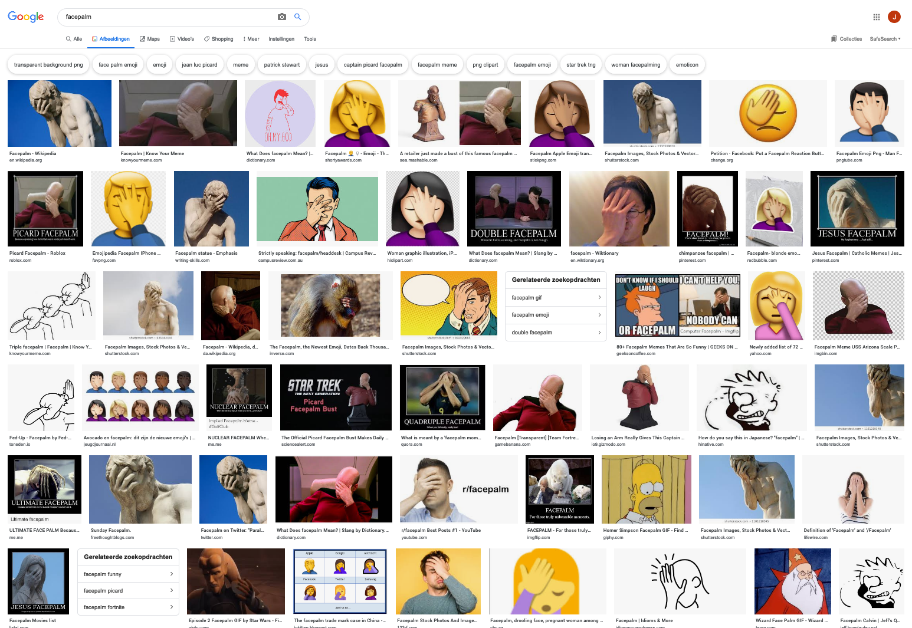

<!-- In dit hoofdstuk wordt uitgelegd hoe de ontwerpen van dit product tot stand zijn gekomen. Er worden in totaal 2 hoofdontwerpen beschreven. Het eerste ontwerp `invoergedeelte` gaat over de invoer van onderzoeksdata in database. Het tweede ontwerp gaat over de `visuele weergave` van de onderzoeksdata.
 -->

De Feedback op de 'Feedback Frenzy' presentatie gaf een duidelijk beeld over de status van het project. In het doorgelopen proces tot aan dit moment was het van mijn kant handiger geweest als ik wat concreter was geweest met de keuzes die ik heb gemaakt. Aan het eind van de presentatie was het nog steeds een lastig verhaal.

__Dit zijn de belangrijkste verbeterpunten:__
* User journey inkaart brengen
* Denk aan complexiteit van het gebruikersinterface
* Zoom wat meer uit, minder op detail niveau
* Een goede probleem beschrijving
* Persona ter ondersteuning
* Hele scherpe vraag: Alle informatie ingevuld en dan? (Tip van Thomas: kijk naar een rechercheur/politie case)

Bij de laatste verbeterpunt 'Alle informatie ingevuld en dan?', had ik het gevoel dat ik onhandig bezig ben geweest. Het is niet alsof ik er niet bij stilgestaan heb, maar om die vraag te beantwoorden is een heel andere versie van het ontwerp nodig.

Google. (z.d.-c). Facepalm. Geraadpleegd op 8 oktober 2019, van https://www.google.com/search?q=facepalm&client=firefox-b-d&source=lnms&tbm=isch&sa=X&ved=0ahUKEwiomaPMv4zlAhVCEVAKHUvNDCwQ_AUIESgB&biw=2319&bih=1442

## Is een tweede ontwerp nodig?
Het bouwen van een product die alle behoeftes van alle gebruikers vervult is een lastige opgave. Dit wordt nog lastiger wanneer het product twee verschillende soorten rollen gaat spelen. Namelijk het invoeren van informatie, de informatie weergeven en daarbovenop moet het ook nog eens de informatie doorzoekbaar maken.

Wanneer je deze rollen vanaf het begin van de productontwikkeling gaat bundelen in 1 product wordt het een rommeltje. Te veel interactie-elementen op hetzelfde scherm, moeilijke keuzes maken welke elementen moeten blijven en het is lastig om de beste gebruikersflow te vinden.

Ik heb daarom besloten om een tweede ontwerp te ontwerpen, die moet aansluiten op het eerste ontwerp.

* Eerste ontwerp: invoeren van onderzoeksdata
* Tweede ontwerp: visuele weergave

Beide moeten een deel van de design challenge beantwoorden.

## Het eerste ontwerp: invoeren van onderzoeksdata

### Design challenge
__Vanuit de design challenge gaat het ontwerp `invoeren van onderzoeksdata` zorgen voor:__

* `Aanvulbaarheid`

Dit product is voor veiligheidsoverwegingen alleen offline beschikbaar en ook om het project af te kaderen. Samenwerken met meerdere computers valt momenteel nog buiten het kader van het project. Dit betekent natuurlijk niet dat je er niet gezamenlijk met 1 computer aan kan werken.

## Het tweede ontwerp: visuele weergave
Het tweede ontwerp gaat over de visuele weergave van de ingevoerde informatie. Het ontwerp dat de onderzoeksjournalist de mogelijkheid bied om de informatie te bekijken, te doorzoeken en ook om te delen met collega's.

### Probleem en oplossing
Via het eerste ontwerp is de ingevoerde informatie nu gestructureerd, maar nog steeds niet doorzoekbaar. Het tweede ontwerp is bedoeld om de gestructureerde informatie op een logische manier weer te geven en doorzoekbaar te maken.

### Design challenge
__Vanuit de design challenge zorgt dit ontwerp voor:__

* `Transparantie`
* `Toegankelijkheid`
* Kan helpen met `reproduceerbaarheid`, maar de onderzoeksjournalist moet dit nog steeds zelf doen.

## Focus op het tweede ontwerp: Visuele weergave
Binnen de tijd die er beschikbaar is voor dit afstudeerproject, is het voor mij van belang dat ik keuzes maak welke ontwerp ik het verste uitwerk. De keuze die ik gemaakt heb, is het ontwerp de `visuele weergave van de onderzoeksdata` geworden. De belangrijkste reden achter deze keuze, aannamen: Je kan de frictie / drempel van het `invoergedeelte` zo laag mogelijk maken door slimme oplossingen te verzinnen, maar als de __meerwaarde__ van de `Visuele weergave` niet een veelvoud van het `invoergedeelte` is, dan is de drempel nog steeds te hoog om het daadwerkelijk te gaan gebruiken.

## Startdatums ontwerpen

