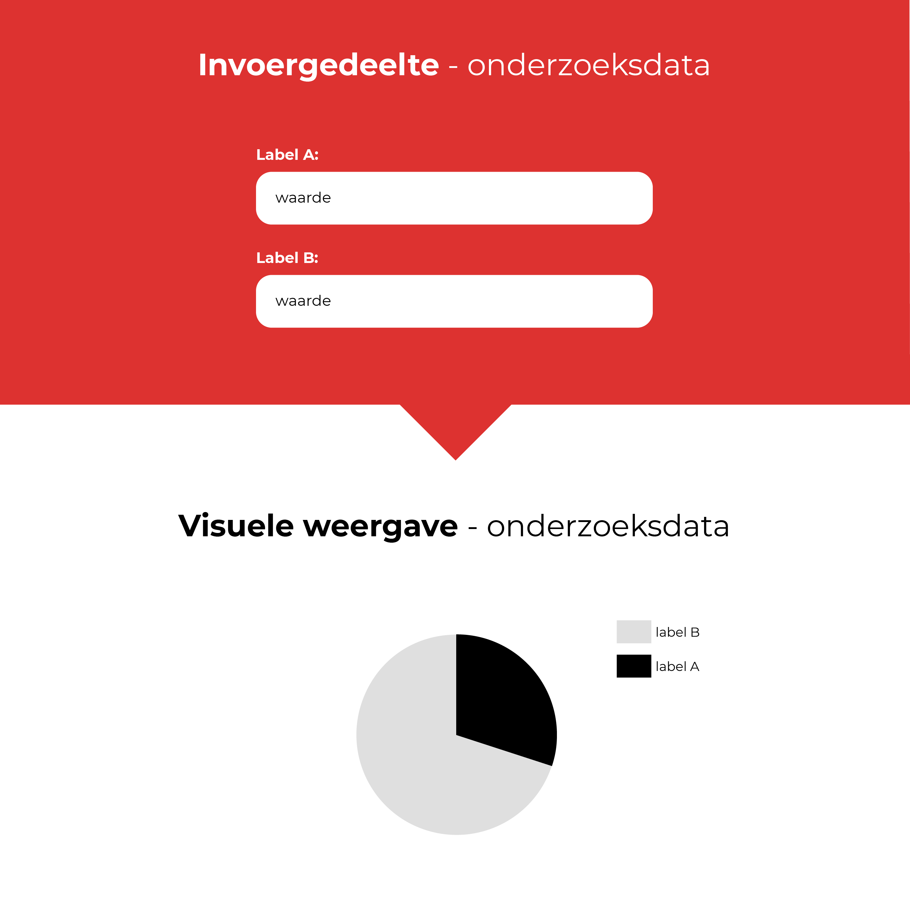
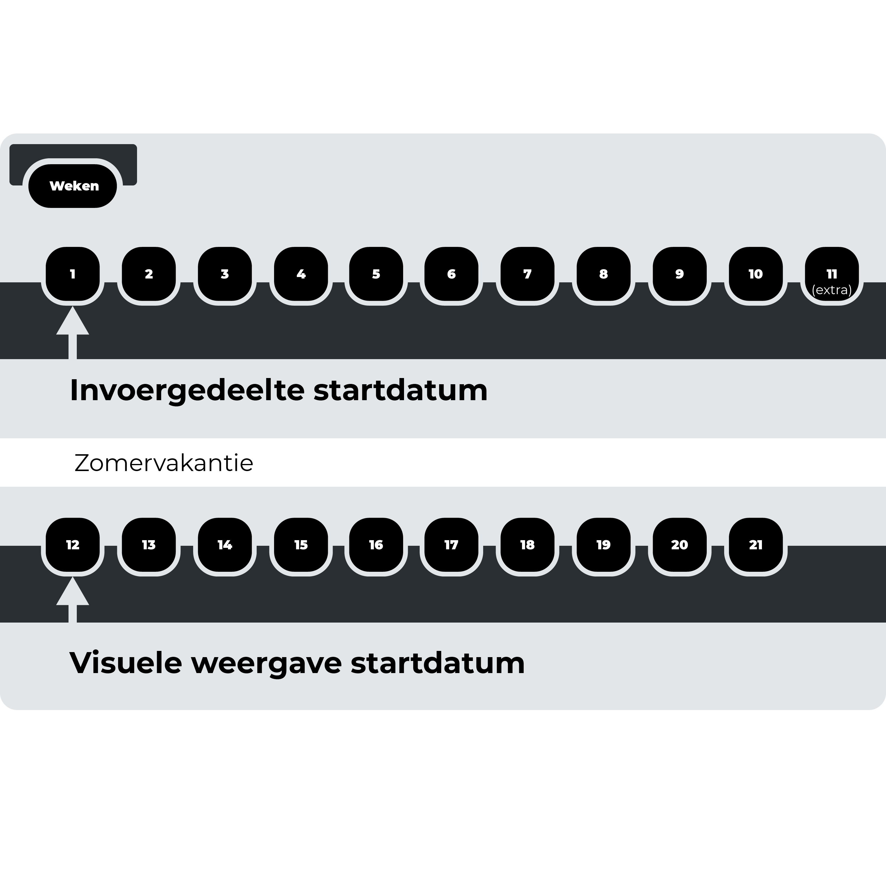

<!-- In dit hoofdstuk wordt uitgelegd hoe de ontwerpen van dit product tot stand zijn gekomen. Er worden in totaal 2 hoofdontwerpen beschreven. Het eerste ontwerp `invoergedeelte` gaat over de invoer van onderzoeksdata in database. Het tweede ontwerp gaat over de `visuele weergave` van de onderzoeksdata.
 -->

De Feedback uit de 'Feedback Frenzy' gaf duidelijk aan dat de concepten en ontwerpen nog niet helemaal duidelijk waren voor de gebruikers. Kortom, ik miste nog een paar hele belangrijke punten.

* User journey
* Complexiteit gebruikersinterface
* Zoom wat meer uit, minder op detail niveau
* Een goede probleem beschrijving
* Persona
* Alle informatie ingevuld en dan? (Tip van Thomas: kijk naar een rechercheur/politie case)

## Het tweede ontwerp: visuele weergave
Het tweede ontwerp gaat over de visuele weergave van de ingevoerd informatie. Het ontwerp dat de onderzoeksjournalist de mogelijkheid bied om de informatie te bekijken, te doorzoeken en ook om te delen met collega's.

### Probleem en oplossing
Via het eerste ontwerp is de ingevoerde informatie nu gestructureerd, maar nog steeds niet doorzoekbaar. Het tweede ontwerp is bedoeld om de gestructureerde informatie op een logische manier weer te geven en doorzoekbaar te maken.

### Design challenge
__Vanuit de design challenge zorgt dit ontwerp voor:__

* `Transparantie`
* `Toegankelijkheid`
* Kan helpen met `reproceerbaarheid`, maar de onderzoeksjournalist moet dit nog steeds zelf doen.

## Waarom 2 ontwerpen?
Het bouwen van een product die alle behoeftes van alle gebruikers vervuld is een lastige opgave. Dit wordt nog lastiger wanneer het product twee verschillende soorten rollen gaat spelen. Namelijk het invoeren van informatie, de informatie weergeven en daarbovenop moet het ook nog eens de informatie doorzoekbaar maken.

Wanneer je deze rollen vanaf het begin van de productontwikkeling gaat bundelen in 1 product wordt het een rommeltje. Te veel interactie-elementen op hetzelfde scherm, moeilijke keuzes maken welke elementen moeten blijven en het is lastig om de beste gebruikersflow te vinden.

## Focus op het tweede ontwerp: Visuele weergave
Binnen de tijd die er beschikbaar is voor dit afstudeerproject, is het voor mij van belang dat ik keuzes maak welke ontwerp ik het verste uitwerk. De keuze die ik gemaakt heb, is het ontwerp de `visuele weergave van de onderzoeksdata` geworden. De belangrijkste reden achter deze keuze, aannamen: Je kan de frictie / drempel van het `invoergedeelte` zo laag mogelijk maken door slimmen oplossingen te verzinnen, maar als de __meerwaarde__ van de `Visuele weergave` niet een veelvoud van het `invoergedeelte` is, dan is de drempel nogsteeds te hoog om het daadwerkelijk te gaan gebruiken.

## Startdatums ontwerpen

### Design challenge: invoeren van onderzoeksdata
__Vanuit de design challenge gaat het ontwerp `invoeren van onderzoeksdata` zorgen voor:__

* `Aanvulbaarheid`

Dit product is voor veiligheidsoverwegingen alleen offline beschikbaar voor veiligheids overwegingen en afkadering project. Samenwerken met meerdere computers valt momenteel nog buiten het kader van het project. Dit betekend niet dat je niet gezamenlijk met 1 computer er aan kan werken.
