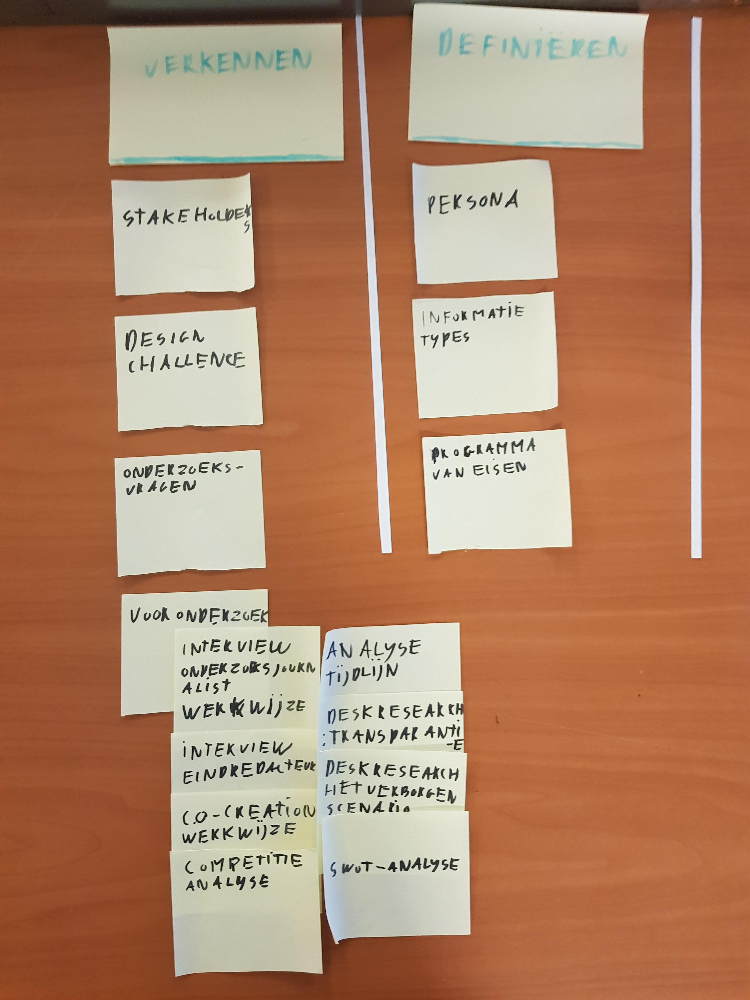
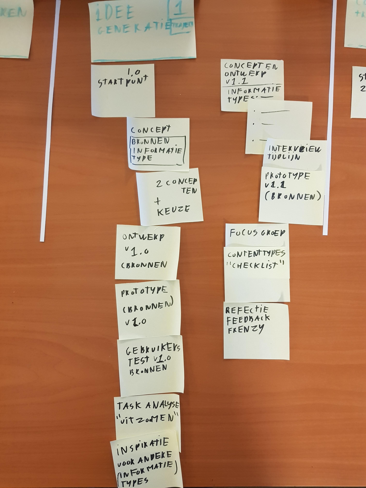
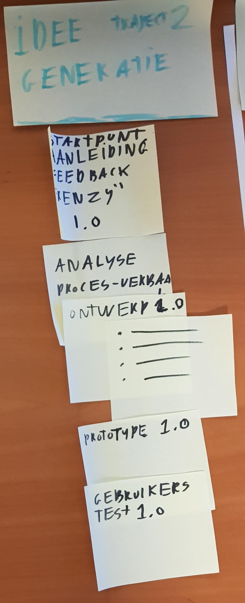
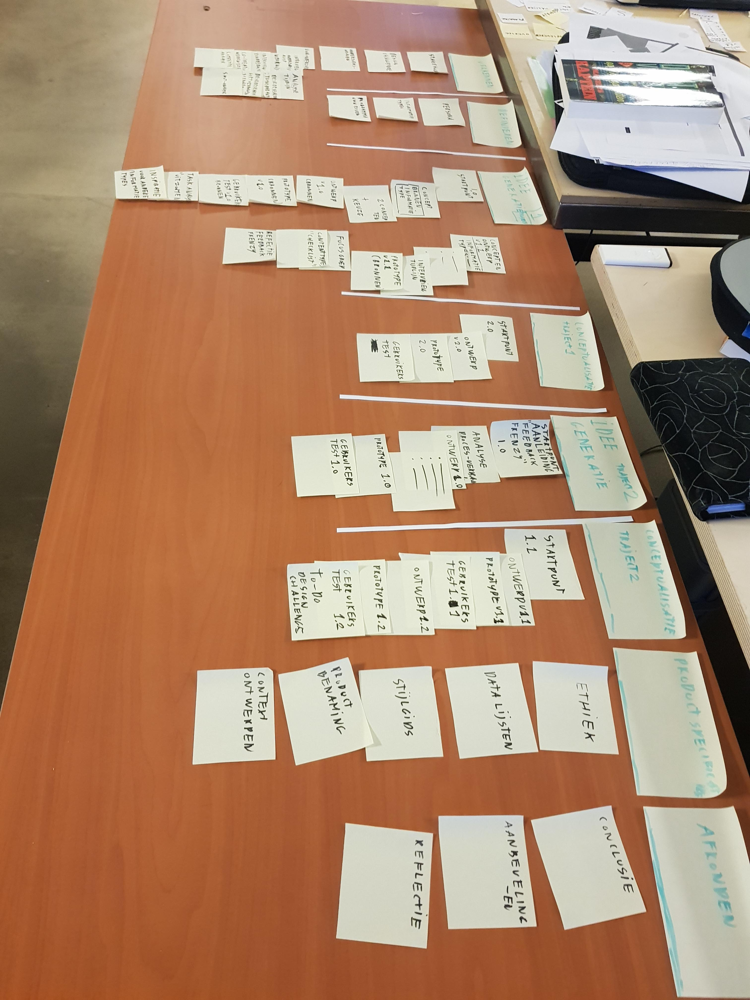
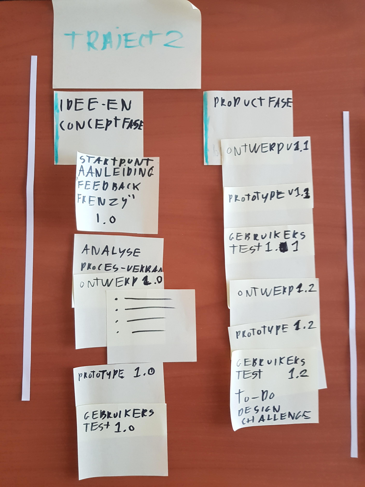

Deze pagina gaat over het herindelen van de biografie en welke iteraties daar aan te pas zijn gekomen. De aanleiding hiervan was de feedback over de documentatie door de derde lezer.

## Feedback

> De (structuur van je) documentatie is voor verbetering vatbaar

* Charl Smit (Eerste lezer)
* Marije ter Beke (Derde lezer)

## Probleemherkenning

Na met Charl de feedback te hebben doorgesproken, kwam ik uit op de volgende problemen en oorsprong.

__Problemen:__

1. In de documentatie wordt de lezer matig geïnformeerd over welke pagina's bij welke fase horen. 
   __Mogelijke oorsprong:__
  * Verslaglegging is niet mijn beste eigenschap.
  * Chronologie in combinatie met twee eindontwerpprocessen, maakt het structuur aanbrengen aan de documentatie lastig.
  * Ik was onbekend met de sectie feature van Gitbook vanuit markdown-formaat. Daarom heb ik deze niet eerder toevoegt.
  
2. De documentatie heeft te veel verdiepingslagen in de vorm van secties, sub-secties en sub-sub-secties.
   __Mogelijke oorsprong:__
  * Ik denk vaak vanuit een hiërarchische structuur dat vaak complexe is. Dit is een handige eigenschap om complexe systemen te begrijpen, maar ook vooral een nadelige eigenschap om informatie over te brengen dat nu het geval is.
3. De structuur van de biografie is net even anders dan die van de design rationale.

## Aanpak verbetering

Om de biografie (en ook de design rationale) structureel te verbeteren.

* Meer inspiratie opdoen vanuit CMD goed gekeurde documentaties.
* Minder verdieping van secties, sub-secties en sub-sub-secties.
* Documentatie verdelen in heldere fases.
* Pagina's verschuiven tot dat ze op een logische plek staan. 
* Pagina indelen met post-its om snel te itereren.
* Testen met de biografie.

## Versie 1

### Globale indeling
* Introductie __pagina__
* Begrippenlijst __pagina__
* Wensen en context 
* Verkennen (Onderzoek doen)
* Definiëren (Welke onderdelen vanuit het onderzoek zijn belangrijk voor het concept en ontwerp?)
* Idee generatie | traject 1 __*__
* Conceptualisatie | traject 1
* Idee generatie | traject 2 
* Conceptualisatie | traject 2
* Productspecificaties (Eigenschappen van beide ontwerpen)

\* De traject verdeling is bedoeld om de lezer niet te verwarren met het feit dat er twee ontwerpen zijn. Elk ontwerp heeft nu zijn eigen traject.

### Lucht!
Na het toevoegen van de secties merk ik dat er nu meer lucht in mijn documentatie zit op een goede manier.

### Pagina indeling

__Verkennen:__

Deze sectie bevat een verzameling van pagina's die gerelateerd zijn aan het verkennen van de wensen en problemen door middel van onderzoeksmethodes.

__Definiëren:__

Deze sectie bevat een verzameling van pagina's die de belangrijke aspecten van het onderzoek samenvatten en benodigd zijn bij het ontwikkelen van ideeën, concepten en ontwerpen.

\-          -          -          -          -          -

__Idee generatie | traject 1:__

Dit is het eerste traject dat doorlopen is om de onderzoeksjournalist de mogelijkheid geeft om zijn journalistieke onderzoek in te voeren. De focus ligt bij de fase idee generatie.

Onderaan(rechts) is de Feedback Frenzy opgenomen. Dit is het moment dat traject 2 begint en parallel gaat lopen aan traject 1.

\-          -          -          -          -          -

__Conceptualisatie | traject 1:__

Het zelfde traject als hierboven, alleen dan met de focus op het ontwikkelen van het eindconcept.

\-          -          -          -          -          -

__Idee generatie | traject 2:__

Het tweede traject gaat over de output van de ingevoerde data van traject 2. De 'visuele weergave' van de data.

\-          -          -          -          -          -

__Conceptualisatie | traject 2:__

Het zelfde traject als hierboven, alleen dan met de focus op het ontwikkelen van het eindconcept.

__Productspecificaties:__

Deze sectie gaat pagina's bevatten die over de eigenschappen van beide ontwerpen gaan. Zoals welke data komt overeen tussen beide eindontwerpen of welke stijl is er gebruikt.

__Afronden:__

Alle onderdelen die het project afsluiten, met conclusies, aanbevelingen en deze reflectie.

## Versie 2

### Globale indeling
* Introductie (pagina)
* Begrippenlijst (pagina)
* Wensen en context
* Verkennen (Onderzoek doen)
* Definiëren (Welke onderdelen vanuit het onderzoek zijn belangrijk voor het concept en ontwerp?)
* Idee generatie | traject 1 __*__
* Conceptualisatie | traject 1
* Idee generatie | traject 2 
* Conceptualisatie | traject 2
* Productspecificaties (Eigenschappen van beide ontwerpen)

### Pagina indeling

De onderzoeksmethode jobstories komt voor in het vooronderzoek, maar deze was ik vergeten toe te voegen.

\-          -          -          -          -          -

Bij nader inzien heb ik __idee generatie__ en __conceptualisatie__ samengevoegd tot __Idee- en conceptfase__. Waar eerst __conceptualisatie__ stond, staat nu productfase. De reden hierachter zit hem in de inhoud, bij mij staat idee generatie en conceptualisatie vrij dicht bij elkaar omdat er in het onderzoeksproces bijna alle ideeën + concepten parallel zijn ontwikkeld per journalistieke informatietypes. <!--<<TODO>>--> 

\-          -          -          -          -          -

## Versie 3

### Globale indeling
* Introductie __pagina__
* Begrippenlijst __pagina__
* Wensen en context
* Analyse
* Onderzoekskader

### Pagina indeling

__Wensen en context:__

Een aantal onderdelen van __Verkennen__ worden verplaatst naar __Wensen en context__. Waaronder de stakeholders en design challenge, omdat deze al eerder vast gelegd zijn.

__Analyse:__

Het hoofdstuk __Verkennen__ heb ik hernoemd naar __Analyse__, omdat de term 'Verkennen' niet voor iedereen duidelijk is. Het hernoemen naar 'Onderzoek' zou ook nog een optie kunnen zijn.

__Onderzoekskader:__

Het hoofdstuk __Definiëren__ heb ik hernoemd naar __Onderzoekskader__, om het eenvoudiger te houden. Of deze term geschikt is als alternatief, ben ik nog aan het aftasten.

\-          -          -          -          -          -

__Idee- en conceptfase__ en __Productfase__ heb ik nu beide onder 1 traject verplaatst. Dit geeft nu een beter inzicht in welke fases bij elkaar horen.

\-          -          -          -          -          -

Hetzelfde is gedaan met traject 2.