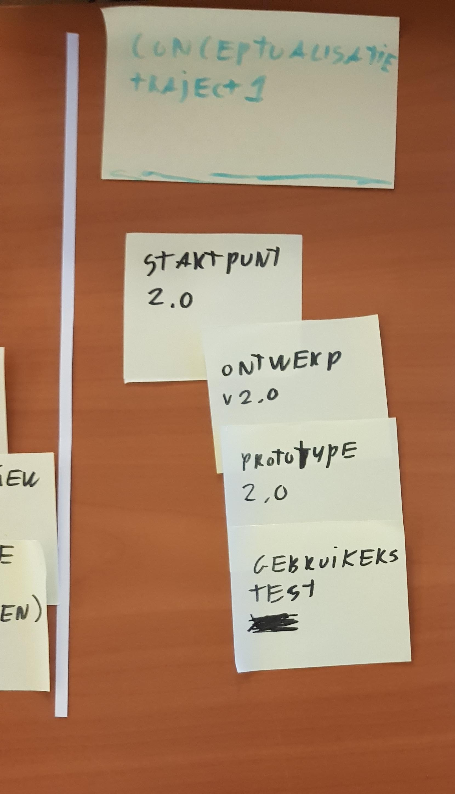
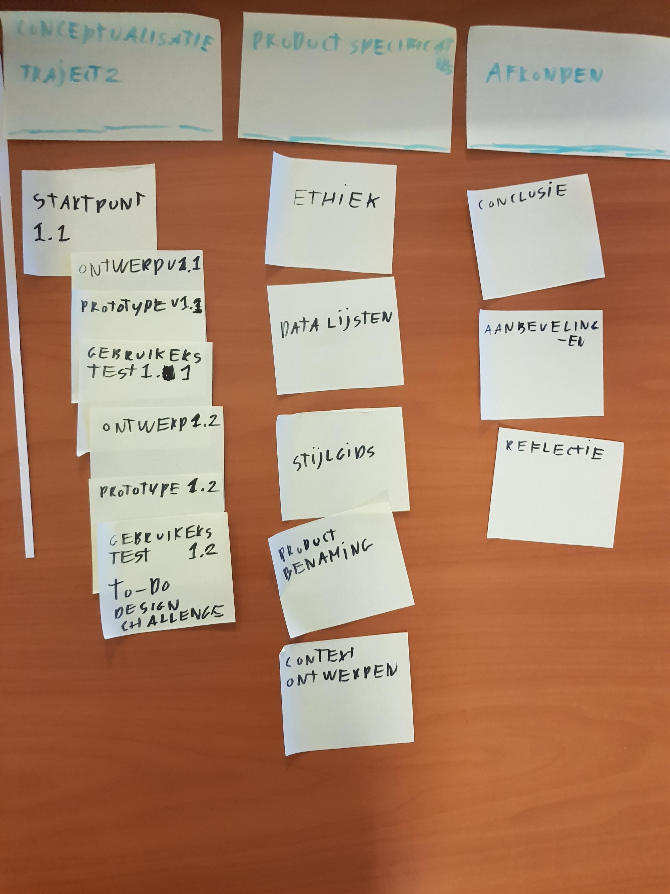
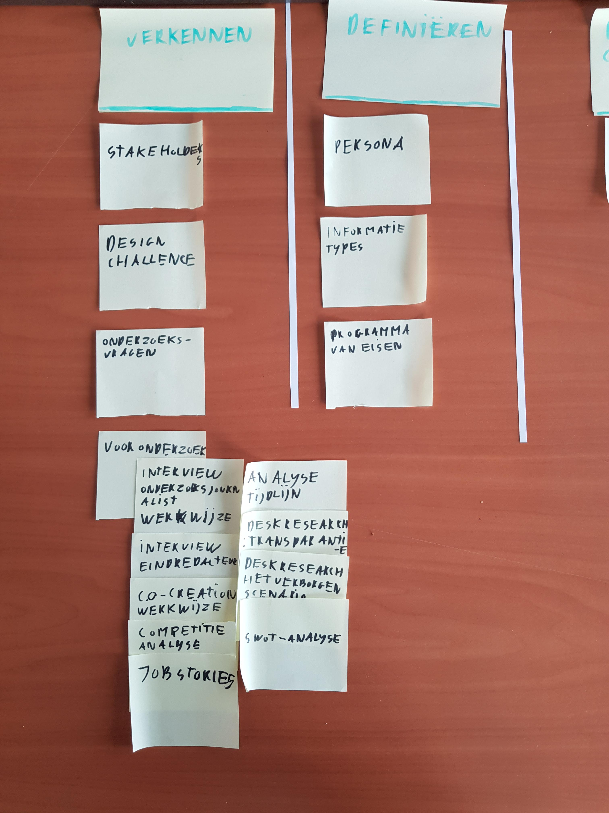
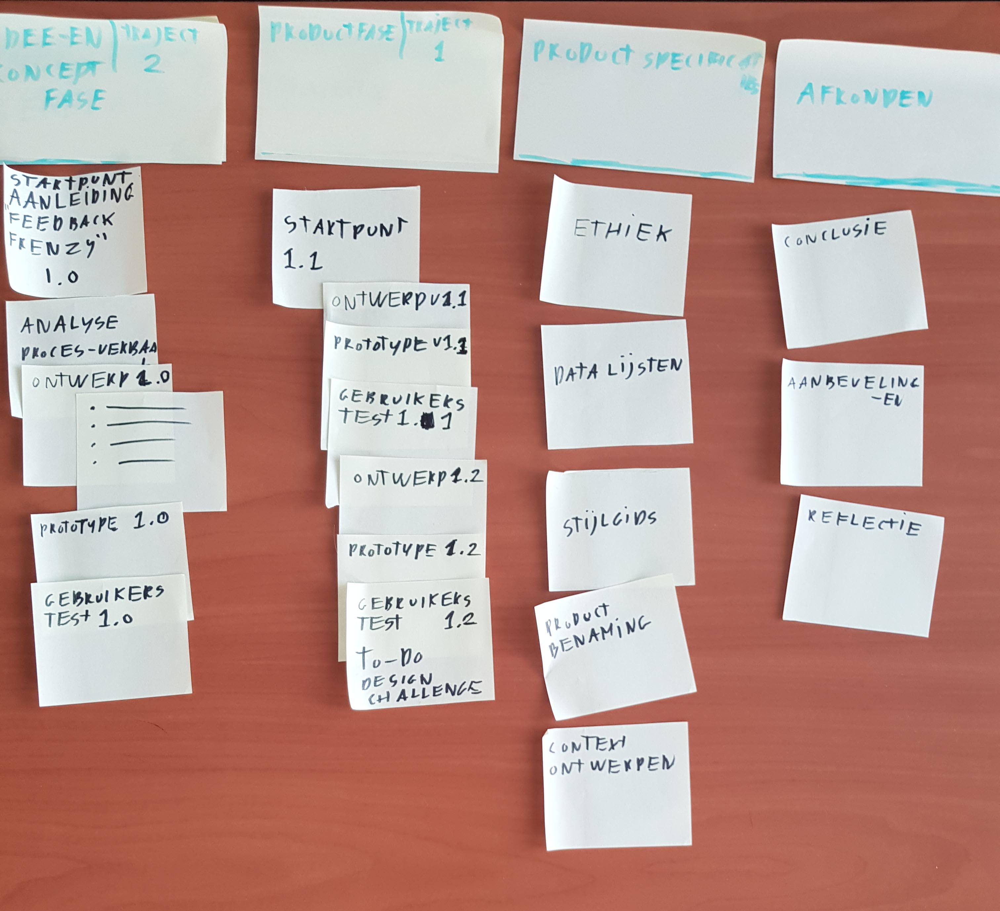
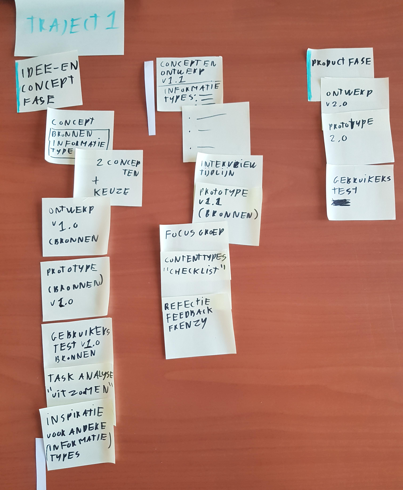
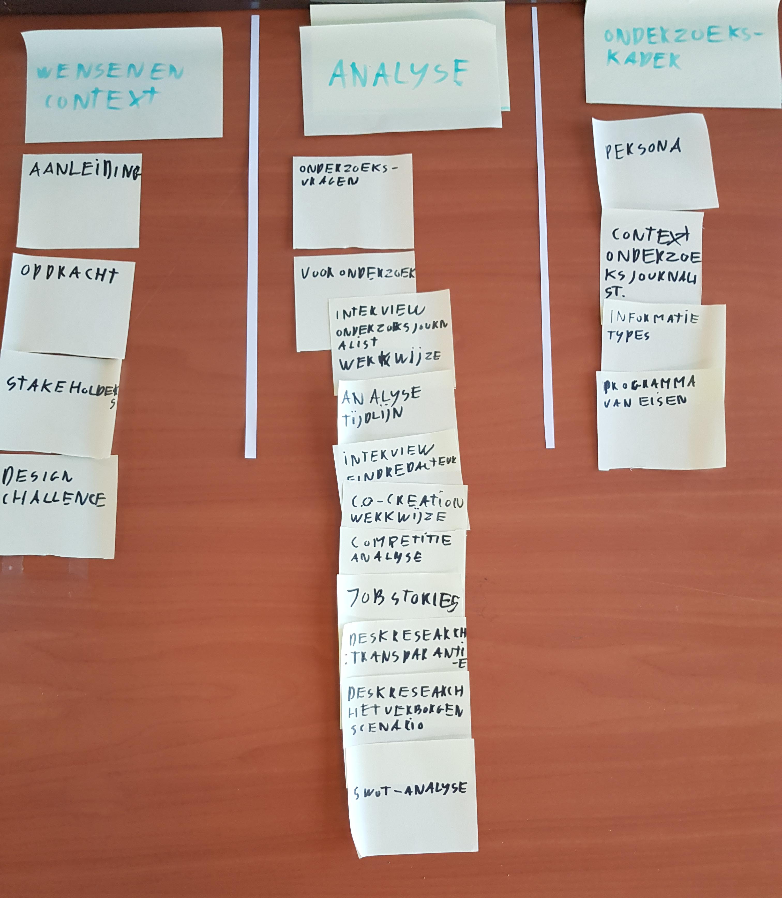

Deze pagina gaat over het herindelen van de biografie en welke iteraties daar aan te pas zijn gekomen. De aanleiding hiervan was de feedback over de documentatie door de derde lezer.

## Feedback

> De (structuur van je) documentatie is voor verbetering vatbaar

* Charl Smit (Eerste lezer)
* Marije ter Beke (Derde lezer)

## Aanpak

Om de biografie (en ook de design rationale) structureel te verbeteren.

* Meer inspiratie opdoen vanuit CMD goed gekeurde documentaties.
* Minder verdieping van secties, sub-secties en sub-sub-secties.
* Documentatie verdelen in heldere fases.
* Pagina's verschuiven tot dat ze op een logische plek staan. 
* Zorg voor post-its om snel te itereren.
* Test in de biografie.

## Versie 1

### Globale indeling
* Introductie __pagina__
* Begrippenlijst __pagina__
* Wensen en context
* Verkennen (Onderzoek doen)
* Definiëren (Welke onderdelen vanuit het onderzoek zijn belangrijk voor het concept en ontwerp?)
* Idee generatie | traject 1 __*__
* Conceptualisatie | traject 1
* Idee generatie | traject 2 
* Conceptualisatie | traject 2
* Productspecificaties (Eigenschappen van beide ontwerpen)

\* De traject verdeling is bedoeld om de lezer niet te verwarren met het feit dat er twee ontwerpen zijn. Elk ontwerp heeft nu zijn eigen traject.

__Verkennen__

* Definiëren

## Versie 2

### Globale indeling
* Introductie (pagina)
* Begrippenlijst (pagina)
* Wensen en context
* Analyse
* Onderzoekskader

## Versie 3

