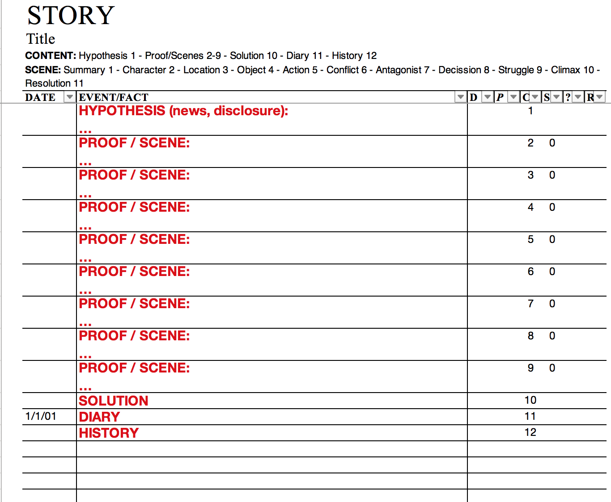
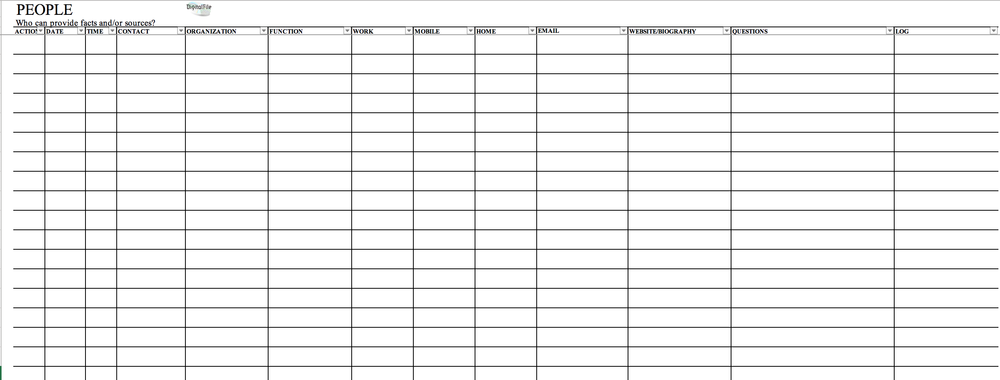
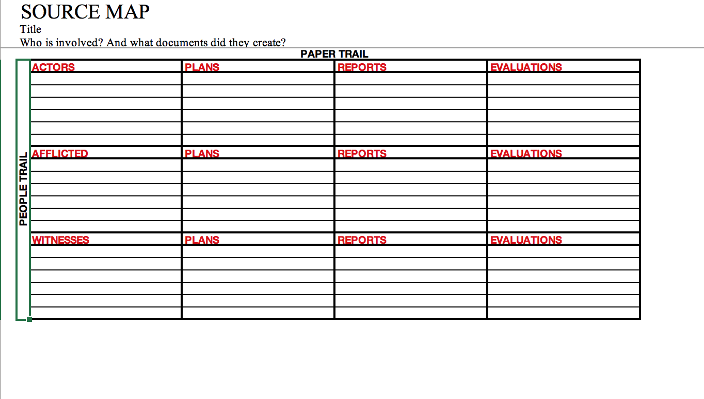

# Masterfile

In dit hoofdstuk analyseer ik de masterfile die ontwikkeld is door [Luuk Sengers](https://www.luuksengers.nl). Deze masterfile is bedoeld voor onderzoeksjournalisten om het werkproces voort te zetten in een soort database. Niet schrikken van de naam 'database', het is namelijk een database in Excel. Dit wil natuurlijk niet zeggen dat deze eenvoudig is. Het voordeel van een database is in de meeste gevallen dat je de informatie op een hoger niveau kan doorzoeken. Ook geeft het je de mogelijkheid om verschillende soorten data beter aan elkaar kan koppelen.

## Waarom dit onderzoek
De masterfile gebruikt ongeveer dezelfde informatie als mijn product. Door dit te onderzoeken kan ik mijn informatielijst aanvullen en ook achterhalen welke informatie belangrijk is.

## Onderdelen indeling:
| Story | Documents | People | Sourcemap | Questions |
| --- | --- | --- | --- | --- |
| Verhaal | Documenten | Mensen | Bronnen | Onderzoeksvragen |

### Story
Op de pagina 'story' houd je het verhaal bij en vult deze kolommen in:

| Date | Event/fact | D (Document) | P (pagina) | C (Component) | S (Scenepart) | ? (check) | R (Ranking) |
| --- | --- | --- | --- | --- | --- | --- | --- |
| Datum | Gebeurtenissen | Document (ref) | Pagina (ref) | Onderdeel / type | Specifiek onderdeel van het verhaal | Gecontroleerd op de waarheid | Prioriteit |

(Sengers, 2010)

### Documents

| ID | Kind | Reference | Link | Organization | Contact | Date | Status |
| --- | --- | --- | --- | --- | --- | --- | --- |
| Een uniek referentie nummer | Soort | Referentie | Link (URL) | Organisatie | Contact informatie | Datum | Status |

(Sengers, 2010)

### People

| Action | Date | Time | Contact | Organization | Function | Work | Mobile | Home | Email | Website/Biography | Questions | Log |
| --- | --- | --- | --- | --- | --- | --- | --- | --- | --- | --- | --- | --- | --- | --- | --- |
| Manier van contact  | Datum | Tijd | Contact informatie | Organisatie | Functie | Werk | Mobiele nummer | Thuis nummer | Email | Website of biografie | Vragen voor deze persoon | Resultaat |

(Sengers, 2010)

### Sourcemap

| Actors | Plans | Reports | Evaluations |
| --- | --- | --- | --- |
| Verantwoordelijken | Alle documenten `voor` het probleem plaats vond | Alle documenten `tijdens` het moment dat het probleem plaats vond | Alle documenten `na` het moment dat het probleem plaats vond |

| Afflicted | Plans | Reports | Evaluations |
| --- | --- | --- | --- |
| Slachtoffers | | | |

| Witnesses | Plans | Reports | Evaluations |
| --- | --- | --- | --- |
| Getuigen | | | |

(Sengers, 2010)

* Sengers, L. (2010). Masterfile-OZJ. Tabel. Geraadpleegd op 6 juni 2019 in masterfile. Excel.
* Sengers, L. (2010). Masterfile-OZJ. Instructie. Geraadpleegd op 6 juni 2019 in masterfile. Word.

> Masterfile in handen gekregen via Arjan van der Linden.

## Dit neem ik mee voor het ontwerp
* Informatietype: Gebeurtenissen. *Relevant voor het chronologisch vertellen van het journalistieke verhaal.*
* Bij gebeurtenissen zitten referenties naar onderdelen zoals documenten. *Documenten kunnen bewijzen dat bepaalde gebeurtenissen zijn gebeurt en welke actoren daar allemaal in voorkomen.*
* Datumindicatie. *De gebruiker de mogelijkheid geven om content te sorteren op tijd. Chronologie komt voor in de leesrichting van een journalistieke verhaal.*
* Informatietype: Mensen (bronnen) die eigenschappen hebben. *Eigenschappen zorgen voor meer context of een betere omschrijving.*
* Informatietype: Documenten. *Dient als bewijsmateriaal.*
* Maak het niet zo ingewikkeld als deze Excel database. *Naar mijn mening: zelfs iemand die bekend is met een database concept heeft hier moeite mee omdat er nog regels aanvast zitten*
* Informatietype: Onderzoeksvragen. *De verkenning van de onderzoeksjournalist, deze informatie geeft transparantie over hoe het journalistieke onderzoek is ontstaan.*