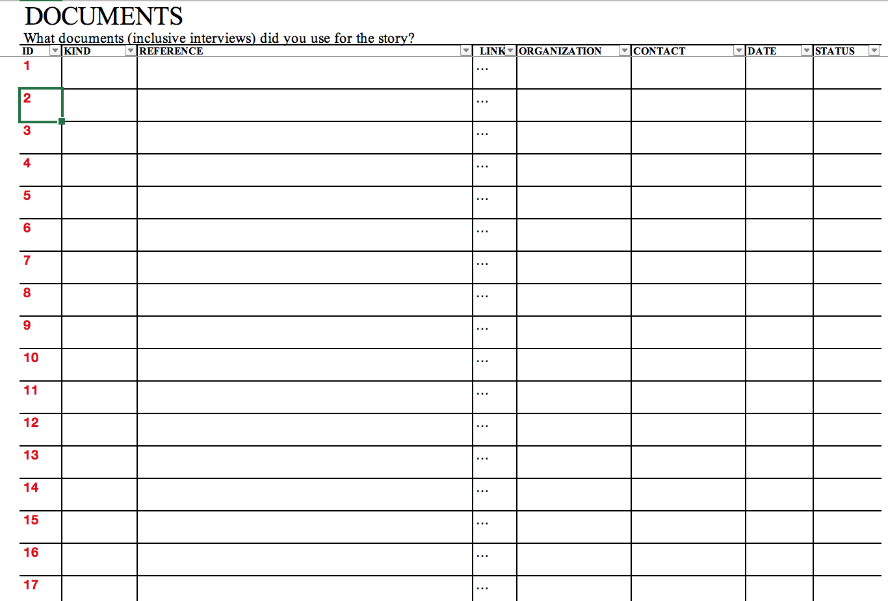

# Masterfile

In dit hoofdstuk analyseer ik de masterfile die ontwikkeld is door [Luuk Sengers](www.luuksengers.nl). Deze masterfile is bedoeld voor onderzoeksjournalisten om het werkproces voort de zetten in een soort database. Niet schrikken van de naam "database", het is namelijk een database in Excel. Dat wil natuurlijk dat niet zeggen dat deze niet ingewikkeld is. Het voordeel van een database is in de meeste gevallen dat je informatie op een ander of hoger niveau doorzoekbaar is. Maar ook dat je verschillende soorten data beter aan elkaar kan koppelen.

## Onderdelen indeling:
Story | Documents | People | Sourcemap | Questions
Verhaal | Documenten | Mensen | Bronnen | Onderzoeksvragen

### Story
Op de pagina story houd je het verhaal bij en vult waaronder deze kolommen in:

Date | Event/fact | D (Document) | P (pagina) | C (Component) | S (Scenepart) | ? (check) | R (Ranking)
Datum | Gebeurtenissen | Document (ref) | Pagina (ref) | Onderdeel / type | Specifiek onderdeel van het verhaal | Gecontroleerd op de waarheid | Prioriteit

(Sengers, 2010)

### Documents

ID | Kind | Reference | Link | Organization | Contact | Date | Status
Een uniek referentie nummer | Soort | Referentie | Link (URL) | Organisatie | Contact informatie | Datum | Status

(Sengers, 2010)

### People

Action | Date | Time | Contact | Organization | Function | Work | Mobile | Home | Email | Website/Biography | Questions | Log
Manier van contact  | Datum | Tijd | Organisatie | Functie | Werk | Mobiele nummer | Thuis nummer | Email | Website of biografie | Vragen voor deze persoon | Resultaat

(Sengers, 2010)

### Sourcemap

Actors | Plans | Reports | Evaluations
Verantwoordelijken | Alle documenten `voor` het probleem plaats vond | Alle documenten `tijdens` het moment dat het probleem plaats vond | Alle documenten `na` het moment dat het probleem plaats vond

Afflicted | Plans | Reports | Evaluations
Slachtoffers | | |

Witnesses | Plans | Reports | Evaluations
Getuigen | | |

(Sengers, 2010)

Sengers, L. (2010). Masterfile-OZJ. Tabel. Geraadpleegd op 6 juni 2019 in masterfile. Excel.
Sengers, L. (2010). Masterfile-OZJ. Instructie. Geraadpleegd op 6 juni 2019 in masterfile. Word.
