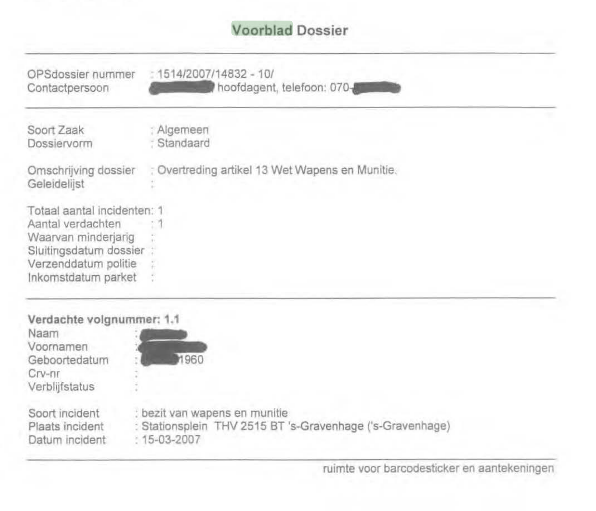
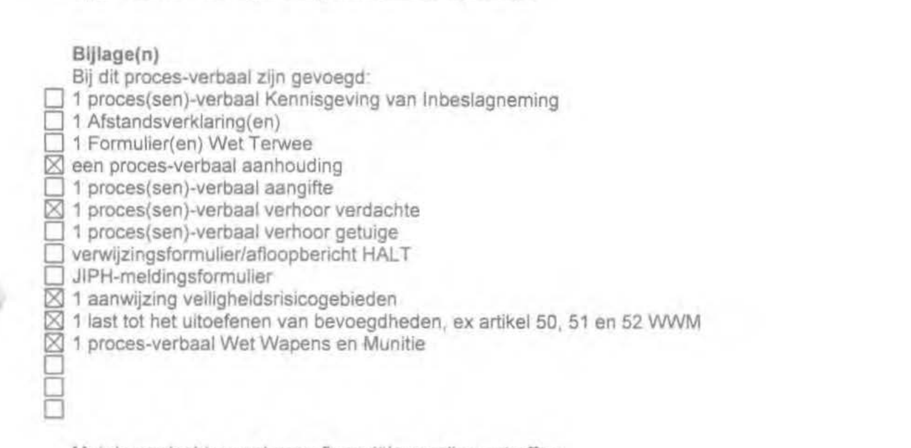

# Proces-verbaal

Vanuit de feedback uit de feedback-frency, werd als tip gegeven door [Thomas Bijen](https://www.hva.nl/profiel/b/i/t.n.m.bijen/t.n.m.bijen.html) om eens te kijken naar hoe de politie onderzoeksrapporten opstelt. Deze rapporten zijn kort gezegd niet voor het publiek bedoeld. Er staan ten eerste veel gevoelige persoonlijke gegevens en ten tweede wordt een proces-verbaal gebruikt om deze mensen te vervolgen. Het is dus niet ethisch verantwoord om dit soort documenten te laten rondslingeren op het web, zonder de betrokken anoniem te maken.

Vanuit deze bron [Bureau Jansen & Janssen](https://www.burojansen.nl/) heb ik inzage kunnen krijgen in een lijst met proces-verbaal documenten. Het bureau is een onderzoeksbureau dat justitie, politie, de overheid in Nederland, inlichtingendiensten en Europa aandachtig volgt.

Dit is de lijst die ik tegengekomen ben:
[Enkele proces-verbalen uit Denhaag](https://www.burojansen.nl/pdf/enkeleprocessenverbalendenhaag.pdf)

## Analyse indeling

In dit document ben ik de volgende soort pagina's tegengekomen:
* *Mutatieformulier*
	Een formulier met velden dat in de toekomst kan veranderen (muteren). Dit formulier bevat voornamelijk een overzicht met belangrijke gegevens.
  * Memo
  * Aangehouden verdachten, verdachte
  * Aanhoudingsgegevens
* Proces-verbaal aanhouding
  * Aanhouding
  * Reden aanhouding
  * Doorzoeken plaatsen
  * Doorzoeken woning
  * Overige tenlastelegging(en)
  * Reden van wetenschap
  * Voorgeleiding
  * Inbeslaggenomen

* *Afstandsverklaring inbeslaggenomen voorwerpen*
	Beschrijving van inbelslaggenomen voorwerpen

* Gegevensblad Verdachte 1.1
  Informatie over persoon.
* Inhoudsopgave
	* Algemene-paragraaf
	* Verdachte-paragraaf
	* Zaaks-paragraaf
* Proces-verbaal van verhoor verdachte
* Proces-verbaal
	* Aanleiding en voortzetten onderzoek
	* Aanwijzing veiligheidsrisicogebied
	* Bevel officier van justitie
	* Aanhouding
	* Overbrengen, aankomst plaays onderzoek en voorgeleiding
	* Insluitingsfouillering
	* Inbeslagneming wapen
	* Onderzoek wapen
	* Foto wapen
	* Verhoor verdachte
	* Afstandsverklaring in beslag genomen goed
	* In vrijheid stellen verdachte
	* Afhandeling in beslag genomen wapen
	* Antecedenten verdachte
	* Verificatie persoonsgegevens verdachte
* Voorblad dossier
* Voorblad per incident

### Bevindingen

#### Meta data dossier
Wat mij opvalt uit deze lijst is dat de informatie op een hoog niveau verijkt is met meta gegevens. Op elke pagina staat wel een registratie nummer van het dossier, de datum van publicatie en een versie van het rapport.

#### Dossier-voorblad

Op voorblad van dit dossier worden belangrijke punten opgesomd die veel zeggen over wat voor dossier/zaak het is. Niet elk punt is overigens ingevuld.
* Soort Zaak
* Dossiervorm
* Omschrijving dossier
* Totaal aantal incidenten
* Aantal verdachten 
etc.

[Bekijk van bron](https://www.burojansen.nl/pdf/enkeleprocessenverbalendenhaag.pdf#page=97&zoom=auto,-74,755)

#### Bijlage met checklist

In dit proces-verbaal wordt een checklist gebruikt voor de bijlage. Hiermee kan een componentenlijst worden weergegeven en verteld ook welke informatie wel en niet aanwezig is.

[Bekijk van bron](https://www.burojansen.nl/pdf/enkeleprocessenverbalendenhaag.pdf#page=30&zoom=auto,-209,725)

#### Verdeling dossier

De verdeling van het dossier is gestructureerd in de volgende punten:
* Algemene-Paragraaf
Algemene informatie over het dossier.

* Verdachte-Paragraaf
Alle informatie over de verdachten binnen het dossier.

* Zaaks-Paragraaf
Hoe de politiezaak in elkaar zit.

Deze onderwerpen komen ook terug in een onderzoek van een onderzoeksjournalist.

### Belangrijke punten om op te nemen
* Het gebruik van een dossier in de informatie hiërarchie.
* Het gebruik van een voorblad om de basis informatie aan te bieden.
* Een checklist met informatie dat voor bepaalde gebruikers niet aanwezig is, maar wel technisch gezien opgevraagd zou kunnen worden.
* Indeling verdeling dossier.
