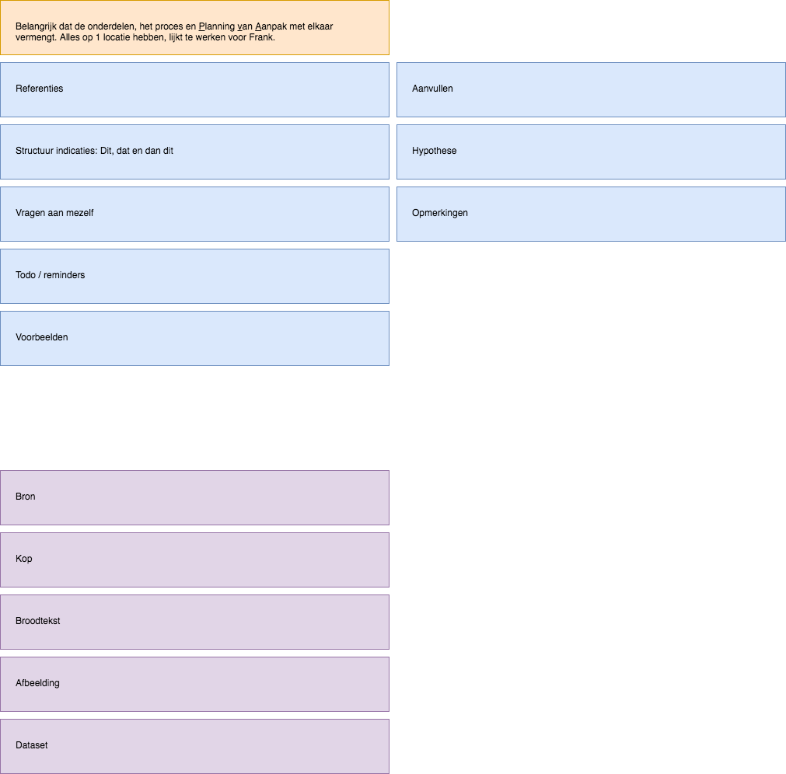

# Werkwijze onderzoek door Frank

De werkwijze waarop Frank Meijer zijn onderzoeksjournalistieke proces uitvoert.

## De onderdelen

### 1. Kan er worden gestart?
Dit proces begint met vooronderzoek naar een bepaald onderwerp. Vaak is hiervoor wel al een aanleiding. Een aanleiding zou vanaf een bron kunnen komen of van een onderwerp waar nog niet zoveel bekend van is. Maatschappelijke belangen komen hier ook vrij vaak in voor.

In het vooronderzoek met in iedergeval deskresearch word het probleem tot dusdanig in kaart gebracht dat deze goed genoeg is voor een idee pitch. De hoofdredactie beoordeeld of er met dit idee door kan gaan. Mocht het idee niet worden goedgekeurd dan moet er nog wat meer worden geïtereerd tot dat deze haalbaar en relevant is. Het is soms ook handig om overstappen op een ander onderwerp/idee, in het geval dat er te veel twijfel is.

### 2. Is het idee goedgekeurd?
Frank werkt vaak het verhaal(product) met proces uit in 1 document. Het `Werkdocument`. Dit document wordt in de eerste instantie opgebouwd door middel van een `PvA`(Plan van Aanpak) en een `artikel opzet`.

#### Bij de PvA worden de volgende vragen gesteld:
* Wat behandel ik?
* Wie wil ik spreken?

#### Voor het `artikel opzet` de volgende punten:
* Volgorde (Chronologisch, of ander structuur?)
* Vorm (Welke verhaal/artikel vorm?)

#### Werkdocument
Het werkdocument is voor Frank een informatie vorm die zich constant evolueerd en itereerd tot dat het uitgroeid tot een artikel. 
Als CMD ontwerper houd je het eindproduct gescheiden van het proces omdat de verantwoording voor de keuzes al genomen zijn en het product moet voor zichzelf spreken. In onderzoeksjournalistiek is dat in Frank zijn manier niet een probleem. De veranwoording staat letterlijk in het verhaal en zal zich in een tekstuele manier moeten presenteren.

Of dit de beste methode is, dat weet ik persoonlijk niet. Het is wel duidelijk dat er sneller toegang is tot de informatie op het moment dat je bezig bent hetzelfde deel van het werkdocument.

### 3. Werken vanuit het werkdocument
Vanuit het werkdocument houd je je bezig met twee belangrijke onderzoeksprocessen. Het onderzoeken opzichzelf en het spreken met bronnen. Veel van wat je onderzoek of onderzocht hebt leg je voor aan je bronnen. Deze kunnen helpen om te valideren van de onderzoeksresultaten. Dit is de belangrijkste iteratie proces van een onderzoeksjournalist. Alle resultaten en hypotheses worden geupdate in het werkdocument. 

### 4. Concept & eindredactie
Mochten alle hypotheses getoetst zijn dan zal je uitkomen op een concept. Dit concept is ee

[Foto's van het proces](fotos.md)

## Samenvatting
Het onderzoeksproces van een onderzoeksjournalist begint met een duidelijke aanleiding. Zonder aanleiding is er te veel risico dat er niet genoeg naar boven komt om tot resultaat te komen. (Dat heeft betrekking op het verdienmodel van de onderzoeksjournalist) Mocht hier aan voldaan zijn dan zal de onderzoeksjournalist zijn of haar idee pitchen bij de eindredactie. Als deze niet goed gekeurd is dan moet de onderzoeksrichting of pitch worden bijgesteld tot dat deze goedgekeurd is door de eindredactie.

Als de pitch is goedgekeurd, dan kan de onderzoeksjournalist beginnen met zijn werkdocument op te zetten. Deze bevat in het begin het Plan van Aanpak (PvA) en een `artikel opzet`. Door het proces heen zal dit document zich langzaam ontwikkelen tot een artikel. De input hiervoor is afkomstig van `A`: verschillende soorten onderzoek(voornamelijk desk research) en `B`: het spreken van bronnen. Tijdens dit proces is het belangrijk dat de bevindingen van `A` en `B` met elkaar worden vergeleken en tot nieuwe onderzoeksvragen zullen leiden. 

Als er genoeg informatie beschikbaar is en de problemen die bij de aanleiding spelen goed inzichtelijk zijn gemaakt, zal de onderzoeksjournalist een concept voorbereiden voor de eindredactie. Dit concept is in principe het werkdocument dat in deze stadium al op een artikel begint te lijken. De eindredactie beoordeeld het concept en besluit of deze klaar is om door de eindredactie te laten verwerken tot een definitief artikel.

Vanaf het pitchen/laten zien van het concept, wordt er wederhoor gepleegd met alle stakeholders die betrokken zijn in dit artikel.

