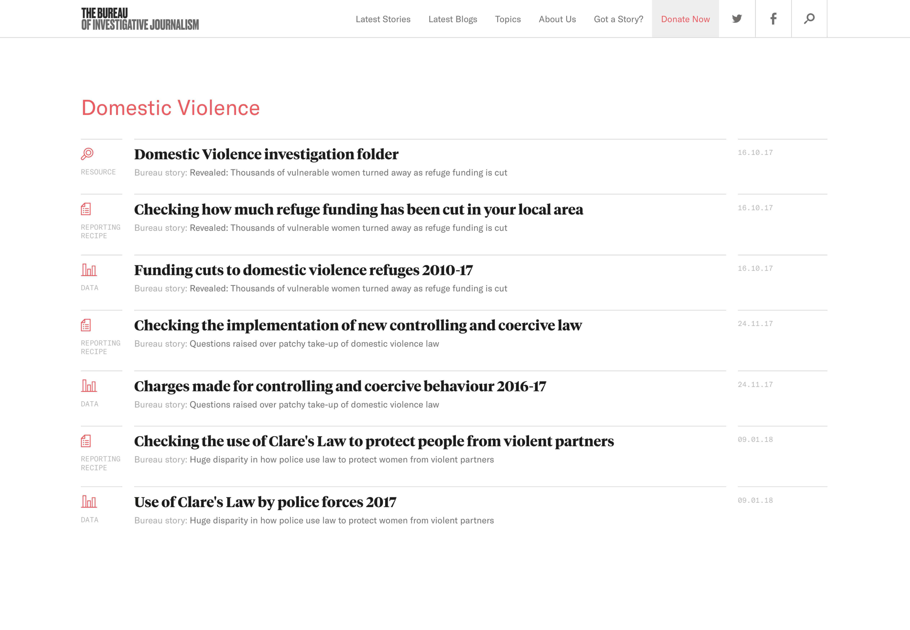
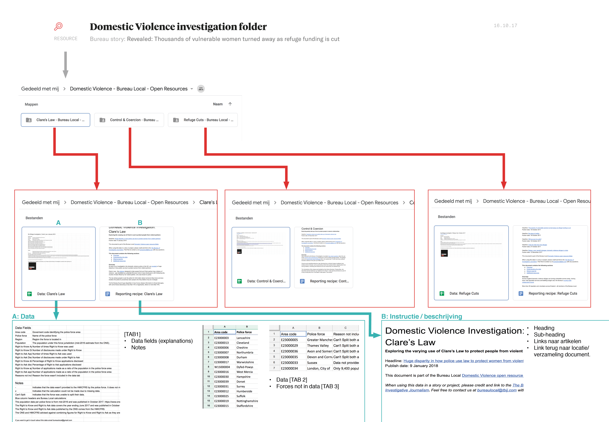

# Competitive analysis

__Datum: 6 mei__

Het volgende project "Bureau Local Open Resources" was een inspiratie bron van Follow the Money om tot de volgende vraag te komen:
[De vraag van het project](https://jorik.gitbook.io/project-blauwdruk/opdracht_vanuit_follow-the-money#de-vraag)

Om te begrijpen wat Follow the Money graag als eindproduct wil is deze analyse noodzakelijk.

[CMD: Competitive Analysis](http://www.cmdmethods.nl/cards/library/competitive-analysis)

## Recept – analyse

Dit project gaat over hoe `The Bureau of Investigative Journalism` een recept creëert vanuit eigen onderzoek en dit vervolgens openstelt voor andere de lokale \(onderzoeks\)journalisten en het publiek. In dit project kan men dit proces aanvullen om zo tot meer data te komen.

> Bureau Local Open Resources
>
> Bureau Local is committed to transparency. We ask it of organisations we investigate, and of ourselves as well. On this page you will find the workings behind our investigations and guides for taking our stories further. We hope this makes the investigative process accessible to local reporters as well as the public.
>
> * Types of resources on this page:
> * Data - evidence behind our investigations
> * Reporting recipe - how-to guides for using our data and developing the story
> * Code - our technological tools to interrogate or visualise data
> * Resource - investigation folder or additional documents

\(The Bureau of Investigative Journalism, 2018\)

[The Bureau of Investigative Journalism](https://www.thebureauinvestigates.com)

Dit is de lijst met resources\(recept\) / reports en data. [Hier te vinden](https://www.thebureauinvestigates.com/projects/refuges/open-resources)

Dit is de indeling van hoe een recept `resource` is ingedeeld, met daarin de documentatie en data.

Deze is ingedeeld in twee bestanden.

* Rapport \(docs\)
* Dataset \(spreadsheet\)

### Het rapport geeft een overzicht en toelichting over:

* Conclusies
* Hoe het onderzoek in elkaar zit
* Waar welke data te vinden is
* Een beschrijving van de data
* Variabelen \(Datums, cijfers\)

### Het dataset bestand bestaat uit twee tabs:

* Instructie hoe de data lezen moet worden
* Welke kolommen er gebruikt worden 
* De dataset zelf

### Vergelijking

Dit project dat door de `The Bureau of Investigative Journalism` is gedaan, werkt ongeveer met dezelfde doelgroep en heeft zich gefocust op een documentatie + format met daarbij een duidelijke doel om een samenwerking te beginnen met het publiek van buiten af. Het blauwdruk project zal zich niet gaan focussen op dit soort samenwerkingen omdat de behoefte tot een blauwdruk in de eerste instantie vanaf Follow the Money komt. Het is een blauwdruk van en voor onderzoeksjournalisten en nog niet voor het publiek van buiten af. Als ik de lezer\(publiek\) nu al bij het project ga betrekken, is er een grote kans dat het project te breed wordt.

